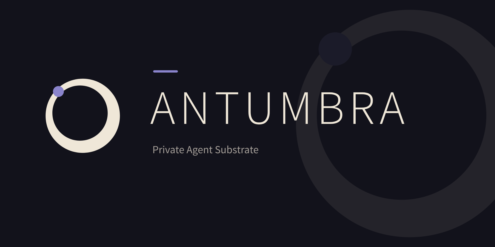

<p align="center">
  
</p>

Antumbra is a private substrate that plugs into a coding agent you already use (Claude Code, Cursor, any MCP client) and, instead of merely _remembering_, it **gets better** by training verified outcomes into frozen LoRA adapters over a shared base, and learning a competence boundary for each. Every milestone is a falsifiable experiment with a kill criterion; the sections below lay out the design and what has (and hasn't) held up so far.

---

## The premise

Most "AI assistants" are one large model in someone else's data center: you rent it, you send it your data, and it is exactly as good tomorrow as today. It never learns _your_ work.

Antumbra takes the opposite approach. It maintains a **population of small, frozen specialists** [LoRA adapters](https://huggingface.co/docs/peft/en/developer_guides/lora) over one shared, code-capable base model, each good at a narrow, recurring task. When a result is **verified** (a test passes, a command works, a schema matches, you accept a draft), that competence is trained into an adapter and [**frozen** into the population](https://openreview.net/forum?id=aGOQYJfz6H). A [**router**](https://www.sciencedirect.com/science/article/pii/S111001682500122X) sends each new task to the specialist most likely to handle it (today a trained per-dimension metric over the experts' capability centroids behind a relative-coverage gate; a learned latent mixer is the north star), and a [**competence boundary**](https://eric.ed.gov/?id=ED306490) decides whether to answer locally or escalate. The payoff: over time it gets measurably better at the work you do most, on your own machine, with your data never leaving the building.

It is also a deliberate offramp from renting frontier models. Early on a big remote model does the heavy lifting (cold-start, the genuinely novel); as your verified memory accumulates and specialists graduate, more of your everyday work is served locally and the expensive tier shrinks, at whatever pace you choose. The portable asset is the memory, not the adapters: a specialist is a LoRA overlay on a specific base, so when you move to a stronger local model you re-derive your specialists from the memory you already captured rather than starting over. Small, open models are improving fast (2026 alone brought capable on-device models and the first million-token-context open models), so Antumbra is built to turn that curve into capability that is specialized to your work, private, and yours.

Two design commitments are the heart of Antumbra:

- **Frozen experts.** A graduated specialist is immutable. Immutability is the only hard guarantee that a learned skill is never silently forgotten when the system trains something new.
- **Scope, not just skill.** Most systems accumulate what _works_. The neglected, more valuable half is the **boundary** of a rule: learning that a behavior is right in one context and wrong in a neighbouring one, and _which contextual feature governs the switch_. Constraints are scoped, not absolute: "use `deno install`, not `npm install`" is true **in this repo**, not everywhere. By defining context boundaries, the system learns when to answer locally and when to escalate, which results in more accurate responses and prevents it from [interfering when it's out of its depth](https://cloud.google.com/discover/what-are-ai-hallucinations).

---

## How it's exercised

Antumbra has a CLI you run directly, but current-state is BYOA, for monitoring the loop and inspecting the population, gate, and memory. Its everyday role, though, is as the brain an agent plugs into over MCP.

Currently supported coding-agents tested:

- **Claude Code** (via `settings.json` hooks)

Planned:

- **Goose.ai** (via `settings.json` hooks)
- **Gemini CLI** (via `settings.json` hooks)
- **OpenCode** (via `settings.json` hooks)
- **Codex** (via `settings.json` hooks)
- **Copilot** (via `settings.json` hooks)

Lifecycle hooks for `claude` which is supported for **bootstrapping** your agent.

1. **Bootstrap on session start.** A hook pulls standing conventions and the memory relevant to this project into the agent's opening context. There is no cold start; it already knows "this repo uses `deno`."
2. **Route or answer.** The agent calls the `answer`/`route` tools: a task goes to the frozen expert most likely to cover it, or escalates when out of scope.
3. **Capture on stop.** A hook nudges the agent to write verified observations back. Those recurrent, checked traces are what `antumbra metabolize` later turns into a new permanent expert.

Hook templates (PowerShell + bash, Windows/macOS/Linux) live in **[`scripts/hooks/`](scripts/hooks/)**; the walkthrough is **[Using Antumbra](docs/integration.md)**.

The same engine runs two ways: **offline** (embedded store, stdio or loopback MCP, one identity, so nothing leaves the machine) and **networked** (HTTP/SSE, a signed JWT per request, engine-enforced multi-tenancy, device sync). The two are the on-device deployment and the hosted, multi-tenant one.

---

## How it learns (not distillation)

Antumbra learns from **verifiable outcomes in an environment**, not by imitating a teacher's text:

- **The environment is the truth.** For coding over repos: the test that passes, the command that runs, the build that goes green. That is the reward (RAFT, reward-ranked fine-tuning over verified completions).
- **A critic turns a failure into a diagnostic signal**, such as "`npm install` failed because this is a Deno project; use `deno install`", and names the _governing feature_ of the boundary. That is counterfactual scope extraction.
- **Training is on the verified outcome, not the critic's words.** That keeps learning grounded in real data, and clear of "trained on a provider's outputs." A frontier model, if used at all, is an optional cold-start accelerator.

This makes **coding over one's own repos the ideal first domain**: maximally verifiable (you can _run_ it), maximally context-scoped (per-repo conventions are textbook boundaries), and the data is yours.

---

## Memory, multi-tenancy, and sharing

Antumbra carries its own first-class memory and runtime rather than running alongside a separate agent engine.

- **Memory store** (Penumbra): a tenant-scoped store with three networks (`world` facts, `bank` experiences, `opinion` judgments), HNSW vector recall, reinforcement counts, and per-memory provenance. It is both the **bootstrap** (existing memories seed the population with no cold start) and the **consolidation source**: an offline pass scores memories (recurrence × verifiability × stability), graduates the trusted ones into experts with an interleaved **replay** buffer that resists catastrophic forgetting, and retires an expert when a consolidated memory is later contradicted. Forgetting is a **soft-delete tombstone**, so a deletion propagates and isn't silently resurrected by another replica. The embedder is pluggable behind the `Embedder` port, so the embedding step that touches your content stays on your side.

- **Engine-enforced isolation**: multi-tenancy and identity live in the SurrealDB engine, not in handler code. Record-access binds `(tenant, user)` to `$auth`, and table permissions (`WHERE tenant_id = $auth.tenant`, plus compartment ownership and grant subqueries) filter every row at the engine, so a forgotten app-side filter cannot leak. Validated live against a real `ws://` server, including the fix (R-6) that runs each request on a scoped, non-root connection.

- **Compartments**: named, ownable latent-spaces of memory, the unit of organization, deletion, and sharing. A user grants another `reference` or `link` capability (engine-enforced); a private compartment consolidates into a private expert. **Revocation is a tombstone** that fails closed immediately at the engine and propagates across devices.

## The runtime surface

- **MCP server** (`antumbra-mcp`): a Rust Model Context Protocol server exposing memory, graph, compartment, routing, and `answer` tools, over **stdio** (one local identity) or a **networked, multi-tenant HTTP** surface where each request's signed JWT `(tenant, user)` claims become the engine's `$auth` (streamable-HTTP stateful/SSE, so the server can push notifications).

- **Live propagation**: when a shared compartment changes, a SurrealDB `LIVE` subscription resolves the audience (owner + grantees) and pushes a notification to each open SSE stream, so an agent learns of new or forgotten memories without polling. Validated end-to-end over the wire.

- **Collector / sync** (`antumbra-sync`): keeps a local embedded store and a remote authoritative store in agreement by periodic **bidirectional last-write-wins** reconciliation (by each row's version timestamp), so memories, grants, and revocations become visible across a fleet. CLI: `antumbra sync`.

---

## Current State

Every milestone is a falsifiable experiment with a kill criterion.

- **Storage** Leverages SurrealDB v3 for persistence storage for offline/online functionality
- Multi-tenancy, identity, and isolation are engine-enforced and signed JWT authenticated over the wire. single process; data in SurrealDB via `surql-rs` (builder-only); training and serving via `candle`.

**substrate:** one frozen, code-capable base (Qwen2.5-Coder-1.5B-Instruct) on a single 24 GB GPU, a growing library of frozen LoRA experts, and a boundary-conditioned coverage gate. The real candle trainer/server is behind a `models` feature; the default build runs a CPU demo trainer so the orchestration is exercisable without a GPU.

**Validated (toward 2026-06):**

- **Provenance over extraction ([ADR-0018](https://github.com/albedosehen/antumbra-meta/blob/main/adr/0018-provenance-over-extraction.md)).** Memories about code carry a git anchor (repo, commit, branch) that recall scopes to where the caller is and the session hook judges against HEAD (`[live]`, `[not-on-head]`, `[orphaned]`); inventory answers come from ingesting what the framework itself prints (`antumbra ingest -- <lister>`) and from `git log` (`antumbra git-facts`), never from a parser Antumbra would have to maintain.
- **Native GitHub integration ([ADR-0019](https://github.com/albedosehen/antumbra-meta/blob/main/adr/0019-github-integration-and-evidence-graph.md)).** A GitHub App webhook (`--github-webhook-secret`) keeps those anchors accurate from the platform's own events: a merged pull request re-anchors the merged branch's memories to the merge commit, becomes a memory of its own, and (with the App's key) has its changed documents ingested at that commit; a deleted branch marks its memories orphaned server-side; installing the App cold-starts a repository from its default branch. The knowledge diff check run and the evidence-based dependency graph are the next increments.
- **Training works on a real GPU.** RAFT lifts pass-rate to 1.0 under both a convention reward and a verifier that _executes_ generated code; the generation-quality recipe is dialed in, and a small corpus trains an expert that generalizes to held-out inputs.
- **Consolidation closes the loop:** memories score through the gate and graduate into a specialist; a private compartment consolidates into a private expert.
- **Routing + boundary:** a real embedder drives a gate that routes to the right specialist and escalates out-of-scope queries by _relative coverage_, not an absolute floor; the counterfactual boundary composes end-to-end.
- **Networked multi-tenancy is engine-enforced over `ws://`** (real SurrealDB v3): cross-tenant isolation and intra-tenant compartment privacy both hold; grant makes a shared memory visible and revoke fails closed, all over the wire.
- **Multi-device:** bidirectional LWW sync converges; deletes and revocations propagate as tombstones with no resurrection; live SSE notifications reach grantees end-to-end.

**Not yet / in progress:** large corpora and many experts (the real generalization-and-forgetting test at scale); the learned latent-mixing gate (the north star beyond the coverage gate); 4-bit quantized training (RAFT and GRPO both ship); heterogeneous composition by learned cross-attention bridges (the north star). The hosted direction (the control plane and product surface) is in progress: the control-plane onboarding _core_ exists (invite-gated signup/login that provisions a tenant and issues the RS256 token the server verifies, plus magic-link auth), and the web dashboard's first, read-only slice is served at `/dashboard`, while the rest of the dashboard and OAuth providers are still to come. The CLI/TUI and the [`scripts/hooks/`](scripts/hooks/) templates are today's interface.

---

## Install

New here? With Docker and ollama running, one command sets everything up and connects Claude Code:

```bash
cargo install --path crates/antumbra-cli --locked   # from a clone, until the first release
antumbra setup local                                # or: antumbra setup hosted <url> --token-file <file>
antumbra setup check
```

**[docs/getting-started.md](docs/getting-started.md)** walks through it, and through each step by hand, for macOS, Windows, and Linux. Agents setting it up for someone follow **[docs/agent-setup.md](docs/agent-setup.md)**. The paths below cover just the binaries.

### Prebuilt binaries (no Rust toolchain)

> No release has been tagged yet, so the installers below resolve only once the first version tag is pushed (the `Release` workflow builds them). Until then, build from source.

Each binary ships a one-line installer that pulls the right prebuilt build for your OS (macOS, Linux, Windows) from the latest GitHub release. The operator console (`antumbra-tui`):

```bash
# macOS / Linux
curl --proto '=https' --tlsv1.2 -LsSf https://github.com/Oneiriq/antumbra/releases/latest/download/antumbra-tui-installer.sh | sh
```

```powershell
# Windows (PowerShell)
irm https://github.com/Oneiriq/antumbra/releases/latest/download/antumbra-tui-installer.ps1 | iex
```

The CLI (`antumbra`) and the MCP server (`antumbra-mcp`) install the same way, swapping `antumbra-tui` for `antumbra-cli` or `antumbra-mcp` in the URL. Windows `.msi` packages, per-OS archives, and checksums are attached to every [release](https://github.com/Oneiriq/antumbra/releases).

### From source (needs the Rust toolchain)

```bash
just install        # builds + installs antumbra, antumbra-tui, antumbra-mcp into ~/.cargo/bin
# or, without `just`:
cargo install --path crates/antumbra-cli --locked
cargo install --path crates/antumbra-tui --locked
cargo install --path crates/antumbra-mcp --locked
```

Both the prebuilt binaries and `just install` produce the light, no-GPU build. GPU training and serving are a feature-gated source build (see Run, below).

## Run

```bash
# Operator console (ratatui): a live view of the population, gate, loop, and memory.
antumbra-tui

# Drive the durable loop with the scripted DEMO trainer (--demo: it always
# graduates; real training is `train` under --features models), then inspect
# it. The CLI and the operator console share one persistent on-disk store by
# default, so state from one command is there for the next (and shows up live
# in antumbra-tui).
antumbra schema                        # print the generated DDL
antumbra loop --demo --generations 3
antumbra status

# Anything that embeds (remember, route, ingest, ...) needs an embedder: bring an
# OpenAI-compatible /embeddings endpoint (Ollama serving all-minilm), or pass
# --fake-embedder for a demo (a byte histogram: NOT semantic). Without
# --features models a command refuses to run with neither, rather than degrade.
antumbra --embedder-url http://127.0.0.1:11434/v1/embeddings route "reverse a string"

# Answer inventory questions without a parser: store what the framework's own
# lister prints, stamped with the repo, commit, and branch it ran at (add
# --copal-addr and the original is archived to copal first, the document of
# record, exactly as the server does); and derive ownership / hotspots /
# co-change from git log, anchored to the commit range.
antumbra --embedder-url ... ingest --tenant ws:me --user user:me --title routes -- deno task routes
antumbra git-facts --tenant ws:me --user user:me --compartment comp:repo --days 90

# Bidirectional sync between this local store and a remote authoritative SurrealDB.
antumbra sync --remote ws://host:8000/rpc --remote-user root --remote-pass <pw>
```

Real training and serving need the GPU build (a CUDA GPU and the Qwen weights, plus `python` for the exec verifiers), which is a source build behind the `models,cuda` features:

```bash
cargo run -p antumbra-cli --features models,cuda -- \
  train --corpus corpora/arith.json --run arith --generations 1
cargo run -p antumbra-cli --features models,cuda -- \
  ask "Write a Python function add(a, b) that returns their sum."   # route -> load adapter -> generate
```

The networked MCP server (`antumbra-mcp --http 0.0.0.0:8081 --url ws://... --db-user root --db-pass <pw> --embedder-url <your /embeddings endpoint> --tools agent`, with a JWT key; `--tools agent` advertises only the eleven tools a coding agent needs, so operator actions are never one agent call away and every session carries less tool text; without `--features models` the server refuses to start with no embedder rather than fall back to the `--fake-embedder` stand-in) and its live multi-tenant validation are reproducible with the probes under `docs/` (against a SurrealDB v3 server, e.g. `docker run -p 8000:8000 surrealdb/surrealdb:v3.0.5 start --user root --pass root
memory`). See **[Running the trainer](docs/running-the-trainer.md)** for the CUDA recipe and the validated generation-quality settings.

---

## Documentation

- **[Getting started](docs/getting-started.md)**: end-to-end setup on macOS, Windows, and Linux. Start here.
- **[Antumbra, explained for anyone](docs/antumbra-explained.md)**: a plain-English tour with diagrams and analogies (no ML background needed).
- **[Using Antumbra](docs/integration.md)**: wire it into a coding agent (the bootstrap/capture lifecycle hooks), offline vs networked. Start here.
- **[Architecture](docs/architecture.md)**: system, substrate, decision chain, training and data flow, schema.
- **[Security posture](docs/security.md)**: the trust model, engine-enforced isolation, and the threat-model conclusions of the security review.
- **[Running the trainer](docs/running-the-trainer.md)**: the CUDA GPU recipe.

The design records (the ADRs the code names by number, such as `ADR-0025`), the roadmap and the experiment ledger are kept in a private companion repository, [antumbra-meta](https://github.com/albedosehen/antumbra-meta).

### Crates

`antumbra-core` (domain types, ports) · `antumbra-auth` (JWT token contract) · `antumbra-store` (SurrealDB persistence via surql-rs) · `antumbra-embed` (HTTP `/embeddings` client behind the `Embedder` port) · `antumbra-copal` (the copal document-of-record archive client, shared by the server and the CLI) · `antumbra-gate` (router/coverage gate) · `antumbra-boundary` (counterfactual scope) · `antumbra-rerank` (cross-encoder `/rerank` client behind the `Reranker` port) · `antumbra-bench` (retrieval-quality harness) · `antumbra-critic` (verifiers + credit assignment) · `antumbra-train` (candle Qwen + LoRA trainer) · `antumbra-serve` (resident multi-adapter serving) · `antumbra-loop` (generational loop) · `antumbra-sync` (collector/sync + live propagation) · `antumbra-mcp` (MCP server, stdio + networked) · `antumbra-control` (hosted-onboarding control plane) · `antumbra-control-server` (the control plane's HTTP surface: invite-gated signup + magic-link login) · `antumbra-cli` · `antumbra-tui`.

## License

Copyright (c) 2026 Shon Thomas.

Antumbra is source-available under the [Elastic License 2.0](LICENSE) (ELv2, SPDX `Elastic-2.0`); Shon Thomas is the licensor. You may use, copy, modify and distribute it, and run it for yourself or inside your own organization, subject to three limitations:

- You may not provide it to third parties as a hosted or managed service that gives them access to any substantial set of its features or functionality.
- You may not move, change, disable or circumvent any license key functionality, or remove functionality it protects.
- You may not alter, remove or obscure the licensor's licensing, copyright or other notices.

Anyone you give a copy to gets these terms with it, and modified copies must say they were modified. ELv2 is not an open source license as the OSI defines one. The [`LICENSE`](LICENSE) file is the license; this summary is not.
