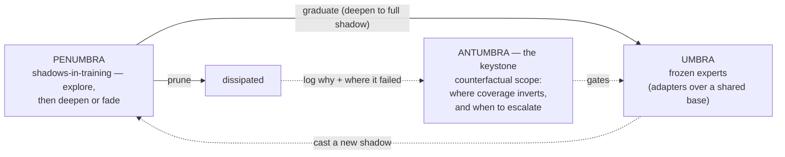

# Antumbra

> A private, self-improving AI that grows its own team of small specialists on your own hardware —
> and learns the *scope* of what each one is good at.

---

## What this is, in plain terms

Most "AI assistants" are one enormous model in someone else's data center. You rent it, you send it your
data, and it is exactly as good tomorrow as it is today — it never actually *learns your work*.

**Antumbra is the opposite.** It runs on your own computer and grows a **population of small, frozen
specialists** — each good at a narrow, recurring task. When it meets something it can't do well, it spawns a
temporary *apprentice* that practices until it either **graduates** into a new permanent specialist or is
**pruned**. Crucially, it learns *where* each specialist is reliable and where it isn't — so it knows when to
answer locally and when to step back. Over weeks it quietly gets better at *your* work, on *your* machine, with
*your* data never leaving the building.

The name is load-bearing. A shadow cast by an occluder has three regions, and so does this system:

- **Umbra** = the frozen experts — total shadow, full and proven coverage; immutable (immutability is the only
  guarantee a skill is never forgotten) — *ADR-0001*
- **Penumbra** = the shadows-in-training — the partial-shadow ring around the umbra where coverage is still
  forming; each one then deepens into umbra (graduates) or fades (prunes) — *ADR-0002*
- **Antumbra** = the keystone — the region beyond the umbra's tip where the geometry *inverts*: the occluder no
  longer covers the light source and a ring of light breaks through. That inversion is the counterfactual
  *scope* — the context where a behavior that was right becomes wrong, where local competence gives out and you
  must escalate — *ADR-0004*

The project is named for that third region: the boundary **is** the thesis. Knowing exactly where your own
shadow stops covering — and which contextual feature governs the edge — is the whole game.



---

## Who is it for? (a concrete example)

> **Maya is a marketing specialist.** Half her week is banal: reformatting campaign numbers into the same
> weekly deck, drafting routine emails in her company's voice, triaging the inbox, cleaning spreadsheets. A
> cloud AI could help — but her company's data can't leave the building, and the generic local model she tried
> is mediocre at *her* formats and tone.
>
> Antumbra runs on the workstation under her desk. The first week it is average. But every time it gets one of her
> recurring tasks right — *verified*: the numbers reconcile, the schema matches, the draft survives her edit —
> that competence is **frozen into a specialist**. A month later it has a "weekly-deck" expert, a "brand-voice
> draft" expert, an "inbox-triage" expert: small, private, and genuinely good at the banal 50% of her job.

---

## How it pays for itself

You don't replace the expensive model overnight — you **harvest it, then wean off it.** The paid frontier model
is a *teacher* you consult less and less:

1. **Route through Antumbra.** Keep using the expensive model, but every task + context + result is logged.
2. **Verify & capture.** When a result passes a check (tests, schema, or *you accept the draft*), it becomes a
   training example you already paid for once.
3. **Graduate a local specialist** that reproduces that behavior on *that one narrow recurring task*.
4. **Route local, escalate only out-of-scope.** Once the local expert passes the same verification reliably
   *within its scope*, Antumbra serves that task for **$0** and only calls the expensive model when the
   **boundary** says "out of scope / not confident" — and that call becomes the next training example.

So you **amortize your bill toward zero on the work you repeat**, while keeping the frontier model on retainer
for genuinely novel tasks. The keystone (ADR-0004) is what makes this *safe*: knowing the scope of what you can
do locally is precisely the "answer-locally vs pay-the-expensive-model" decision.

*Honest caveats:* there's an investment period (you pay while teaching); you trade API bills for a GPU + your
time (pays off at volume, not light use); some hard/novel tasks never graduate and stay on the paid model; and
training on a provider's *outputs* can run into their terms — which is why Antumbra grounds truth in **your own
data + real execution**, not the flagship's text (see below).

---

## Why this is deeper than "yet another agent harness"

Most agent frameworks are **orchestration harnesses**: prompt-routing and tool-calling *on top of a frozen
brain*. The brain never changes; only the choreography does.

Antumbra's core thesis is more fundamental: **modeling the *counterfactual boundary of its own competence.*** Most
systems accumulate what *works* (skill libraries). Antumbra's bet is that the more valuable, neglected half is the
**scope** of a rule — learning that a behavior is **right in one context and wrong in a neighbouring one**, and
*which contextual feature governs the switch.* Constraints are scoped, not absolute: *"use `deno task`, not `npm
install`"* is true **in this repo**, not everywhere. Capturing that scope is a form of **world modeling** — and
it is the same thing as knowing when to trust a local expert vs escalate. Everything else (frozen experts,
shadows, critic, gate) is the apparatus that serves this. We will ship a harness too — but here it is the
*surface*, not the substance.

---

## How it learns (and why it's not just distillation)

Antumbra learns from **verifiable outcomes in your environment**, not by imitating a teacher's text:

- The **environment is the truth.** For a coding agent on your repos: the test that passes, the command that
  actually works, the build that goes green. That is the reward.
- A **critic** (which *may* be a flagship model, or your own verifiers) turns a raw failure into a dense,
  *diagnostic* signal — *"`npm install` failed because this is a Deno project; use `deno task`"* — and names the
  **governing feature** of the boundary (Deno-vs-npm). That is counterfactual scope extraction (ADR-0004).
- You **train on the verified outcome, not the critic's words.** That keeps the learning grounded in your data
  (and clear of "trained on a provider's outputs"). The flagship, if used, is an *accelerator for cold-start* —
  optional, because your own repos are a more authoritative teacher about *your* conventions than any model.

This makes **coding-over-your-own-repos the ideal first domain**: maximally verifiable (you can *run* it),
maximally context-scoped (per-repo conventions are textbook boundaries), and the data is yours.

---

## Status & shape (honest)

- **Research project, not a product.** Every phase is a falsifiable experiment with a kill criterion.
- **All-Rust, single process.** Data in SurrealDB via `surql-rs`; inference via `llama-cpp-2` / `mistral.rs`;
  training (QLoRA adapters **and** the gate) via a DIY `candle` path.
- **v0 = shared-base adapters on one RTX 3090 Ti (24 GB):** one frozen, code-capable base + a growing library of
  frozen LoRA experts + a learned, boundary-conditioned gate. The same artifacts are *both* the routable
  population *and* an in-latent composed model.
- **North star = a heterogeneous composed model** (genuinely separate frozen experts wired by learned
  cross-attention bridges) — *ADR-0009*. The v0 gate, boundary engine, loop, and substrate all carry over;
  only the composition substrate changes.

---

## Build & run (v0)

The substrate, critic, gate, boundary engine, and the durable generational loop are implemented and tested in
Rust against **surql-rs** on the SurrealDB 3.x driver (builder-only — no hand-written SurrealQL). GPU training
and serving are seams that return `Unimplemented` for now, so the loop runs end-to-end with a demo trainer.

```bash
cargo test                                   # whole workspace, green

# operator CLI (ephemeral mem:// by default; pass --url for persistence)
cargo run -p antumbra-cli -- schema                              # print generated DDL
cargo run -p antumbra-cli -- --url surrealkv://./data/a.skv loop --generations 3
cargo run -p antumbra-cli -- --url surrealkv://./data/a.skv status
cargo run -p antumbra-cli -- --url surrealkv://./data/a.skv route "fix the deno build"
```

See [architecture §7](docs/architecture.md#7-repo-structure-greenfield) for the per-crate status.

---

## Documentation map

- **[Architecture](docs/architecture.md)** — system, substrate, decision chain, training/data flow, schema.
- **[Diagram Atlas](docs/diagrams.md)** — every diagram in one place: concept, system, flow, schema, per-ADR.
- **[Architecture Decision Records](docs/adr/README.md)** — every load-bearing decision, ADR-0001 … ADR-0009.
