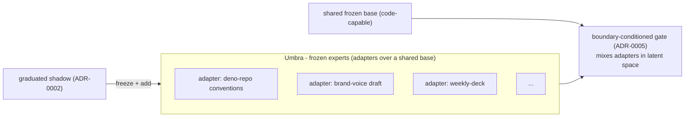

# ADR-0001 - A population of small, frozen experts

**Status:** Accepted · **Date:** 2026-05-30 · **Related:** 0002 (shadows), 0005 (gate), 0006 (serving), 0008 (loop), 0009 (north star)

> **Metabolizing the harness, first increment (2026-06-05).** The thesis that the _harness_ (loops, behavior graphs, task execution) is scaffolding to absorb into weights rather than clone now has a runnable path: `antumbra-train::harness` adapts a harness's **successful, recurrent orchestration traces** into the same capture tasks the population internalizes (goal → prompt, collapsed outcome → completion), gated so a one-off or failed orchestration is never frozen. Driven by `antumbra metabolize` (mirrors `memory-import`; `--train` internalizes through the capture loop). So the brain can learn to do in one shot what the harness did in many steps.
>
> **Structure-aware + harness-agnostic (2026-06-05, refined 2026-06-10).** Metabolization is **structure-aware**: a trace's decomposition (`steps`/`nodes`/`iterations`) is metabolized as its own capture tasks alongside the collapsed whole: _process_ supervision, not just _outcome_, so the expert learns the sub-skills (Structured Agent Distillation, arXiv:2505.13820). Ingestion is file-based and producer-agnostic: `antumbra metabolize --source <file>` reads a normalized trace export through the tolerant `normalize_traces` adapter, and `--watch` re-reads on a **cadence**. Antumbra is itself the harness, so it metabolizes an export rather than integrating a foreign harness to pull from; an earlier live HTTP puller against a specific external harness was removed for that reason. Still deferred: learning the graph's _edge_ structure (ordering/branching) beyond per-node steps.

## Context

Catastrophic forgetting is the central failure mode of continual learning: train on task B and you degrade on task A. The cleanest guarantee that a skill is never forgotten is to stop changing the weights that hold it. Separately, the small-language-models-for-agents thesis (Belcak et al., arXiv 2506.02153) argues capability decomposes into many small specialists rather than one monolith - and many small specialists map cleanly onto consumer hardware.

## Decision

Antumbra's capability **is** a growing **population of small, frozen experts** (the _umbra_ - total, proven shadow).

1. **In v0, an expert is a frozen LoRA adapter over one shared, code-capable base.** The "population" is a base
   - a library of adapters, composed in latent space by the gate (ADR-0005) - not separate models passing text. (The north star, ADR-0009, promotes experts to genuinely separate models; the population concept is unchanged.)
2. An expert carries metadata: a structured **capability card**, a learned **capability vector** (ADR-0005), an aggregate **fitness**, a **generation**, and `frozen_at`.
3. **Freezing is permanent and enforced.** Once `frozen_at` is set, the artifact is read-only. This is the invariant the rest of the system is built on (tested in ADR-0002).
4. **Growth is additive.** A new expert is a new adapter; adding it must not require retraining existing experts or the base - only the gate adapts (ADR-0005).

## Consequences

- **Positive:** no catastrophic forgetting _by construction_; a shared base means experts are tiny (adapters, MBs not GBs) and many fit one GPU; growth is additive; composition is in latent space, not lossy text.
- **Negative:** a shared base imposes one "knowledge floor" - experts can specialize but not exceed the base's fundamentals (a code base for coding, etc.). Radically different bases need the north star (ADR-0009). The population can grow unbounded → fitness/prune policy (ADR-0008).
- **Neutral:** the bottleneck moves from the experts to the **gate** (ADR-0005) - the experts are the easy part.

## Alternatives considered

- **One large fine-tuned model.** Rejected: forgetting; no clean unit of "a skill"; doesn't fit the hardware.
- **Independent full models from day one.** Rejected for v0 (memory + representation mismatch on one 24 GB card); this is the north star (ADR-0009), reached after the shared-base version is proven.
- **Adapters that are never frozen.** Rejected: adapter interference reintroduces forgetting; freezing is the guarantee.

## Validation

Jointly with ADR-0002 (forgetting half): after a new adapter graduates and joins the population, prior experts' `regression_fingerprint` on their corpora must be **unchanged**. _Kill criterion:_ old-skill regression on growth → the freeze premise is unsound; stop before 0003/0004.
