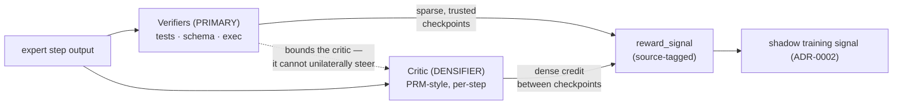

# ADR-0003 — A critic for credit assignment (densifier over verifiable rewards)

**Status:** Accepted (amended 2026-05-30) · **Date:** 2026-05-30 · **Related:** 0002 (shadows), 0004 (boundaries), 0005 (router), 0008 (loop)

## Context

Shadows (ADR-0002) need a learning signal, but experts hand off **text**, and a task usually yields only a
sparse terminal pass/fail. That is far too thin to train on, and worse: a *purely learned* critic over text
invites reward-hacking and collapse. The field's verdict is clear — for non-differentiable text, **verifiable
rewards beat a learned critic**, and **process reward models (per-step) beat outcome reward models**: *Let's
Verify Step by Step* (Lightman, 2305.20050), *Math-Shepherd* (2312.08935).

## Decision

**Verifiable signals are the primary reward; the learned critic is a secondary *densifier*.**

1. **Verifiers are primary.** Wherever a step can be checked mechanically — unit tests pass, JSON-schema
   matches, an exec/eval check succeeds — that check *is* the reward. These are the ground truth.
2. **The critic densifies, it does not rule.** A small PRM-style model interpolates **per-step credit between**
   verifiable checkpoints, turning sparse pass/fail into a dense per-step signal for shadow training. It can
   never override a verifier.
3. Every signal is recorded as a `reward_signal` row tagged `source ∈ {verifier, critic}` so the two are
   always separable and auditable.
4. **Runtime error handling (retry / escalate / discard) is control-flow, not a learning signal** — kept out
   of the reward entirely.

### The critic may be a flagship — but train on the outcome, not its text

For the coding-over-repos domain (ADR-0002), the **environment is the verifier**: a test passes, a build goes
green, a command runs clean. The critic that *densifies* can be verifier rules and/or a **flagship model** that
reads a failure and diagnoses it — e.g. *"`npm install` failed because this is a Deno project; use `deno
task`"* — naming the **governing feature** of a counterfactual boundary (ADR-0004). The discipline: **train
shadows on the verified outcome, not on the flagship's words.** That keeps learning grounded in your data and
clear of "training on a provider's outputs"; the flagship is a cold-start *accelerator*, not an imitation
target — and your own repos are the more authoritative teacher.

## Consequences

- **Positive:** dense enough to train shadows efficiently, but anchored to ground truth so it can't be hacked;
  the verifier/critic split is auditable; per-step credit suits process-level learning.
- **Negative:** a mis-calibrated critic can still mis-train shadows *between* checkpoints — bounded, not
  eliminated, by keeping verifiers primary; building good verifiers per task domain is real work.
- **Neutral:** the critic is itself a small trainable model — it can live as a shadow that graduates
  (ADR-0002/0005).

## Alternatives considered

- **Pure learned critic over text.** Rejected: reward-hacking and collapse; the central failure the literature
  warns about.
- **Outcome reward only (terminal pass/fail).** Rejected: too sparse to train shadows; PRM > ORM.
- **Verifiers only, no densifier.** Held as the *fallback* — if the critic shows no benefit (see Validation),
  we keep verifiers and drop the learned critic.

## Validation

On a verifiable corpus, the critic-densified per-step signal must train shadows to success in **fewer samples**
than terminal-reward-only. *Kill criterion:* no improvement over verifiable-only → drop the learned critic,
keep the verifiers.
