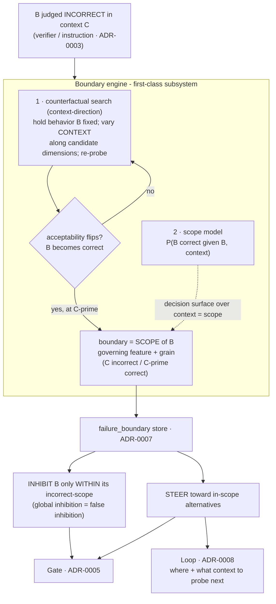

# ADR-0004 - The counterfactual boundary of competence (the keystone)

**Status:** Accepted - **keystone / central thesis** · **Date:** 2026-05-30
**Related:** 0001 (substrate), 0002 (probes), 0003 (measurement), 0005 (consumer), 0008 (refiner)

> This is the ADR the project is *for*. ADRs 0001–0003, 0005, and 0008 describe the **apparatus**; this one
> describes what the apparatus is *for*. It is also the least-proven part - there is no prior art - and we build
> it **first-class and head-on, not staged.** The project succeeds or fails here.

> **Validation (2026-06-03).** The keystone mechanism is now exercised end-to-end through the real substrate and
> the real gate (`crates/antumbra-store/tests/keystone_mem.rs`). Counterfactual search (`find_scope`) holds the
> behavior fixed, varies the context across candidate governing dimensions, re-probes acceptability, and
> recovers the governing feature plus the nearest in-scope context C'. `finding_to_boundary` promotes the finding
> to an **actionable** `FailureBoundary` with an embedded `context_vec`; it persists through surql-rs and
> round-trips. The gate then inhibits a perfectly-matching expert **inside** the failure scope (forcing
> escalation) and does nothing **outside** it - a control run without the boundary routes the same task straight
> to that expert, proving the boundary, not coverage, caused the escalation. The one fake is the
> `AcceptabilityProbe`: judging whether a *real* behavior is acceptable in a context needs serving (ADR-0006),
> so the production probe is deferred. The search, the persistence, the inhibition, and the routing are real.
> Still open: deriving candidate governing features automatically (here they are supplied), and the real probe.

> **Real probe (2026-06-03).** The `AcceptabilityProbe` is no longer only a fake. `GenerateVerifyProbe`
> (`antumbra-serve`) realizes **generate-then-verify**: hold the behavior fixed, render it for a candidate
> context, **serve** a completion, and let a **verifier** judge it — generic over the `Serve` and `Verifier`
> ports, so production composes `CandleServe` (ADR-0006) with `CommandVerifier` (ADR-0003), and tests use
> deterministic fakes. Unit tests prove acceptability is decided by serving-and-checking, and that `find_scope`
> drives the real probe to recover the governing feature and C' (the convert-direction case). Swapping the fakes
> for `CandleServe` + a python verifier makes it a live, GPU-backed probe with no change to the keystone path.
> Now the *only* supplied input is the candidate governing-feature set (automatic discovery remains open).

> **Live GPU run (2026-06-03).** The probe was run end-to-end on the GPU via the CLI `scope` command
> (generate-then-verify, best-of-K over `CandleServe` + `CommandVerifier`). On the v0 base
> (Qwen2.5-Coder-1.5B, **no expert adapter**) it did **not** recover the test boundaries — both a strict
> python-exec spec (`scope-convert`) and a robust in-process `contains_all` spec (`scope-greeting`) stayed open
> across K=8. The small base does not reliably follow terse context hints in free-form generation (it scored
> only ~0.38 on trivial add/reverse before any training). **The integrity point holds:** the probe returned
> "boundary stays open" rather than fabricating a scope — exactly the open-negative discipline ADR-0004 demands.
> So the mechanism is sound and unit-proven; reliable *live* recovery needs a stronger actor (a graduated expert
> as the generator, or a larger base) or more-elicitable checks, not a change to the keystone path. (The K=8
> convert draws also produced identical errors, hinting at low generation diversity — a temperature knob on
> generation is a likely follow-up, since best-of-K only helps if the draws differ.)

> **Live recovery achieved (2026-06-03).** Probing with **the expert's own adapter** (the faithful design — the
> keystone maps a *specific expert's* competence, not the base's) succeeds where base-only failed. A narrow
> **adder** expert was trained (add only; `[0.38, 1.00, 1.00]`, graduated) and `scope --expert adder-g0`
> (`find_scope_over_contexts` over whole candidate contexts, each with its own verifier) probed its boundary:
> the adder **passed** the `op=add` context (clean `def add`, `add(2,3)==5`) and **failed** the `op=multiply`
> context (it emits no `multiply`), so the search recovered governing feature `op` and C' `{op: add}` and stored
> an **actionable** boundary — `status` then reports `boundaries (antumbra): 1 (1 actionable, 0 open)`. This is
> the keystone **fully live**: a real trained expert → real generation (`CandleServe`) → real execution (python
> verifier) → counterfactual recovery → a persisted, actionable boundary. No fake remains in this path. Still
> open: automatic discovery of the candidate governing features (here they are authored), and scale.

> **Autonomous discovery, live and reliable (2026-06-03).** `discover_boundary` removes the last authored
> input: instead of being *told* the governing feature, the system probes a pool of contexts, partitions them by
> pass/fail, and infers the feature whose value alone separates the two (`scope --discover`). On the GPU,
> `scope --expert adder-g0 --discover` **inferred** governing feature `op` and C' `{op: add}` and stored an
> actionable boundary — nothing supplied but the candidate contexts. Reaching reliable live recovery flushed out
> three real bugs (each fixed): best-of-K re-seeded the RNG identically so the K draws were one completion
> (per-call generation nonce); the server reloaded the multi-GB model every `act` (cache it once); and the
> verifier ran untrusted generated code with no timeout, so a runaway draw hung the whole run (null stdin + a
> hard kill timeout). The earlier "stochastic" reading was those bugs, not actor weakness. Integrity held
> throughout — the probe returned "stays open" rather than fabricating a scope. Still open: scale, and a
> stronger actor would widen the in-scope margin further.

## Context

The thesis at full strength: **a continual learner becomes capable by modeling the *counterfactual boundary* of
its own competence.** Not "what works" (skill libraries already accumulate that), but the more valuable,
neglected half - learning that a **behavior is correct in one context and incorrect in a neighbouring one**, and
*which contextual feature governs the difference.*

Consolidating that is a form of **world modeling**: the system learns the **context-conditioned rules** of its
environment - constraints and preferences that vary by file, client, brand, recipient, time - rather than a
flat memory of pass/fail.

This is genuinely novel, and the absence of prior art is diagnostic. The closest work stores or relabels
failures but **none recovers the scope**: Reflexion (2303.11366), ExpeL (2308.10144), Voyager (2305.16291),
Hindsight Experience Replay (1707.01495), mistake-clustering. They keep the *negative*; none learn *where the
negative applies.*

**The architecture radiates from here.** 0001 gives a *stable substrate* (a scope can't be stable if the model
drifts); 0002 gives *probes*; 0003 *measures* correctness; 0005 *consumes* the boundary; 0008 *refines* it.

## What the counterfactual *is* - and is *not*

This is the crux, and it is easy to get wrong. Take the instruction:

> *"Use the Illustrator MCP tool to make a portrait of X with colors a, b, c - never y, z."*

- ❌ **The useless counterfactual (boolean negation):** invert the goal → *"don't make the portrait; always use
  y, z."* This just flips the proposition. It is never what's wanted.
- ✅ **The useful counterfactual (contextual scope):** hold the *behavior* ("use colors y, z") fixed and vary
  the **context**. The discovery is that the prohibition is **scoped** - *forbidden in this file/brand, fine in
  other projects.* The counterfactual is **"had this been a different file (C′), y, z would be acceptable,"**
  and the payload is the **governing dimension** (file identity / brand) and its **grain** (this file? this
  client? this session?).

> **A boundary is a context-scoped conditional, never a negation of the goal.** The counterfactual varies the
> *context* with the behavior held fixed; what it learns is *where a rule applies and where it doesn't.*

And the load-bearing consequence: **over-generalizing a scope *is* false inhibition.** Learn "never y, z"
*globally* from one project and you wrongly refuse y, z everywhere. Getting the scope (and its grain) right is
therefore not a refinement - it is the safety mechanism that keeps the inhibitory store from poisoning the
whole system.

## Decision

Build, as a **first-class subsystem from day one**, a **boundary engine** that learns the *scope* of behaviors
and constraints and acts on it. A boundary is a scoped conditional, not a bare negative:

```
boundary = (
  behavior B,                  -- e.g. "use colors {y,z}" (held fixed)
  scope,                       -- region of context where B is CORRECT
  governing_features,          -- which context dims the scope depends on (file, brand, client, ...)
  grain,                       -- resolution of the scope (this file | project | client | session)
  (C, C′),                     -- minimal contrastive pair: C where B is incorrect, nearest C′ where it is correct
  context_vec, confidence
)
```

Three co-equal jobs:

1. **Counterfactual search (context-direction).** Hold the behavior **B** fixed; vary the **context** along
   candidate dimensions; re-probe via the frozen experts (cheap, repeatable replay) until B's *acceptability*
   flips. The output is the **governing dimension and grain** - *where and why* the rule applies - **not** a
   negated goal. The frozen, servable population (ADR-0001) is what makes running the context-counterfactual
   affordable.
2. **Scope modeling.** Fit `P(B is correct | B, context)`; the boundary is its **decision surface over
   context-space**, and feature-attribution on it names the governing dimensions. This is the world-model
   fragment - a model of *context-conditioned correctness.*
3. **Act within scope - two channels.** **Inhibit** B *only inside its incorrect-scope* (never globally - that
   is false inhibition) and **steer** toward in-scope alternatives. The boundary is a guide applied *at the
   right grain*, not a blanket veto.

It is **integrated, not bolted on**: scope *uncertainty* drives the loop (ADR-0008) - it says *where to spawn
shadows and what context to probe* - and the boundary feeds the gate (ADR-0005) as both scoped penalty and
guide.



### What makes this buildable rather than hand-wavy

- **Instructions often *state* the scope** ("in this file", "for this client") - that is direct supervision for
  the governing dimension and grain, not something we must always infer blind.
- **Verifier / user-edit ground truth (ADR-0003)** gives an objective correct/incorrect label to anchor C and C′.
- **The frozen population (ADR-0001)** makes context-counterfactual re-probing cheap and repeatable.
- **Confidence + scoped application** bound false inhibition by construction.
- **The coding domain makes scope concrete** (ADR-0002): per-repo conventions are ready-made boundaries -
  *`npm install` is wrong in a Deno repo (C), right in an npm repo (C′)* - and the governing feature (an
  inspectable `deno.json`) is often directly observable, not inferred blind.

## Consequences

- **Positive:** the differentiator; the system learns *context-conditioned rules* (a real world model), steers
  rather than only suppresses, and applies constraints at the right grain.
- **Negative:** the hardest, riskiest part of the project - **owned, not deferred.** The dangerous failure is
  **over-generalized scope = false inhibition**; inferring the *grain* of "this one" (file vs client vs session)
  is genuinely hard; context-counterfactual search has cost (mitigated by frozen-replay); the store grows
  unbounded → merge/decay (ADR-0007).
- **Neutral:** a dedicated scope/world-model *model* may emerge inside job #2 - an internal evolution of a
  first-class component, not a separate staged ADR.

## Alternatives considered

- **Store negatives only (skill-library-with-failures).** Rejected: that is what Reflexion / ExpeL / Voyager do,
  and it never recovers the *scope* - so it over-generalizes.
- **Treat every learned constraint as a global rule.** Rejected: this *is* the false-inhibition failure mode;
  the entire point is scope.
- **Boolean negation of the goal.** Rejected as meaningless (see *What the counterfactual is*).
- **Stage extraction for "later."** **Rejected this session** - deferring the thesis demotes the project to
  "yet another harness." Built first-class.
- **A big LLM that "explains" failures in prose.** Rejected as the *mechanism*: a prose rationale is not a
  scope - it is ungrounded and unverifiable.

## Validation - the central project gate

This is *the* make-or-break experiment. On a corpus with checkable answers and **deliberately scoped**
constraints (a rule that holds in some contexts, not others):

1. **Locate the scope** - the engine recovers C′ and names the governing dimension better than a chance /
   nearest-neighbour baseline.
2. **Apply in-scope** - it enforces the constraint where it *does* hold (fewer repeated known failures than
   store-negatives-only).
3. **Do not apply out-of-scope** - it does **not** suppress the same behavior where it is fine. This is the
   false-inhibition / over-generalization test, and it is now central, not a footnote.

**Kill criterion (the whole thesis):** if the engine cannot recover scope well enough to cut repeated in-scope
failures *without* inflating out-of-scope false inhibition, the central claim is unproven - and *that* is the
result that matters most, found as early as possible. Everything else is apparatus; **this is the point.**
