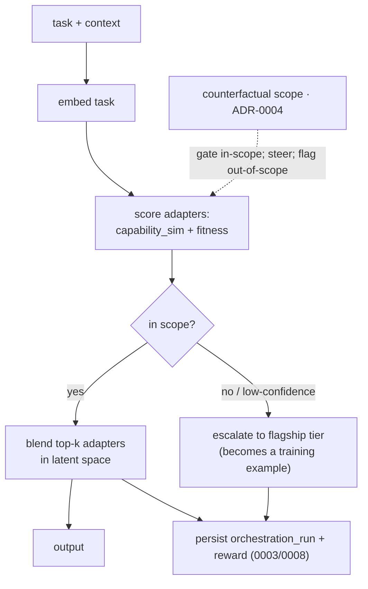

# ADR-0005 — From router to an in-model, boundary-conditioned gate

**Status:** Accepted · **Date:** 2026-05-30 · **Related:** 0001 (experts), 0002 (shadows), 0003 (critic), 0004 (boundary keystone), 0006 (serving), 0009 (north star)

## Context

Something has to select and combine experts. Earlier this was framed as a *router over separate models passing
text* — but text is a lossy bus and there is no gradient across separate models. With v0's shared-base adapters
(ADR-0001), composition can instead happen **in latent space**: a learned **gate** mixes adapters within one
forward pass. The same artifacts then serve two modes with no rewrite — pick one adapter (*coverage*) or blend
several (*composition*). This is the LoRA-MoE family (LoraHub 2307.13269; PHATGOOSE 2402.05859; X-LoRA 2402.07148).

## Decision

1. **The gate is a learned, in-model mixer over the adapter library.** Capability vectors (learned from
   evaluated behavior, ADR-0004's measurement) seed it; it is trained on accumulated traces with the critic's
   per-step reward (ADR-0003). It is itself a trainable component on the shadow lifecycle (ADR-0002).
2. **The gate is boundary-conditioned (the keystone in the forward pass).** It does not weight adapters by
   capability-similarity alone — the counterfactual scope (ADR-0004) **gates and steers** it: down-weight
   out-of-scope experts, prefer in-scope ones. The boundary is an inductive bias *inside* the model, not an
   external penalty.
3. **The gate also makes the escalate-or-answer decision.** When the boundary says *out-of-scope / low
   confidence*, the gate **escalates to the optional flagship tier** (ADR-0003/0006) instead of guessing — and
   that escalation becomes a training example, so the escalation set shrinks over time. This is the mechanism
   behind "how it pays for itself."
4. **Composition is a durable flow.** Multi-step tasks persist state in `orchestration_run` so a crash resumes
   mid-task — same engine as the generational loop (ADR-0008).
5. **North-star continuity (ADR-0009).** When experts become separate models, the gate generalizes from
   adapter-mixing to **selecting top-k experts + driving learned cross-attention bridges** — same role, heavier
   substrate. v0's gate logic carries over.

## Consequences

- **Positive:** composition in latent space (not lossy text); coverage and composition are the *same* artifacts;
  the boundary becomes a real inductive bias; the escalation mechanism is the cost-savings engine; the gate
  self-improves on the same critic/loop machinery.
- **Negative:** the gate is a **second DIY-candle training target** (after the QLoRA adapters); a mis-trained
  gate can mis-mix confidently — the boundary + verifiers are the guardrails; latent mixing of many adapters has
  its own failure modes (interference).
- **Neutral:** runtime error handling (retry/escalate plumbing) stays separate from the learning signal.

## Alternatives considered

- **Text router over separate models.** Rejected for v0: lossy, no cross-expert gradient. (It survives only as
  the *interface* to the optional flagship escalation tier.)
- **Capability-only gate (no boundary).** Rejected: routes confidently out-of-scope; the keystone exists
  precisely to prevent this.
- **A big LLM as the gate.** Rejected as default: violates the small-model thesis and the single-GPU budget.

## Validation

3–4 adapters, none solving task T alone. (a) The gate blends them to complete T (composition works). (b) On
out-of-scope tasks it **escalates** rather than guessing, and the escalation rate **falls** as experts graduate.
*Kill criterion:* the gate can't beat single-adapter routing on composed tasks, or never reduces escalation →
stay on coverage routing (still useful) and revisit composition.
