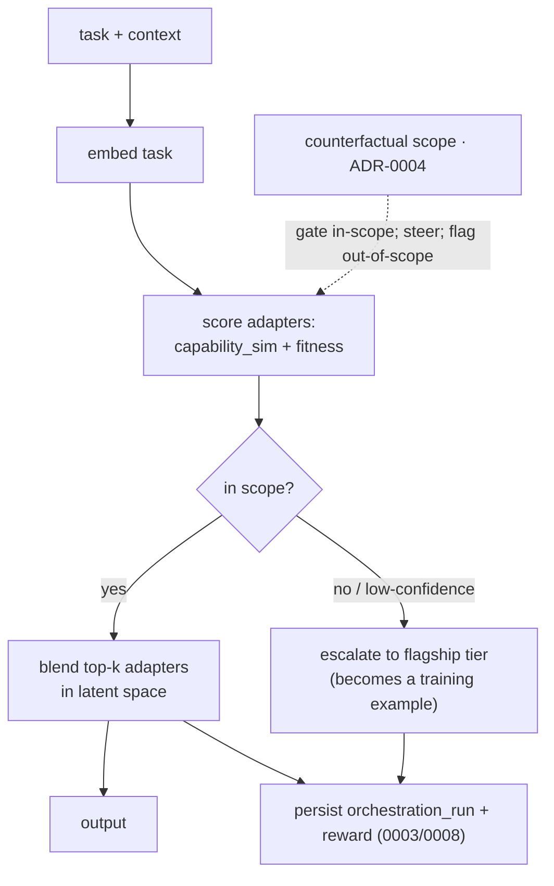

# ADR-0005 - From router to an in-model, boundary-conditioned gate

**Status:** Accepted · **Date:** 2026-05-30 · **Related:** 0001 (experts), 0002 (shadows), 0003 (critic), 0004 (boundary keystone), 0006 (serving), 0009 (north star)

> **Learned gate realized (2026-06-04).** The relative-coverage heuristic below is now backed by a *learned*
> boundary-conditioned gate (ADR-0009's mixer in routing form), validated in EXP-013/017. A per-dimension metric,
> trained on the population's own solved exemplars (prototypical cross-entropy, `antumbra-train::router`),
> amplifies the directions that separate experts — turning the compressed cosine band into clean separation: a
> specialist the heuristic margin *escalated* (0.051) now routes at p=1.000, and it generalizes to held-out
> tasks. Out-of-distribution is caught by an **absolute floor** on the nearest-centroid similarity in the learned
> space (calibrated `mean-2σ` over in-distribution exemplars): "capital of France" escalates (sim 0.41 < floor
> 0.53) where the softmax was overconfident (p=0.98). The router is **self-maintaining** (auto-retrained on every
> `train`/`teach` once ≥2 experts) and **unified with boundaries** (route by the learned metric, but escalate on
> OOD *or* boundary inhibition). The heuristic gate stays the fallback (<2 experts / no router). Recurring
> principle, proven three times now (this gate EXP-002, the boundary, the router EXP-017): on compressed sentence
> embeddings use *relative/learned* separation + an *absolute* OOD floor, never a raw similarity cutoff. Compass:
> RMD (2106.09022), DynMoLE entropy gating (2504.00661), selective prediction (1705.08500).

> **Validation (2026-06-03).** The real candle embedder (all-MiniLM-L6-v2, 384-d) is now wired
> (`antumbra-serve::BertEmbedder`), replacing the byte-histogram fake, so the v0 coverage gate runs on real
> semantic vectors. Seeding three described specialists (arithmetic / strings / dates) and routing matched
> queries, **in-scope discrimination was 3/3**: each query's nearest expert was the correct one
> (arith 0.831, string 0.906, datetime 0.845 - each the clear top-1). **But absolute-threshold escalation
> failed:** an out-of-scope query ("train a CNN on images") still scored 0.70 against the string specialist,
> because sentence-transformer cosine for short texts is compressed into a high band (~0.6-0.9 for *everything*).
> A fixed similarity floor cannot separate in- from out-of-scope. The signal that *does* separate here is the
> **top-1-to-top-2 margin** (in-scope ~0.11-0.16, out-of-scope ~0.04) - and, more durably, the boundary
> mechanism (ADR-0004) rather than a raw similarity threshold. This is the concrete next problem for the gate:
> out-of-scope detection needs margin/calibration or boundary inhibition, not an absolute cosine cutoff.

> **Resolution (2026-06-03).** Escalation is now **relative coverage**, grounded in the OOD literature.
> Out-of-scope is an out-of-distribution problem; the fix is to cancel the non-discriminative shared direction
> rather than threshold absolute similarity.
> - *Relative Mahalanobis Distance* (arXiv:2106.09022): near-OOD fails because shared dimensions make in/out
>   equidistant; cancel a class-agnostic background. RMD uses covariance whitening - infeasible with one vector
>   per expert.
> - The valid cosine-space realization is the **prototype margin** `cos(task, e₁) − cos(task, e₂)`: the shared
>   direction contributes near-equally to both and cancels. Subtracting the population *centroid* instead was
>   **measured to fail** - the centroid absorbs the shared direction, so `cos(task, centroid) ≈ cos(task, e₁)`
>   and coverage collapsed to ~0 for in- and out-of-scope alike (arith −0.009, datetime −0.002 vs cooking
>   +0.006: unseparable).
> - *Deep-kNN OOD* (arXiv:2204.06507): same family (distance to nearest prototypes on L2-normalized features -
>   the embedder normalizes). *Selective prediction* (arXiv:1705.08500): escalation is abstention; the threshold
>   is the risk-coverage knob, calibrated per deployment.
>
> Implemented in `antumbra-gate`: ranking unchanged (cosine − boundary inhibition); escalate when
> `(top-1 − top-2) − inhibition < coverage_threshold` (default 0.08). Re-running the demo, all five queries are
> correct: arith/string/datetime routed (margins 0.106 / 0.163 / 0.110) and two out-of-scope queries escalated
> ("train a CNN" 0.037, "grill a rack of lamb" 0.068). Known v0 limitation: a task served equally by two
> experts has a small margin and escalates (ambiguity conflated with out-of-scope); north-star composition
> (ADR-0009) dissolves it. A confident boundary (ADR-0004) is subtracted from coverage, so it escalates
> independently.

## Context

Something has to select and combine experts. Earlier this was framed as a *router over separate models passing
text* - but text is a lossy bus and there is no gradient across separate models. With v0's shared-base adapters
(ADR-0001), composition can instead happen **in latent space**: a learned **gate** mixes adapters within one
forward pass. The same artifacts then serve two modes with no rewrite - pick one adapter (*coverage*) or blend
several (*composition*). This is the LoRA-MoE family (LoraHub 2307.13269; PHATGOOSE 2402.05859; X-LoRA 2402.07148).

## Decision

1. **The gate is a learned, in-model mixer over the adapter library.** Capability vectors (learned from
   evaluated behavior, ADR-0004's measurement) seed it; it is trained on accumulated traces with the critic's
   per-step reward (ADR-0003). It is itself a trainable component on the shadow lifecycle (ADR-0002).
2. **The gate is boundary-conditioned (the keystone in the forward pass).** It does not weight adapters by
   capability-similarity alone - the counterfactual scope (ADR-0004) **gates and steers** it: down-weight
   out-of-scope experts, prefer in-scope ones. The boundary is an inductive bias *inside* the model, not an
   external penalty.
3. **The gate also makes the escalate-or-answer decision.** When the boundary says *out-of-scope / low
   confidence*, the gate **escalates to the optional flagship tier** (ADR-0003/0006) instead of guessing - and
   that escalation becomes a training example, so the escalation set shrinks over time. This is the mechanism
   behind "how it pays for itself."
4. **Composition is a durable flow.** Multi-step tasks persist state in `orchestration_run` so a crash resumes
   mid-task - same engine as the generational loop (ADR-0008).
5. **North-star continuity (ADR-0009).** When experts become separate models, the gate generalizes from
   adapter-mixing to **selecting top-k experts + driving learned cross-attention bridges** - same role, heavier
   substrate. v0's gate logic carries over.

## Consequences

- **Positive:** composition in latent space (not lossy text); coverage and composition are the *same* artifacts;
  the boundary becomes a real inductive bias; the escalation mechanism is the cost-savings engine; the gate
  self-improves on the same critic/loop machinery.
- **Negative:** the gate is a **second DIY-candle training target** (after the QLoRA adapters); a mis-trained
  gate can mis-mix confidently - the boundary + verifiers are the guardrails; latent mixing of many adapters has
  its own failure modes (interference).
- **Neutral:** runtime error handling (retry/escalate plumbing) stays separate from the learning signal.

## Alternatives considered

- **Text router over separate models.** Rejected for v0: lossy, no cross-expert gradient. (It survives only as
  the *interface* to the optional flagship escalation tier.)
- **Capability-only gate (no boundary).** Rejected: routes confidently out-of-scope; the keystone exists
  precisely to prevent this.
- **A big LLM as the gate.** Rejected as default: violates the small-model thesis and the single-GPU budget.

## Validation

3–4 adapters, none solving task T alone. (a) The gate blends them to complete T (composition works). (b) On
out-of-scope tasks it **escalates** rather than guessing, and the escalation rate **falls** as experts graduate.
*Kill criterion:* the gate can't beat single-adapter routing on composed tasks, or never reduces escalation →
stay on coverage routing (still useful) and revisit composition.
