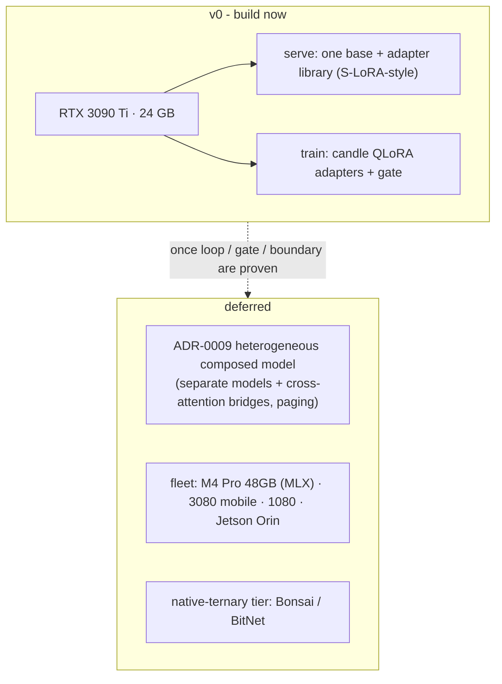

# ADR-0006 - Hardware-adaptive serving (v0: one GPU, one base + adapters)

**Status:** Proposed (amended 2026-06-02, ternary scope) · **v0 scoped to a single RTX 3090 Ti** · **Date:** 2026-05-30 · **Related:** 0001 (adapters), 0002 (training), 0005 (gate), 0009 (north star)

> **First serving path (2026-06-03).** `antumbra-serve::CandleServe` implements the `Serve` port by reusing the
> trainer's candle Qwen2.5-Coder + LoRA model: it loads the shared base, restores a graduated expert's adapter
> (`QwenCausalLm::load_adapter` -> `VarMap::load`), and generates. Validated on the GPU via the CLI `ask`
> command: `ask "add two integers"` routed to the arith specialist, loaded `arith_g0.safetensors`, and emitted
> `def add(a, b): return a + b`; `ask "reverse a string"` routed to the strings specialist and emitted
> `return s[::-1]`. This is v0 single-adapter serving (one configured adapter per `act`); multi-adapter hot-swap
> (S-LoRA) and the `llama-cpp-2` / `mistral.rs` backends with the ternary tier remain the deferred richer scope.
> It also unblocks the real `AcceptabilityProbe` (ADR-0004): a behavior can now be generated and then judged.

> **Resident multi-adapter engine (2026-06-04).** `antumbra-serve::MultiAdapterServe` now implements the S-LoRA
> hot-swap directly on the candle path: it loads the shared base **once** (neutral zero LoRA factors) and, per
> request, `load_adapter`s the routed expert's factors into the resident model — an O(adapter) swap, not an
> O(base) reload — skipping the swap when consecutive routes name the same expert. A registered
> `ExpertId -> adapter-path` map resolves the gate's selections; resolution failures (empty request, unregistered
> expert) error *before* any device load, so that logic is unit-tested on CPU, and the candle generation path is
> type-checked under `--features models`. v0 serves the single top-ranked adapter; a true latent blend of >1
> (which changes the LoRA rank and so the base shape) stays the `ask --with` `compose_adapters` path.
>
> Its long-running caller landed the same day: `antumbra serve` registers every expert's adapter into one
> resident `MultiAdapterServe`, then routes a single `--task` or a stream of stdin prompts through the learned
> router and answers from the resident engine — a stream pays the base load only on the first prompt and reuses
> the loaded factors when consecutive prompts route to the same expert.
>
> **GPU-validated (2026-06-05).** On the RTX 3090 Ti (CUDA 13.3): `train` learned a LoRA on `smoke.json`
> (graduated, pass-rate 1.0), then both serving paths answered through it — `ask` (`CandleServe`: routed to the
> expert, cold-loaded `adapters/run_train_g0.safetensors`, generated) and `serve` (`MultiAdapterServe`: registered
> the adapter, loaded the base once, hot-swapped, and served). So the candle forward/backward/save and the
> S-LoRA hot-swap are proven on real hardware, not just type-checked. (Generation quality is untuned — the smoke
> corpus uses a trivial always-pass verifier; this validated the *pipeline*, not the model's answers.)

## Context

The eventual target is a heterogeneous home cluster, but building placement first would sink the project before
the core science is proven. Decision: **target a single RTX 3090 Ti (24 GB, Ampere) for v0**, and lean on the
shared-base-adapter design (ADR-0001) that fits one card comfortably.

## Decision

### v0 - one base, many adapters, all-Rust

1. **Serve one shared base + a library of LoRA adapters** via `llama-cpp-2` (GGUF + LoRA hot-swap) or
   `mistral.rs` (candle, ISQ). This is **S-LoRA-style multi-adapter serving**: a 7–8 B base at Q4 ≈ 5 GB, plus
   many adapters of a few MB each - dozens fit on 24 GB. vLLM is dropped (Python, unjustified for one GPU).
2. **Train on the same GPU** via the DIY `candle` path (adapters + gate, ADR-0002/0005).
3. **Base model is code-capable** (Qwen-Coder-class or code-tuned OLMo 3) for the coding-over-repos first domain.
4. **The optional flagship escalation tier** (ADR-0005) is the only external call - used out-of-scope and at
   cold-start, shrinking over time.

### Deferred - recorded so the seam exists

- **Heterogeneous composition (ADR-0009)** is the north star and the memory-hungry path; it needs sparse
  selection + paging and likely more than 24 GB. The user acknowledges the hardware limit - v0 stays shared-base.
- **The fleet:** RTX 3090 Ti 24 GB · MacBook M4 Pro 48 GB (Metal/**MLX**, largest capacity) · RTX 3080 mobile
  8/16 GB · GTX 1080 8 GB (Pascal, weak at low-bit) · Jetson Orin Nano Super 8 GB (edge). Placement-aware
  routing (S-LoRA 2311.03285, Punica 2310.18547), a `device_profile` registry, LRU/predictive eviction.
- **The ternary tier** (Bonsai 1.58-bit / Microsoft BitNet `bitnet.cpp`) is an 8 GB-edge density play - only
  relevant once the small devices join. Both are llama.cpp forks; **llama.cpp is the engine floor, not a
  wrapper**.

### Amendment (2026-06-02) - ternary is a north-star density lever, not a v0 substrate

The live question - *"use many tiny native-ternary models (Bonsai / BitNet) as the population instead of
shared-base adapters?"* - is **rejected for v0** and **retained as a candidate density mechanism for the
heterogeneous north star (ADR-0009).** Ternary optimizes static weight memory, which is **not v0's binding
constraint** (a 7–8 B code base at Q4 ≈ 5 GB leaves the 24 GB card ample room). It regresses the axes v0 *is*
built on:

| Axis | Shared-base adapters (v0) | Many native-ternary models |
|---|---|---|
| Static weight memory | base ≈ 5 GB + adapters (MBs) | smaller per model - **ternary wins** |
| Cheap plasticity (ADR-0002) | spawn = train a few-MB LoRA, then freeze | ternary needs quantization-aware training; graduation = train a whole model - **breaks the disposable-shadow loop** |
| Code-capable verified signal (ADR-0002/0004) | strong shared code base acts well enough to pass tests | no strong code-capable ternary today (Bonsai ~0.5 B general; BitNet 2B4T non-coder) → **cold-start collapse** |
| Composition | latent-space adapter mixing over one base (ADR-0005), no bridges | separate models → inherits ADR-0009 cross-attention bridges + representation alignment |

**Why it still lives in this ADR:** ternary shrinks **weights only** - not KV-cache, activations, or the
bridges - so it *softens* the ADR-0009 memory wall rather than removing it. That is precisely its right role:
prove the science on shared-base adapters first, then reach for ternary to make *N genuinely-separate frozen
experts* resident at once when ADR-0009 wakes. A ternary **shared base** (keeping the adapter architecture) is
also rejected - it trades away the code-capability the keystone (ADR-0004) needs to solve a density problem v0
does not have.

## Consequences

- **Positive:** drastically smaller v0; all-Rust; one base + adapters is exactly what a 24 GB card is good at;
  placement, the fleet, and ternary all defer cleanly; the future is documented.
- **Negative:** single point of failure / limited parallelism; the deferred work is real and reopens this ADR
  and ADR-0009.
- **Neutral:** the gate (ADR-0005) treats adapters uniformly, so future device-placement is additive.

## Alternatives considered

- **Design for the full fleet / heterogeneous composition now.** Rejected: complexity before the science holds.
- **Native-ternary now (Bonsai / BitNet) as the v0 population.** Rejected for v0: unnecessary on 24 GB; locks
  the population to a young family; breaks cheap LoRA plasticity and the code-capable cold-start signal. Full
  rationale in the *Amendment (2026-06-02)* above; ternary is retained as an ADR-0009 density lever.
- **Keep vLLM.** Rejected: Python; unjustified for single-GPU multi-adapter serving.

## Validation

A seed adapter answers a corpus (repo) task end-to-end on the 3090 Ti, served by `llama-cpp-2`/`mistral.rs` and
trained by the candle path. *Kill criterion:* the all-Rust serve+train loop can't complete on one GPU → revisit
engine choices before adding any device.
