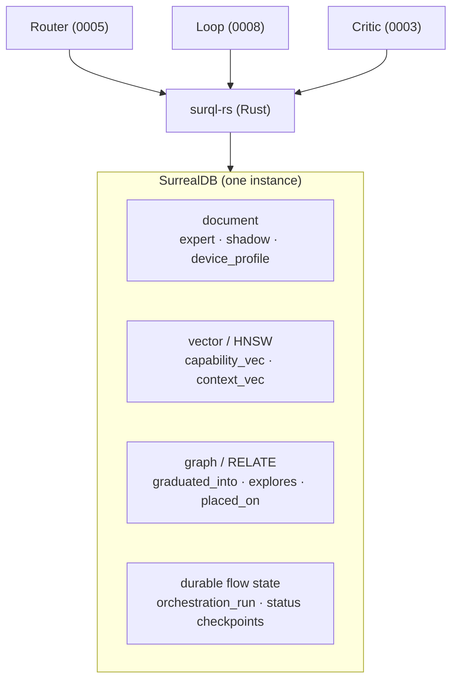

# ADR-0007 - SurrealDB as the unified substrate

**Status:** Accepted - v0 substrate implemented (2026-06-02) · **Date:** 2026-05-30 · **Related:** all ADRs (every store lives here)

## Context

Antumbra needs a document store (the stores), a vector index (router retrieval, boundary lookup), a graph
(lineage), and durable flow state (resumable loop/router). Running four systems is overhead. SurrealDB is one
multi-model engine that does all four, and `surql-rs` (`oneiriq-surql` ≥ 0.28) gives Rust a type-safe layer
with HNSW index defs, `<|k|>` KNN, `RELATE`/traverse helpers, migrations, and transactions - exactly this
project's hot path.

Two proven references inform the schema (we reuse their **persistence patterns**, not their orchestration):
**kushtaka** (memory networks, HNSW recall, `memory_contradiction`, `evaluation_run` + `regression_fingerprint`)
and the local **data-plane-builder-graph** at `C:\Users\shonp\repos\data-plane-builder-graph` (schema-as-code
in `shared/schema/*.py`, drift detection in `schema/drift.py`, timestamped `migrations/`, tenant `PERMISSIONS`
in `schema/_permissions.py`).

## Decision

A single SurrealDB instance is every store **and** the durable flow state, accessed only through `surql-rs`.
Schema is authored as `surql-rs` migrations with drift detection (the dpbg pattern). `EMBED_DIM = 384`
(all-MiniLM-L6-v2 convention; the embedder choice moved to MiniLM, see ADR-0005).

> **Rule:** schema, reads, writes, and KNN go through `surql-rs` abstractions (the schema builders, the
> `Query` builder, the `crud` helpers) — no hand-authored SurrealQL for data access. The **one** exception is
> the engine-enforced **table PERMISSIONS predicates** (the ACL subqueries in `schema.rs`, ADR-0013/0014):
> SurrealQL expression strings rendered onto the builder-generated `DEFINE TABLE`, because the row-level ACL
> has no builder representation. Those predicates are the deliberate, reviewed exception — not a data path.

### Implementation note (v0, 2026-06-02)

The `antumbra-store` crate implements this substrate against **`oneiriq-surql` 0.28** (public on crates.io,
lib `surql`, feature `client-rustls`) on the **SurrealDB 3.x** driver - builder-only, no hand-authored SurrealQL:

- **Schema as code** via the surql-rs builders (`table_schema`, `hnsw_index`, `unique_index`, `index`); the
  `DEFINE` DDL is *generated*, not written. v0 tables are `SCHEMALESS` with explicit unique + HNSW indexes;
  tightening to `SCHEMAFULL` and adopting the migration-history runner are follow-ups.
- **Reads/writes/KNN** via `crud::{create_record, upsert_record, get_record, query_records, first}` (bound
  `$data`) and the `Query` builder, with `Query::vector_search` for cosine KNN.
- **Identity:** the domain id is stored in a `key` column (SurrealDB's `id` is the reserved record id);
  `RecordID` auto-escapes complex keys for the durable-checkpoint rows.
- **Engines:** embedded `kv-mem` (tests, ephemeral) and `kv-surrealkv` (durable local file) are lit up via a
  direct `surrealdb` dependency; remote `ws://` also works. v3 note: `type::thing` → `type::record`.



### Schema (DDL)

```surql
-- Expert population (ADR-0001). Weights on disk; DB holds metadata + capability vector.
DEFINE TABLE expert SCHEMAFULL;
DEFINE FIELD name            ON expert TYPE string;
DEFINE FIELD base_model      ON expert TYPE string;                  -- e.g. olmo3-7b, qwen3-1.7b
DEFINE FIELD artifact_uri    ON expert TYPE string;                  -- gguf / safetensors / lora path
DEFINE FIELD capability_card ON expert TYPE object DEFAULT {};       -- structured "what I do"
DEFINE FIELD capability_vec  ON expert TYPE option<array<float>>;    -- learned, from eval behavior (0005)
DEFINE FIELD fitness         ON expert TYPE float DEFAULT 0.0;
DEFINE FIELD frozen_at       ON expert TYPE option<datetime>;        -- null = not yet frozen
DEFINE FIELD generation      ON expert TYPE int DEFAULT 0;
DEFINE FIELD created_at       ON expert TYPE datetime DEFAULT time::now();
DEFINE INDEX expert_name_idx ON expert FIELDS name UNIQUE;
DEFINE INDEX expert_cap_hnsw ON expert
    FIELDS capability_vec HNSW DIMENSION 384 DIST COSINE TYPE F32;  -- routing-as-retrieval (0005)

-- Shadow lifecycle (ADR-0002). The trainable penumbra.
DEFINE TABLE shadow SCHEMAFULL;
DEFINE FIELD parent_expert ON shadow TYPE option<record<expert>>;
DEFINE FIELD adapter_uri   ON shadow TYPE option<string>;           -- LoRA checkpoint
DEFINE FIELD status        ON shadow TYPE string
    ASSERT $value IN ['spawning','exploring','scoring','graduated','pruned'];
DEFINE FIELD generation    ON shadow TYPE int;
DEFINE FIELD reward_curve  ON shadow TYPE array<float> DEFAULT [];
DEFINE FIELD created_at     ON shadow TYPE datetime DEFAULT time::now();
DEFINE INDEX shadow_status_idx ON shadow FIELDS status, generation;
DEFINE TABLE graduated_into TYPE RELATION FROM shadow TO expert;     -- lineage
DEFINE TABLE explores       TYPE RELATION FROM shadow TO expert;

-- Critic signal (ADR-0003). Dense per-step reward, verifiable-first.
DEFINE TABLE reward_signal SCHEMAFULL;
DEFINE FIELD run_id     ON reward_signal TYPE string;
DEFINE FIELD step_idx   ON reward_signal TYPE int;
DEFINE FIELD dimension  ON reward_signal TYPE string;               -- tests|schema|exec|critic|...
DEFINE FIELD value      ON reward_signal TYPE float;
DEFINE FIELD source     ON reward_signal TYPE string
    ASSERT $value IN ['verifier','critic'];                        -- verifier = primary, critic = densifier
DEFINE FIELD created_at ON reward_signal TYPE datetime DEFAULT time::now();
DEFINE INDEX reward_run_idx ON reward_signal FIELDS run_id, step_idx;

-- Inhibitory store (ADR-0004). Boundary, not just a negative. Survives generations.
DEFINE TABLE failure_boundary SCHEMAFULL;
DEFINE FIELD action          ON failure_boundary TYPE string;
DEFINE FIELD fail_context    ON failure_boundary TYPE object;       -- where it fails (C)
DEFINE FIELD near_ok_context ON failure_boundary TYPE option<object>; -- nearest where it doesn't (C')
DEFINE FIELD context_vec     ON failure_boundary TYPE option<array<float>>;
DEFINE FIELD confidence      ON failure_boundary TYPE float DEFAULT 0.5;
DEFINE FIELD generation      ON failure_boundary TYPE int;
DEFINE FIELD created_at       ON failure_boundary TYPE datetime DEFAULT time::now();
DEFINE INDEX fb_ctx_hnsw ON failure_boundary
    FIELDS context_vec HNSW DIMENSION 384 DIST COSINE TYPE F32;    -- inhibitory penalty lookup (0005)
DEFINE TABLE boundary_evidence TYPE RELATION FROM failure_boundary TO shadow;

-- Durable orchestration + generational loop (ADR-0005/0008). State = checkpoint.
DEFINE TABLE orchestration_run SCHEMAFULL;
DEFINE FIELD task_id         ON orchestration_run TYPE string;
DEFINE FIELD round           ON orchestration_run TYPE int DEFAULT 0;
DEFINE FIELD status          ON orchestration_run TYPE string
    ASSERT $value IN ['routing','executing','scoring','deciding','done','failed'];
DEFINE FIELD chosen_experts  ON orchestration_run TYPE array<record<expert>> DEFAULT [];
DEFINE FIELD compose_strategy ON orchestration_run TYPE option<string>;  -- parallel|cascade|vote|refine
DEFINE FIELD updated_at      ON orchestration_run TYPE datetime DEFAULT time::now();
DEFINE INDEX orun_status_idx ON orchestration_run FIELDS status, updated_at;  -- resume stalled runs

-- Placement (ADR-0006) - defined now, used when the fleet wakes up.
DEFINE TABLE device_profile SCHEMAFULL;
DEFINE FIELD host         ON device_profile TYPE string;
DEFINE FIELD backend      ON device_profile TYPE string;           -- cuda|metal|mlx|cpu
DEFINE FIELD vram_gb      ON device_profile TYPE float;
DEFINE FIELD capabilities ON device_profile TYPE object DEFAULT {};
DEFINE INDEX device_host_idx ON device_profile FIELDS host, backend;
DEFINE TABLE placed_on TYPE RELATION FROM expert TO device_profile;

-- Validation harness (kushtaka's strongest idea: one row per measured run).
DEFINE TABLE evaluation_run SCHEMAFULL;
DEFINE FIELD run_id        ON evaluation_run TYPE string;
DEFINE FIELD subject_kind  ON evaluation_run TYPE string
    ASSERT $value IN ['expert','shadow','router','composed'];
DEFINE FIELD subject_id    ON evaluation_run TYPE string;
DEFINE FIELD corpus_task_id ON evaluation_run TYPE string;
DEFINE FIELD status        ON evaluation_run TYPE string
    ASSERT $value IN ['pending','running','success','failure','error'];
DEFINE FIELD metrics       ON evaluation_run TYPE option<object>;
DEFINE FIELD regression_fingerprint ON evaluation_run TYPE option<string>;  -- sha256(canonical output)
DEFINE FIELD created_at     ON evaluation_run TYPE datetime DEFAULT time::now();
DEFINE INDEX eval_subject_idx ON evaluation_run FIELDS subject_kind, subject_id;
```

## Consequences

- **Positive:** one system for document + vector + graph + durable state; `surql-rs` matches the Rust plane;
  proven patterns (drift detection, migrations, `regression_fingerprint`) are reused, not reinvented.
- **Negative:** single-DB coupling; the `failure_boundary` and memory tables grow unbounded → need a merge/decay
  policy (a learning problem inside the learning system); KNN-with-relational-filters is raw SurrealQL (the
  `surql-rs` query builder doesn't cover it) - acceptable.
- **Neutral:** `device_profile` / `placed_on` are defined now but inert until ADR-0006's fleet wakes up.

## Alternatives considered

- **Separate vector DB + document DB + graph DB.** Rejected: operational overhead; SurrealDB unifies them.
- **Reuse dpbg / kushtaka schema as a dependency.** Rejected (greenfield); their *patterns* are adopted, the
  code is not.

## Validation

Apply `migrations/` to a local SurrealDB; confirm tables + both HNSW indexes exist and `INFO FOR DB` is clean.
*Kill criterion:* HNSW KNN with a relational filter can't be expressed performantly → reconsider the substrate
for the router path before building on it.
