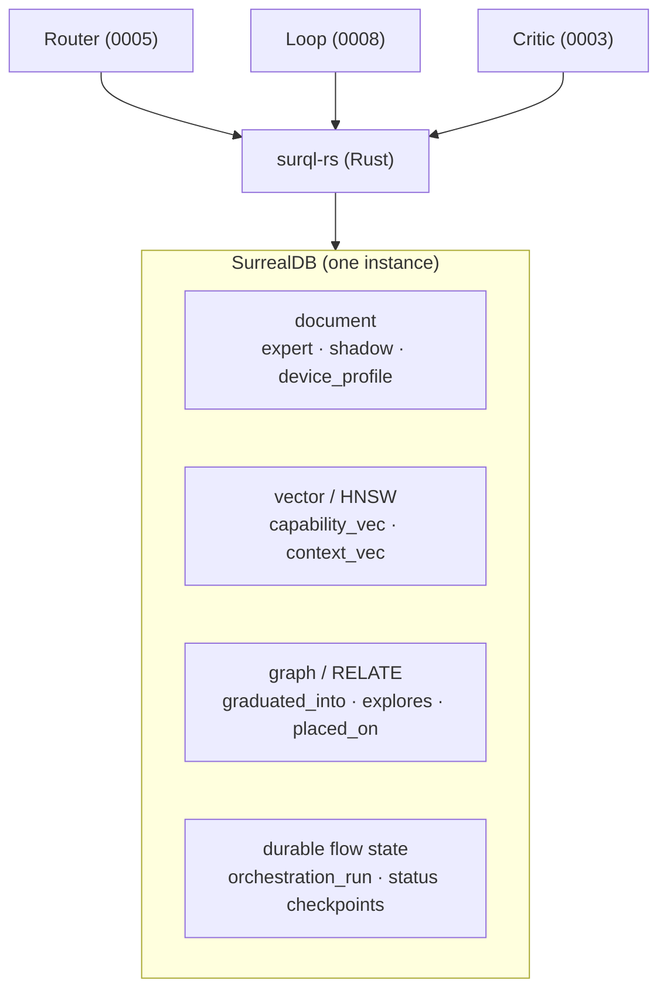

# ADR-0007 - SurrealDB as the unified substrate

**Status:** Accepted - v0 substrate implemented (2026-06-02) · **Date:** 2026-05-30 · **Related:** all ADRs (every store lives here)

## Context

Antumbra needs a document store (the stores), a vector index (router retrieval, boundary lookup), a graph (lineage), and durable flow state (resumable loop/router). Running four systems is overhead. SurrealDB is one multi-model engine that does all four, and `surql-rs` (`oneiriq-surql` ≥ 0.28) gives Rust a type-safe layer with HNSW index defs, `<|k|>` KNN, `RELATE`/traverse helpers, migrations, and transactions - exactly this project's hot path.

Two proven references inform the schema (we reuse their **persistence patterns**, not their orchestration): a prior memory engine (memory networks, HNSW recall, `memory_contradiction`, `evaluation_run` + `regression_fingerprint`) and the local **data-plane-builder-graph** at `C:\Users\shonp\repos\data-plane-builder-graph` (schema-as-code in `shared/schema/*.py`, drift detection in `schema/drift.py`, timestamped `migrations/`, tenant `PERMISSIONS` in `schema/_permissions.py`).

## Decision

A single SurrealDB instance is every store **and** the durable flow state, accessed only through `surql-rs`. Schema is authored as `surql-rs` migrations with drift detection (the dpbg pattern). `EMBED_DIM = 384` (all-MiniLM-L6-v2 convention; the embedder choice moved to MiniLM, see ADR-0005).

> **Rule:** schema, reads, writes, and KNN go through `surql-rs` abstractions (the schema builders, the `Query` builder, the `crud` helpers); no hand-authored SurrealQL for data access. The **one** exception is the engine-enforced **table PERMISSIONS predicates** (the ACL subqueries in `schema.rs`, ADR-0013/0014): SurrealQL expression strings rendered onto the builder-generated `DEFINE TABLE`, because the row-level ACL has no builder representation. Those predicates are the deliberate, reviewed exception, not a data path.

### Implementation note (v0, 2026-06-02)

The `antumbra-store` crate implements this substrate against **`oneiriq-surql` 0.28** (public on crates.io, lib `surql`, feature `client-rustls`) on the **SurrealDB 3.x** driver - builder-only, no hand-authored SurrealQL:

- **Schema as code** via the surql-rs builders (`table_schema`, `hnsw_index`, `unique_index`, `index`); the `DEFINE` DDL is _generated_, not written. v0 tables are `SCHEMALESS` with explicit unique + HNSW indexes; tightening to `SCHEMAFULL` and adopting the migration-history runner are follow-ups.
- **Reads/writes/KNN** via `crud::{create_record, upsert_record, get_record, query_records, first}` (bound `$data`) and the `Query` builder, with `Query::vector_search` for cosine KNN.
- **Identity:** the domain id is stored in a `key` column (SurrealDB's `id` is the reserved record id); `RecordID` auto-escapes complex keys for the durable-checkpoint rows.
- **Engines:** embedded `kv-mem` (tests, ephemeral) and `kv-surrealkv` (durable local file) are lit up via a direct `surrealdb` dependency; remote `ws://` also works. v3 note: `type::thing` → `type::record`.



### Implementation note (2026-08-13): the KNN operator form, and the kill criterion

The v0 note above says KNN goes through `Query::vector_search`. It did, and that was the wrong half of the operator. SurrealDB's `<|k,_|>` decides its plan on the **second operand**: an integer is the HNSW search effort and the engine walks the index (`KnnScan`); a metric keyword there asks for an exhaustive comparison over a table scan (`KnnTopK`). `vector_search` renders the metric form. So every recall path in this store — expert routing, boundary lookup, memory recall, document recall — compared every row while four HNSW indexes sat built and unused. Nothing failed; the answers were correct and the indexes were decoration.

All four now render `Query::vector_search_indexed` (surql-rs 0.33), which emits `<|k,ef|>` and leaves the metric to the index definition. `store.rs` pins the plan for each of the four tables through `EXPLAIN`, in both directions: the indexed form must reach the named index, and the metric form must not. The second assertion is what keeps the first one meaningful if a future engine re-plans.

This also settles the **kill criterion** in Validation below, which asked whether HNSW KNN with a relational filter could be expressed performantly. It can, with one caveat that is a property of ANN rather than of this engine: beside an index-backed KNN, a `WHERE` is a **residual** filter. The graph walk returns its nearest neighbours across the whole table and the tenant equality (and the tombstone check) thin them afterwards, so a recall that asks for exactly `k` can come back short — or empty, for a tenant holding a small share of a large table. `antumbra_store::knn` sizes a wider candidate pool for the filtered paths and the answer is truncated to `k` after the thinning; the unfiltered paths (the shared expert and boundary populations) ask for `k` and get `k`. The exhaustive form did not have this property, which is the one thing it was better at, and it is why the change carries a regression test rather than only a plan assertion.

### Schema (surql-rs builders)

Authored the way the store is: surql-rs builders in `antumbra-store/schema.rs`, the single source of truth with migrations and drift detection. Tables are SCHEMALESS in v0, so there is no field DDL; the fields each table carries are documented in the comments below. The only hand-authored SurrealQL anywhere is the permission predicate strings passed to `.with_permissions(...)` (ADR-0013/0014). The domain id lives in a `key` field (SurrealDB `id` is reserved), so the unique indexes are on `key`. The graph relations (`graduated_into`, `explores`, `boundary_evidence`, `placed_on`) are created by `RELATE` at runtime, not defined here.

```rust
// Expert population (ADR-0001). Fields: key, name, base_model, artifact_uri,
// capability_card (object), capability_vec (learned via eval behavior, ADR-0005),
// fitness, frozen_at, generation, created_at. Shared experts (owner = NONE) read
// by all, private experts read by their owner only, owner/root writes.
table_schema("expert")
    .with_mode(TableMode::Schemaless)
    .with_permissions(EXPERT_PERMS)
    .with_indexes([
        unique_index("expert_key_uq", ["key"]),
        hnsw_index("expert_cap_hnsw", "capability_vec", embed_dim,
            HnswDistanceType::Cosine, MTreeVectorType::F32, None, None),
    ]),

// Shadow lifecycle (ADR-0002), the trainable penumbra. Fields: key,
// parent_expert, adapter_uri, status in {spawning, exploring, scoring,
// graduated, pruned}, generation, reward_curve, created_at.
table_schema("shadow")
    .with_mode(TableMode::Schemaless)
    .with_indexes([
        unique_index("shadow_key_uq", ["key"]),
        index("shadow_status_idx", ["status", "generation"]),
    ]),

// Critic signal (ADR-0003), verifier-first. Fields: run_id, step_idx, dimension
// (tests, schema, exec, critic, ...), value, source in {verifier, critic},
// created_at.
table_schema("reward_signal")
    .with_mode(TableMode::Schemaless)
    .with_indexes([index("reward_run_idx", ["run_id", "step_idx"])]),

// Inhibitory store (ADR-0004), the counterfactual boundary. Shared population
// (any tenant reads, owner/root writes). Fields: key, action, fail_context (C),
// near_ok_context (C'), context_vec, confidence, generation, created_at.
table_schema("failure_boundary")
    .with_mode(TableMode::Schemaless)
    .with_permissions(SHARED_POPULATION_PERMS)
    .with_indexes([
        unique_index("fb_key_uq", ["key"]),
        hnsw_index("fb_ctx_hnsw", "context_vec", embed_dim,
            HnswDistanceType::Cosine, MTreeVectorType::F32, None, None),
    ]),

// Durable orchestration and generational loop (ADR-0005/0008). Fields: key,
// task_id, round, status in {routing, executing, scoring, deciding, done,
// failed}, chosen_experts, compose_strategy (parallel|cascade|vote|refine),
// updated_at.
table_schema("orchestration_run")
    .with_mode(TableMode::Schemaless)
    .with_indexes([
        unique_index("orun_key_uq", ["key"]),
        index("orun_status_idx", ["status", "updated_at"]),
    ]),

// Placement registry (ADR-0006), inert until the fleet wakes (ADR-0017). Fields:
// host, backend in {cuda, metal, mlx, cpu}, vram_gb, capabilities.
table_schema("device_profile")
    .with_mode(TableMode::Schemaless)
    .with_indexes([index("device_host_idx", ["host", "backend"])]),

// Validation harness. Fields: run_id, subject_kind in {expert, shadow, router,
// composed}, subject_id, corpus_task_id, status in {pending, running, success,
// failure, error}, metrics, regression_fingerprint (sha256), created_at.
table_schema("evaluation_run")
    .with_mode(TableMode::Schemaless)
    .with_indexes([index("eval_subject_idx", ["subject_kind", "subject_id"])]),
```

## Consequences

- **Positive:** one system for document + vector + graph + durable state; `surql-rs` matches the Rust plane; proven patterns (drift detection, migrations, `regression_fingerprint`) are reused, not reinvented.
- **Negative:** single-DB coupling; the `failure_boundary` and memory tables grow unbounded → need a merge/decay policy (a learning problem inside the learning system); KNN-with-relational-filters is raw SurrealQL (the `surql-rs` query builder doesn't cover it) - acceptable. _(Superseded 2026-08-13: the builder covers it. What remains is that the filter is a residual, handled by over-fetching — see the implementation note above.)_
- **Neutral:** `device_profile` / `placed_on` are defined now but inert until ADR-0006's fleet wakes up.

## Alternatives considered

- **Separate vector DB + document DB + graph DB.** Rejected: operational overhead; SurrealDB unifies them.
- **Reuse the dpbg / prior-engine schema as a dependency.** Rejected (greenfield); their _patterns_ are adopted, the code is not.

## Validation

Apply `migrations/` to a local SurrealDB; confirm tables + both HNSW indexes exist and `INFO FOR DB` is clean. _Kill criterion:_ HNSW KNN with a relational filter can't be expressed performantly → reconsider the substrate for the router path before building on it.
