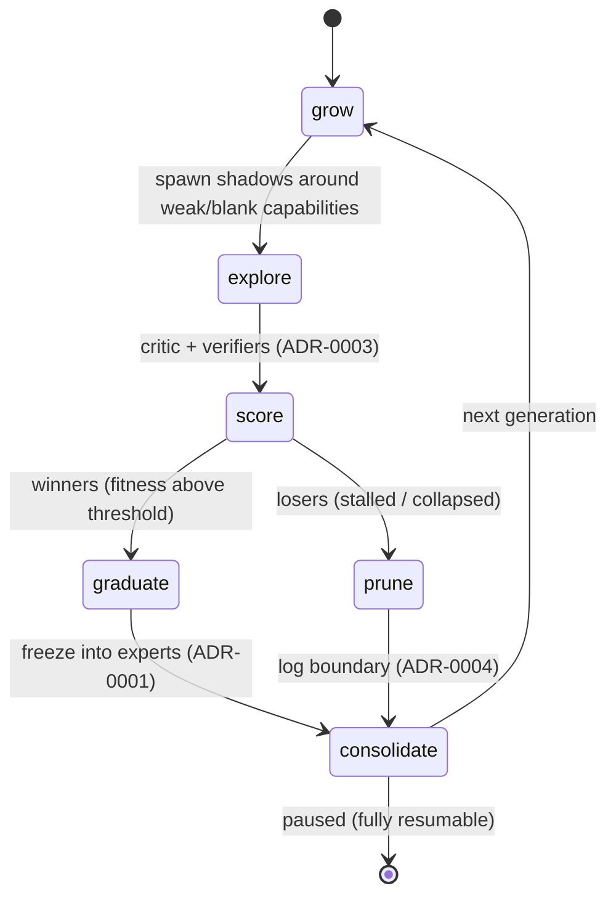

# ADR-0008 - The durable generational loop

**Status:** Proposed · **Date:** 2026-05-30 · **Related:** 0001 (experts), 0002 (shadows), 0003 (critic), 0004 (boundaries), 0005 (router)

## Context

ADRs 0001 through 0005 describe _parts_; something has to drive them as one continuous process: grow shadows, let them explore, score them, graduate the winners, prune the losers, consolidate failures, repeat - unattended, across reboots. A conventional agent loop is _task-centric_ (one task at a time); Antumbra's must be **population-aware** (it manages a growing population across generations) and **durable** (it survives crashes by treating persisted `status` as the checkpoint - the dpbg pattern, done as a real flow engine rather than CRUD handlers).

## Decision

A single resumable **state-machine-in-DB**. Every transition is a transactional `surql-rs` write; the loop can be killed at any point and resumes from the last persisted `status`. This is the **same engine** as the router's multi-round flow (ADR-0005).

1. **grow** - decide where the population is weak (gaps from `evaluation_run`, recurring tasks the router can't satisfy) and spawn shadows there.
2. **explore** - shadows train (DIY candle QLoRA, ADR-0002).
3. **score** - verifiers + critic produce `reward_signal` (ADR-0003).
4. **graduate / prune** - winners freeze into experts (ADR-0001) and update `capability_vec`; losers are discarded and their failure is consolidated into `failure_boundary` (ADR-0004).
5. **consolidate** - update fitness, apply merge/decay to the stores, reindex HNSW; checkpoint; loop.

## Consequences

- **Positive:** the whole system is one durable, restartable process; population growth and old-skill retention are managed in one place; every generation is auditable via `evaluation_run`.
- **Negative:** a buggy loop can spawn/prune pathologically (runaway population, premature pruning) - needs guard rails and budgets; state-machine complexity is real.
- **Neutral:** "population-aware scheduling across the cluster" is the ADR-0006-fleet version; v0 runs the same loop on one GPU.

## Alternatives considered

- **Reuse a conventional task loop.** Rejected: task-centric, not population-aware (greenfield anyway).
- **In-memory loop, persist only results.** Rejected: not crash-resumable; the durable-state property is the point.
- **A general workflow engine (Temporal etc.).** Rejected for v0: heavyweight; the state machine over SurrealDB is enough and keeps everything in one substrate.

## Validation

Run the loop unattended across a deliberate kill/restart: it must resume from the `orchestration_run` / generation `status` checkpoint, and the population must grow while prior-skill fitness holds (the ADR-0001/0002 forgetting check, at scale). _Kill criterion:_ old skills regress as the population grows → forgetting has reappeared at scale; return to the ADR-0001/0002 gate.
