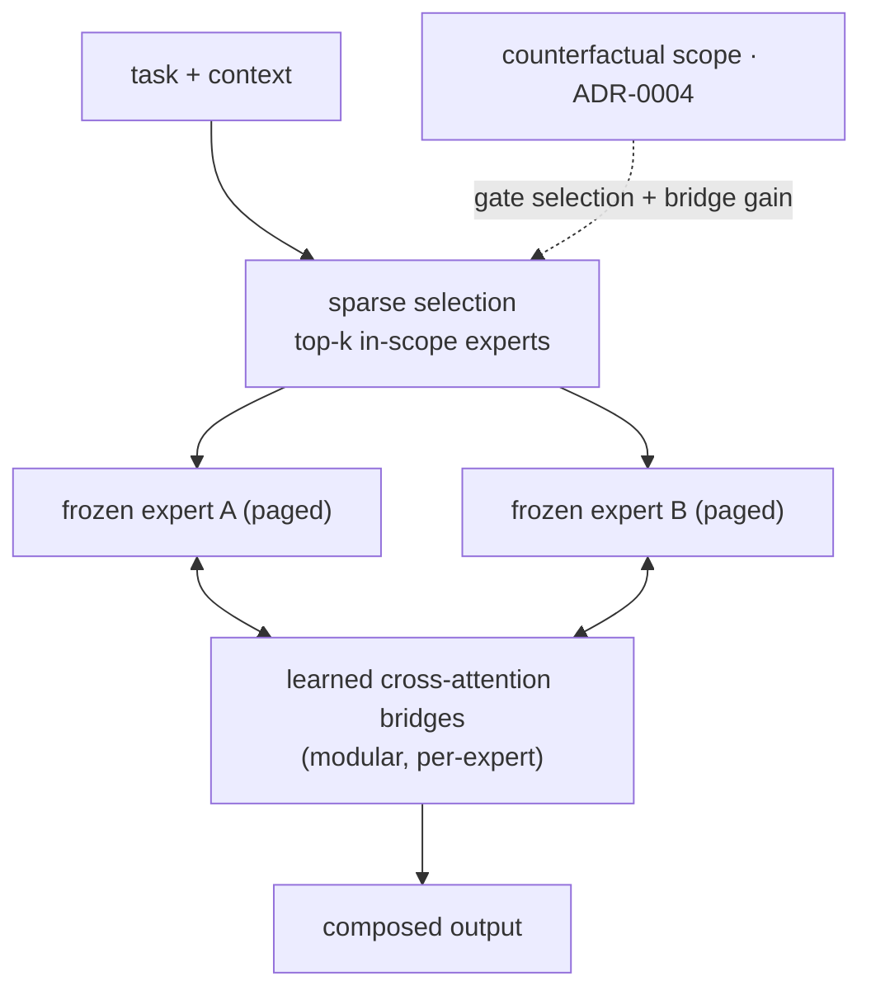

# ADR-0009 - The heterogeneous composed model (north star)

**Status:** North star (deferred) · **Date:** 2026-05-30 · **Related:** 0001 (experts), 0004 (boundary), 0005 (gate), 0006 (hardware)

> **Adapter-level stepping stone realized (2026-06-04).** The four parts below now have a working, shared-base
> realization in LoRA-space (EXP-013 through 017), ahead of the cross-attention-bridge version this ADR ultimately
> wants: (1) **sparse selection** = the learned router (EXP-013), a trained per-dimension metric over the
> population's exemplars, with OOD abstention (EXP-017); (2) **composition** = exact rank-concatenation of the
> selected frozen experts' deltas (EXP-014), the merge being exact because they share base rank/scale; the
> complementary multiplier (a project tool ⊕ a standing convention → `bun add X --save-exact`, neither expert
> alone) is shown in EXP-015; (3) **modular additive growth** holds: experts are frozen and independently
> grown, the router auto-retrains on each addition (self-maintaining), no retraining of others; (4) **boundary
> as latent gating** = the counterfactual boundary (ADR-0004) gates the served decision (EXP-016 closed loop;
> the gate escalates on OOD or boundary inhibition). What remains for *this* ADR proper: composition across
> *different bases/sizes* via learned cross-attention bridges (not shared-base adapter blending), and *per-token*
> bridge gain (the LD-MoLE direction, 2509.25684) instead of one weight per generation. Compass for the realized
> stepping stone: RAMoLE (2406.16989, retrieval-MoLE over a growing pool), DynMoLE (2504.00661), MoLE (2404.13628).

> This is the **end goal**: not a router over separate models, and not adapters over one base, but **a single
> model whose internal modules are genuinely separate, independently-trained, frozen experts**, composed in
> latent space. v0 (shared-base adapters, ADR-0001/0005) is the tractable stepping stone; this is where it
> grows. The hardware to do it at scale exceeds the current single 3090 Ti - an acknowledged limit.

## Context

The shared-base-adapter v0 is constrained to one base's "knowledge floor." The ambition is to compose *truly
different* frozen experts (different bases, sizes, even modalities) into one model - the strongest substrate for
genuine emergence, because composition happens in representation space rather than across a lossy text bus. This
is a live research frontier with existence proofs:

- **Branch-Train-MiX / BTX** (Sukhbaatar et al., 2403.07816) - train experts independently (embarrassingly
  parallel), then mix their FFNs into one MoE and finetune to learn token-level routing.
- **CALM** (*LLM Augmented LLMs: Expanding Capabilities through Composition*, Bansal et al., 2401.02412) - keep
  two models frozen, learn cross-attention bridges (plus small projections) between them.
- **Model stitching** (Bansal, Nakkiran & Barak, 2106.07682; orig. Lenc & Vedaldi 2015) - learned maps that
  align separate models' representation spaces.

CALM proves the *mechanism* (frozen models compose via learned bridges to gain capability); it does **not** yet
prove strong emergence at population scale. That remains the open bet - now on the strong substrate.

## Decision

Compose genuinely separate frozen experts via **learned cross-attention bridges**, keeping the experts frozen
and training only the connective tissue. Four parts:

1. **Sparse selection.** You cannot run a whole population in one forward pass; a gate (ADR-0005, generalized)
   selects the **top-k in-scope experts** per task and composes only those.
2. **Learned cross-attention bridges** let the selected experts attend into each other's intermediate
   representations. Only the bridges train (no-forgetting preserved - experts stay frozen).
3. **Modular, per-expert bridges** so adding an expert adds its bridge *without* retraining the others -
   additive growth, consistent with ADR-0001.
4. **The boundary as latent gating** (the keystone, ADR-0004): the counterfactual scope gates *both* the
   selection (only compose in-scope experts) *and* the bridge gain (attend to expert E ∝ `P(E correct |
   context)`). ADR-0004 becomes a modulator inside the forward pass.

## Continuity with v0 (why v0 is not throwaway)

Everything except the composition substrate carries straight over: the **boundary engine** (0004), the
**gate/selection logic** (0005), the **generational loop** (0008), the **critic + verified-outcome training**
(0002/0003), and the **substrate** (0007). Only "blend adapters over one base" becomes "select + bridge separate
models."

## Consequences

- **Positive:** the literal "model made of tiny models"; latent composition is a far better substrate for
  emergence than text routing; experts can be genuinely heterogeneous.
- **Negative:** **memory is the wall** - composing several full models + activations blows past 24 GB, forcing
  sparse top-k + CPU/disk paging; **representation mismatch** means bridges must learn alignment (hardest fully
  cross-architecture); it is a **third DIY-candle training target** (bridges) and the heaviest infra path.
- **Neutral:** this is where a Python escape-hatch for the bridge-training research spike is most defensible.

## Alternatives considered

- **Distillation / fusion** (FuseLLM, Wan et al., 2401.10491) - distill several models' output distributions
  into one new model. Rejected as the *mechanism*: it dissolves the frozen experts and breaks the no-forgetting
  thesis. "A model made of models" means runtime composition, not melting them down.
- **Shared-base adapters forever (stay at v0).** Not rejected - it *is* v0, and may prove sufficient. This ADR
  is the target if/when v0's one-base floor becomes the binding constraint.

## Validation (the north-star gate)

Minimal proof-of-mechanism first: **two frozen, genuinely-different experts + one learned cross-attention bridge
+ boundary-gated selection**, composing a task neither solves alone. *Kill criterion:* learned latent
composition of separate frozen experts yields no capability beyond the better single expert → the heterogeneous
bet is unproven; stay on shared-base adapters (still valuable).
