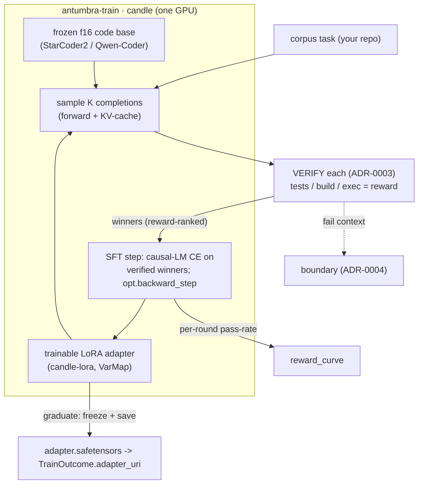

# ADR-0010 — The candle QLoRA trainer (antumbra-train)

**Status:** Accepted — pipeline implemented + compiles (2026-06-02); runtime validation pending on the 3090 Ti · **Date:** 2026-06-02 · **Related:** 0002 (shadow plasticity — this is its engine), 0003 (verified reward), 0001 (graduation target), 0006 (one GPU), 0005 (the gate is a second training target)

> **Implementation (2026-06-02).** The full pipeline is built and compiles
> (clippy-clean): the candle Qwen2.5-Coder + LoRA `CausalLm`
> (`antumbra-train/src/models/qwen.rs`, behind the `models` feature), the RAFT
> loop + `RaftTrainer` (the `Trainer` port), the `CommandVerifier` (ADR-0003
> environment reward), and `JsonCorpus`, all wired into the CLI:
> `cargo run -p antumbra-cli --features models,cuda -- train --corpus corpora/example-tasks.json`.
> The remaining step is **MT-3 runtime**: run it on the 3090 Ti (downloads the
> ~3 GB weights), confirm a shadow's pass-rate rises and the loop graduates a
> real adapter. The LoRA primitive, SFT objective, RAFT loop, trainer wiring,
> and verifier are all CPU-tested; only the GPU model is unvalidated at runtime.

> Concrete design for the heaviest component ADR-0002 named: the DIY `candle` path that turns a shadow into a
> trained adapter from **verified outcomes**. Synthesized from a literature + ecosystem review (2026-06-02).

## Context

ADR-0002 froze the experts and put all plasticity in short-lived shadow adapters, to be trained by a "DIY
`candle` QLoRA path … the highest-effort component." ADR-0003 fixed the training *signal*: **verified outcomes,
not a teacher's text**. The `Trainer` port already exists (`train_shadow(TrainRequest) -> TrainOutcome`); the
loop already calls it; the fake trainer proves the machine. This ADR commits the real one.

## Research synthesis

**Learning algorithm — RLVR, realized as reward-ranked fine-tuning.** "Train on verified outcomes" is exactly
*reinforcement learning with verifiable rewards* (RLVR). Two implementable families:

- **RAFT / RFT / expert-iteration** (Reward rAnked FineTuning, 2304.06767): sample `K` completions, verify each,
  fine-tune on the verified winners. It collapses to **weighted causal-LM cross-entropy on the model's own
  verified-correct generations** — no PPO, critic, importance ratios, or reference-KL machinery. Robust, and the
  natural first target for a hand-rolled `candle` path.
- **GRPO** (DeepSeek; critic-free group-relative policy gradient): more sample-efficient, much more machinery
  (token log-prob ratios, group-normalized advantages, KL-to-reference).

Supporting evidence: LoRA suffices for RL post-training (PERL, 2403.10704; "Evaluating PEFT for RLVR",
2512.23165); negatives carry signal when tagged ("Learning From Failure", 2402.11651 — dovetails with ADR-0004);
**data quality is decisive** ("Noisy data is destructive to RLVR", 2603.16140 — reinforces ADR-0003's
verifier-first rule). PEFT mechanics: LoRA (2106.09685), QLoRA's NF4 + double-quant + paged optimizers
(2305.14314).

**Engine — `candle` can train.** Confirmed: `candle-nn` provides `VarMap` + `VarBuilder` + `AdamW`/`SGD` and
autograd via `opt.backward_step(&loss)` (canonical loop in `candle-examples/mnist-training`). LoRA layer-swapping
+ adapter save/load is handled by **`candle-lora`** (freezes the base, swaps `Linear`/`Conv`/`Embedding` to
trainable LoRA, `get_tensors` → safetensors); `candle-transformers` ships code-capable bases (StarCoder2,
Qwen2). `mistral.rs` (X-LoRA inference) is the reference for ADR-0005/serve.

**The load-bearing constraint.** `candle`'s quantization is the llama.cpp **GGUF** family (Q4_K), not
bitsandbytes **NF4**, and `QMatMul` is **inference-only — no backward**. True 4-bit QLoRA therefore needs a DIY
quantized backward (dequantize the weight for the transpose). So **f16 base + LoRA comes first** (full candle
autograd, works today); the quantized base is a later, isolable lift — exactly the de-risking order ADR-0002
already prescribed ("plain LoRA over a bf16 base first; add NF4 once it works").

## Decision

Build `antumbra-train` as a `candle` crate implementing the existing `Trainer` port, staged:

1. **Algorithm:** v0 = **RAFT-style reward-ranked LoRA fine-tuning** on verified outcomes; v1 = GRPO.
2. **PEFT:** v0 = **LoRA over an f16 frozen, code-capable base**; v1 = GGUF Q4_K quantized base (DIY backward).
3. **Optimizer:** start `AdamW` for stability, expose `SGD`/added-noise (ADR-0002's continual-learning
   preference) behind config.
4. **Same port, heavier body.** `train_shadow` now: load base (+ optional parent adapter) → for each corpus task
   sample `K` → **verify** (the ADR-0003 verifier) → keep winners → SFT the LoRA → repeat → save adapter
   (safetensors) → return `TrainOutcome { adapter_uri, reward_curve = pass-rate per round, final_fitness }`.
5. **Generation lives here too.** RAFT needs sampling, so `antumbra-train` carries a `candle` forward + KV-cache
   generation loop. That same model code is the seed of `antumbra-serve` (ADR-0006) — they will share a model
   layer rather than duplicate it.

## Staged milestones (each a falsifiable experiment with a kill criterion)

- **MT-1 · generate.** A frozen f16 code base loads in `candle` on the GPU box and produces output for a repo
  task. *Kill:* can't load/generate a code base in candle on the target GPU → revisit base/engine before LoRA.
- **MT-2 · one LoRA step.** Attach a LoRA adapter; a single SFT step drives loss down on one example; the frozen
  base tensors are **byte-identical** after (the ADR-0002 isolation invariant). *Kill:* gradient doesn't reach
  the adapter, or the base mutates → the freeze+adapter premise is unsound.
- **MT-3 · RAFT closes the loop.** On a tiny *verifiable* corpus, sample→verify→SFT lifts pass-rate across
  rounds; the adapter saves and reloads; `antumbra-loop` graduates a **real** adapter (not the fake). *Kill:*
  RAFT can't raise in-scope pass-rate over the base → reconsider the algorithm (try GRPO) before scaling.
- **MT-4 · quantize (stretch).** GGUF Q4_K base with a DIY quantized backward; and/or the GRPO option. Deferred
  behind MT-3.

## Consequences

- **Positive:** the loop trains for real; the same candle model seeds serving (ADR-0006) and the learned gate
  (ADR-0005); RAFT is simple enough to hand-roll correctly and robust to reward noise; the Trainer port is
  unchanged so nothing upstream moves.
- **Negative:** the largest dependency graph in the workspace (candle + transformers + cuda) — gate it behind a
  feature so the rest stays light; generation + training in one crate is real complexity; the quantized backward
  is genuinely hard and stays deferred; GPU/VRAM bounds the base size.
- **Neutral:** `candle`'s GGUF-Q4 (vs NF4) is arguably a *better* fit — it is the same quant family
  `llama-cpp-2` serves (ADR-0006), so a graduated adapter is serveable without re-quantizing.

## Alternatives considered

- **GRPO first.** Rejected for v0: more machinery and harder to get right hand-rolled; RAFT reaches a trained
  adapter sooner and is the honest minimum. GRPO is the v1 sample-efficiency upgrade.
- **Imitation SFT on a teacher's text.** Rejected by ADR-0002/0003 (ToS-sensitive, ungrounded). The winners we
  SFT on are the model's *own* verified-correct outputs.
- **A thin Python Unsloth trainer behind the port.** Remains the explicit *fallback* if the candle path stalls
  (ADR-0002's risk table), not the plan.
- **bitsandbytes NF4 in v0.** Not available in candle; GGUF-Q4 is the candle-native quant, and only at MT-4.

## Open inputs (need before MT-1)

- **GPU box VRAM** → bounds the base: e.g. StarCoder2-3B or Qwen2.5-Coder-1.5B/3B comfortably ≤16 GB in f16;
  7B needs ~24 GB f16 with gradient checkpointing (or wait for MT-4 quant).
- **Base model choice** (code-capable, candle-supported): StarCoder2-3B (candle-lora has starcoder) vs
  Qwen2.5-Coder (candle-transformers qwen2 + candle-lora macro conversion).
