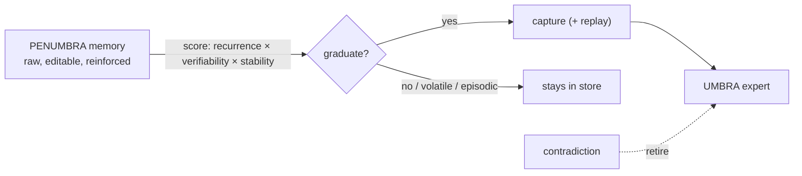

# ADR-0012 - Penumbra: the memory store and consolidation source

**Status:** Accepted · **Date:** 2026-06-04 · **Related:** 0001 (experts/umbra), 0002 (shadows), 0004 (boundary/antumbra), 0007 (substrate)

> **Naming reconciliation.** "Penumbra" is the _partial-shadow region_: everything soft, editable, and not-yet-frozen. It has two facets, both of which consolidate into the umbra: the **shadows-in-training** (trainable adapters, ADR-0002) and the **memory store** introduced here (raw, editable experiences). A memory deepens into umbra (a frozen expert) the same way a shadow graduates. The hippocampus to the population's neocortex.

## Context

People already hold verified competence in their agents' memory stores (a prior service, qdrant, a json file, surrealdb). A memory earned its place by working in production and being reinforced, and that reinforcement _is_ the reward signal RLVR would otherwise have to rediscover from a cold start. Antumbra needs a first-class memory substrate for three reasons: (1) it is the **bootstrap** that sidesteps the high-variance cold-start of pure self-discovery (EXP-019); (2) it is the natural **training unit** the population grows from; (3) collapsing a separate memory service into Antumbra removes a runtime seam (one repo, one schema, one `surql-rs` layer).

## Decision

A tenant-scoped **memory store** (`antumbra-core::Memory`, `antumbra-store` `memory` table + repo) holding content, an embedding (HNSW recall), a `network` (`world`/`bank`/`opinion`, the rule/fact/judgment split), a `strength`/`reinforcement` signal, evidence (provenance), and consolidation state. It is the **consolidation source** for the two existing intake paths (ADR-0002/0003):

- **memory-import** (EXP-020) adapts a normalized memory export into capture tasks, **tiered by confidence**: a reinforced memory is a trusted _capture_ (provenance is its verifier; the loop still checks it stuck); a weak one is a RAFT _seed_ (a hypothesis to be confirmed by experience; nothing unverified is fine-tuned).
- **consolidation** (EXP-021) is the offline "sleep" that graduates trusted memories into the umbra. The gate scores **recurrence × verifiability × stability**; survivors are captured into experts with an **interleaved replay buffer** (the complementary-learning-systems fix against catastrophic interference); a **contradiction** against a consolidated memory **retires** the expert it produced (population-level forgetting, ADR-0004).

A memory store keeps two things RAG conflates: a **behavioral prior** (how to act, these graduate into weights) and a **fact substrate** (look-ups: episodic, volatile, exact, provenance-bearing, these stay in the store). Antumbra metabolizes the former and keeps the latter; the store is demoted from an always-on runtime crutch to an offline training queue + cold-fact oracle.

## Consequences

- **Positive:** lived experience seeds the population without a cold start; the store + population become one circulatory system (memory→weights on consolidate, state→store on graduation, correction→retirement on contradiction); private data becomes private owned weights.
- **Negative:** consolidation is only sound for **verifiable** behavior; opinions/preferences have no executable check and graduate only on the weaker provenance tier; forgetting-at-scale is still small-probed (EXP-010); the end-to-end memory→weights consolidation is GPU-validated only in part.
- **Neutral:** the embedder is the same BERT path the gate uses (a pluggable Ollama path is deferred).

## Alternatives considered

- **Keep memory in a separate service (RAG harness).** Rejected as the runtime model: it makes every inference depend on retrieval firing, and never turns the data into owned capability. Memory stays; its _runtime role_ is what Antumbra obsoletes.
- **Trust all memories on import.** Rejected: unverified text is never fine-tuned. The confidence tier is the guard.

## Validation

EXP-020 (import: 5 CPU tests; faithful to a live store shape), EXP-021 (gate + replay + retire: CPU-proven). _Kill criterion:_ imported captures do not internalize at least as reliably as the same corrections taught by hand, or replay does not reduce interference at scale → the memory-as-training-substrate bet is unproven.
