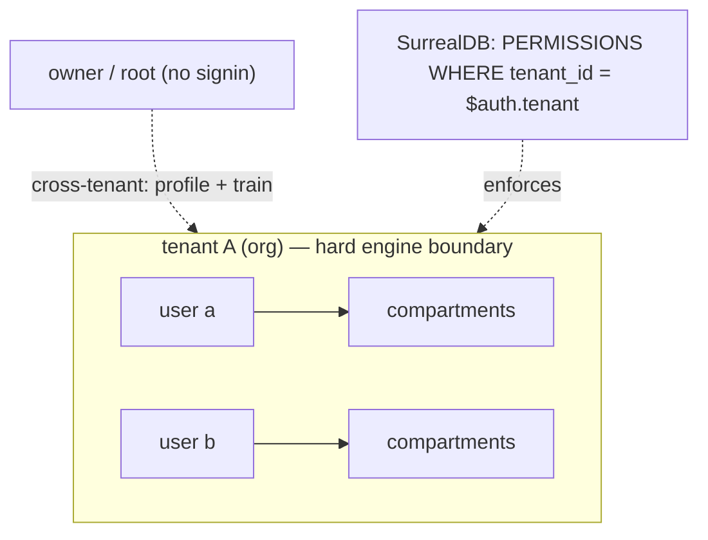

# ADR-0013 - Multi-tenant isolation and identity (engine-enforced)

**Status:** Accepted · **Date:** 2026-06-04 · **Related:** 0007 (substrate), 0012 (Penumbra), 0014 (compartments)

## Context

Antumbra is a networked, persistent memory engine: one user runs agents on several devices (and several agents
per device) that all share a persistent memory and benefit from each other in real time; in an organization,
each user is isolated, and the owner can read across users to profile and train. Isolation in application code —
remembering to add `WHERE tenant_id = ...` on every path — is the failure mode of the contractor stack it
replaces: a missed clause leaks, silently, because the response is still well-formed. Isolation must be enforced
by the **engine**, not the handler.

## Decision

Isolation is **engine-enforced** via SurrealDB **record access + `PERMISSIONS`**, not app-side filters:

- A session signs in via a record-access method (`DEFINE ACCESS … TYPE RECORD SIGNIN (SELECT * FROM principal
  WHERE tenant = $tenant AND user = $user)`) so `$auth` carries both **`$auth.tenant`** (the hard isolation key)
  and **`$auth.user`** (the ownership / sharing actor). A `principal` is provisioned per `(tenant, user)`.
- Every tenant-scoped table carries `tenant_id` and a `PERMISSIONS ... WHERE tenant_id = $auth.tenant` clause —
  the engine refuses cross-tenant rows on every read, even with no app-side `WHERE`. The repo *also* applies the
  explicit filter as a documented second layer.
- The **identity hierarchy**: **tenant** = the org (hard engine boundary); **user** = a member (identity, owns
  compartments); **compartment** = the unit of sharing (ADR-0014); **agent** = a session on a device
  (provenance: who + which machine — `author`/`author_host` on each memory), *not* an isolation boundary.
- **Shared umbra, private penumbra.** The population (experts, the learned router, boundaries) is the *shared*
  brain — readable by any authenticated tenant session (`PERMISSIONS FOR select WHERE true`), writable only by
  the owner (`… WHERE false`; the rootful owner connection bypasses the clause). Memory is *private* per tenant.

## Consequences

- **Positive:** a forgotten filter cannot leak; cross-tenant reads return empty → 404, indistinguishable from
  nonexistent; revocation is immediate; the owner role spans tenants for training without weakening the wall.
- **Negative:** the engine subquery-permissions (used heavily by ADR-0014) add predicate weight; the owner role
  bypasses via a rootful connection (operational care required); cross-*tenant* federation is out of scope.
- **Neutral:** the embedded engine treats a no-auth session as owner/root (bypasses permissions) — convenient
  for schema/migration and the test suite, which exercises the guard under a real record session.

## Alternatives considered

- **App-side `WHERE` only** (the contractor model). Rejected: silent-leak failure mode.
- **Namespace-per-tenant.** Stronger isolation but cross-tenant queries become structurally impossible, breaking
  the owner's profile/train-across-tenants requirement. Kept as a future graduation path; row-level + record
  access chosen so the owner can span tenants.

## Validation

`penumbra_auth` tests: a record-authenticated tenant session reads only its own rows on an unfiltered `SELECT`,
and the shared population reads through; the surql-rs table-`PERMISSIONS` renderer was fixed upstream
(release/0.28.0) to make this expressible in schema-as-code. *Kill criterion:* a record session can read another
tenant's memory through any path → the engine guarantee is false.
