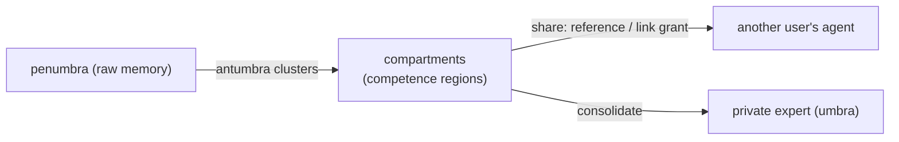

# ADR-0014 - Compartments: latent-spaces of memory

**Status:** Accepted (Phase 1 to 2a, auto-compartmentalization, private experts) · **Date:** 2026-06-04 · **Related:** 0004 (antumbra/boundary), 0012 (Penumbra), 0013 (identity)

> **Private expert minted on GPU (2026-06-05).** The personalization north-star is closed end to end on the
> 3090 Ti: `antumbra remember` seeded three memories into `comp:alice:deno` (owner `user:alice`), then
> `consolidate-compartment` gathered the compartment, scored the gate (3/3 graduated), capture-trained on GPU
> (`internalized 1.00`, verifier-gated), and minted a **private, owner-scoped** expert
> `expert:user:alice:comp:alice:deno` (`owner = user:alice`, `compartment = comp:alice:deno`). So a private
> compartment of memory becomes a private LoRA: "private experts via private discrete training". The engine
> hides another user's private expert (proven in `antumbra-store/tests/penumbra_auth.rs`); the mint creates the
> owner-tagged row.

> **Auto-compartmentalization implemented (2026-06-04).** `antumbra-core::penumbra::propose_compartments` is a
> pure, deterministic single-pass cosine clustering over the embeddings already stored on each `Memory`: it
> groups a pool into `ProposedCompartment{label, members, centroid, cohesion}` (labels slugged from each
> cluster's medoid, proposals returned best-cohesion first). It is policy-free: **the caller selects the pool**,
> since the core cannot know which compartment is the inbox. Surfaced as the MCP `propose_compartments` tool: it
> clusters the *unorganized* pool (the default/inbox compartment plus any uncompartmented memory), leaving filed
> compartments alone. `apply=false` suggests only; `apply=true` creates each as an `Origin::Proposed` compartment
> the user owns and moves its members in (reversible by deleting it; the user curates: keep/name/merge/share).
> The antumbra thus both *draws boundaries* (ADR-0004) and *proposes structure*. Pending: surfacing proposals in
> the TUI, and an antumbra-driven trigger (propose on penumbra growth) rather than on-demand only.

## Context

A single flat memory pool per user is too coarse: every agent shares it, a new agent cannot start clean, and a
user cannot delete or share *a group* of memories or control whether groups may reference each other. The deeper
need: the unit that ties **memory organization** to **learning**. A coherent body of experience is exactly what
the antumbra (the competence-boundary system, ADR-0004) recognizes, and exactly what consolidates into an
expert. Compartments are that unit.

## Decision

A **compartment** is a named latent-space of memory, owned by a `$auth.user` within a tenant: the unit of
organization, sharing, deletion, and reference-scope, and the natural **training unit** (a compartment
consolidates into a *private* expert, ADR-0012). Two creation modes: **explicit** (a user creates/names/shares)
and **emergent**: the antumbra *proposes* compartments by clustering the penumbra (`Origin::Proposed`); the user
disposes (keep/name/merge/share). The same centroid/boundary machinery that does routing + OOD drawing also
draws the compartment lines: **penumbra → antumbra clusters into compartments → umbra**.

**Sharing** is intra-tenant, user-to-user, via capability **grants**: `Reference` (recall/read) or `Link` (also
create graph edges into it). Access is **engine-enforced** (ADR-0013) by the grant graph:

- `memory` read rule: visible when in the tenant AND (un-compartmentalized = the shared pool, OR compartment
  owned by `$auth.user`, OR compartment granted to `$auth.user`), via a subquery over `compartment`/`grant`.
- `memory_edge` create rule (the **link gate**): an edge may target a memory only when its compartment is the
  shared pool, owned, or granted with `capability = 'link'` (mere `reference` is not enough).

Every memory carries **provenance** (`author` user, `author_host` device, `status` committed/planned) so a
recall says who learned it and where, and an agent can announce *planned* changes other agents see.

## Consequences

- **Positive:** private-by-default working memory with opt-in sharing; cross-user knowledge transfer at
  grant-speed, not retrain-speed; the substrate for **private populations** (the personalization north star:
  private compartment → private LoRA); the antumbra curates its own training units.
- **Negative:** richer engine predicates (nested subquery permissions: edge → memory → compartment/grant); the
  per-compartment consolidation → private experts (scoped routing + GPU minting) is not yet built;
  revocation/deletion semantics for already-linked shared memory need a documented rule.
- **Neutral:** un-compartmentalized memory remains the tenant-shared pool (backward compatible); a new
  agent/session defaults to a fresh private compartment.

## Alternatives considered

- **Agent as the isolation boundary** (each agent its own tenant). Rejected as too binary; it breaks "all my
  agents share + benefit"; the user is the actor, the agent is provenance.
- **App-layer ACL.** Rejected: the contractor model. The compartment ACL is engine-enforced (ADR-0013).

## Validation

`penumbra_compartment` tests: a user cannot see another's private compartment until granted (visible immediately
on grant, hidden on revoke), and may not *link* into it without `link`; all on unfiltered reads, engine-enforced
(SurrealDB evaluates the subquery-in-`PERMISSIONS` on the embedded engine). *Kill criterion:* a grant/revoke does
not change visibility at the engine, or link is creatable with only `reference` → the ACL is unsound.
