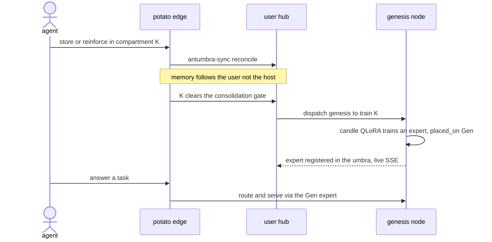
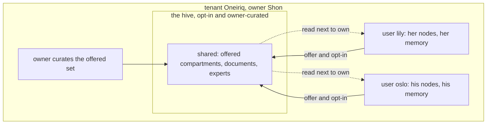
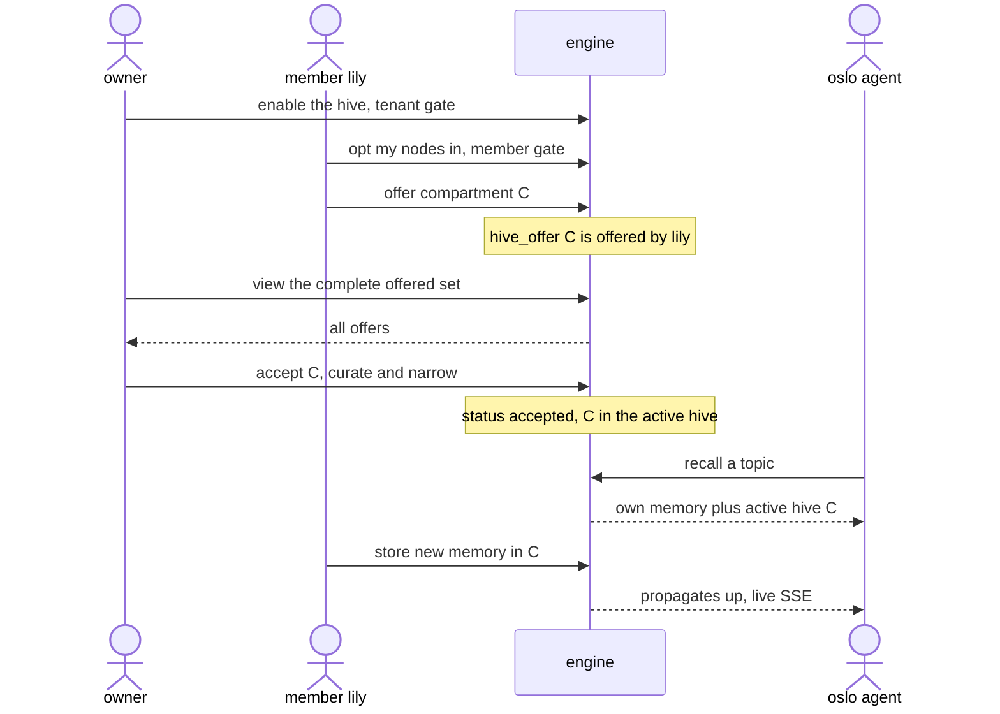

# ADR-0017 - The memory fabric: user nodes, and the tenant hive

**Status:** Proposed (the gate is cleared; the order of work below says what is in). **Date:** 2026-09-02. **Gated on:** ADR-0006 v0 (single-GPU science) validated end to end. **Related:** 0006 (placement seam), 0007 (device_profile), 0012 (consolidation), 0013 (identity, umbra/penumbra), 0014 (compartments, grants), 0015 (MCP surface), 0016 (control plane). **Builds on:** antumbra-sync (R-1/R-2).

## Context

ADR-0013 fixes the identity hierarchy: tenant (org, the hard engine boundary), then user (member, owns compartments), then compartment (the unit of sharing), then agent (a session on a device, provenance only). It states the intent: one user runs agents on several devices that all share a persistent memory, and the owner can read across users to profile and train. Two things that intent implies are not built yet.

1. A user's memory does not span their machines. A user's Antumbra instances on the potato, a laptop, and a GPU box are separate stores. Nothing makes them one memory, and nothing places the GPU-only work (Penumbra genesis, ADR-0012) on the machine that can run it. antumbra-sync (R-1) and the device_profile seam (ADR-0007) are the pieces, and they are not connected.

2. There is no curated, opt-in way to pool users' knowledge into a tenant brain. Today sharing is either the automatic un-compartmented tenant pool (ADR-0014, uncurated) or point-to-point user-to-user grants. Neither is what an org wants. An org wants a hive the owner assembles from what members choose to offer: a shared third brain every agent draws on next to its own memory, without the owner's read-across becoming control over members' agents.

This ADR builds both, on the existing primitives, and only after the single-GPU science it depends on is proven (ADR-0006 warns that placement before the science sinks the project).

## Decision

Two levels, matching the hierarchy: the user fabric (a user's nodes to one memory) and the tenant hive (curated shared knowledge across users).

### A. The user fabric: one user, many nodes, one memory

1. Replication is user-scoped. A user's nodes reconcile to one memory via antumbra-sync hub-and-spoke: one node is authoritative, the rest are edge surrealkv stores plus live SSE. This is the multi-node form of ADR-0013's "all my agents share memory". Memory follows the user, not the host, so an agent on any of that user's machines sees the same penumbra. A tenant has many users, and each user has their own fabric. An earlier draft scoped the fabric to the tenant. That was wrong.

2. Node roles, genesis placed. On start a node upserts its device_profile with a role of memory or genesis, derived from backend and VRAM. Recall, store, and route run locally. Genesis (a reinforced compartment clearing the consolidation gate, ADR-0012, or an explicit train) is dispatched to the user's genesis node. A memory-only node escalates instead of failing. placed_on records where an expert lives. Serving is central in v1: the genesis node serves answer and route, and adapters stay on disk, out of sync scope per R-1.

The fabric in motion. A store on a light node, genesis placed on the GPU node, served back:



### B. The tenant hive: the third brain

1. Opt-in, two gates. The owner enables hivemind for the tenant, a tenant setting. Each member then opts their own nodes in. Neither gate alone activates it. The owner cannot conscript a member's memory, and a member cannot publish into a hive the owner has not opened.

2. Members offer, the owner curates. A member offers units into the hive: compartments (memory, ADR-0014), documents (ADR-0016), and consolidated experts. The offer is a grant to a tenant-hive principal, which extends ADR-0014's user-to-user grant to a user-to-hive grant. The owner sees the complete offered set and narrows it. The active hive is exactly what the owner accepts. Contribution is the member's, curation is the owner's.

3. Every agent reads the hive, new memory propagates up. The active hive is a shared read layer every tenant session sees next to its own private penumbra. It has the same shape as the shared umbra (ADR-0013), extended from experts to curated memory and documents. As members add memory to offered compartments, it propagates up live (ADR-0013, R-2 SSE). Consolidations from hive compartments join the shared umbra. A member's own private, un-offered memory stays private.

4. The boundary: shared knowledge, not control. The hive pools memory. It gives no authority over another user's agents. ADR-0013's owner-reads-across-users is for curation and training only. Curating the hive is not directing lily's or oslo's agents. Agent orchestration stays in each user's nodespace: every user runs their own agents on their own nodes. The hive is a third brain the org shares, not a chain of command.



The hive lifecycle. Offer, curate, activate, use, propagate:



## Schema (extends ADR-0007 and 0014)

Authored the way the store already is (antumbra-store/schema.rs): surql-rs builders, tables SCHEMALESS in v0 with no field DDL, and the only hand-authored SurrealQL is the permission predicate strings handed to with_permissions. The additions are a permissions clause and a user index on the existing device_profile plus one new table for A, three tables for B, and one OR-branch appended to the ADR-0014 memory read rule.

```rust
// Permission predicate strings: the one hand-authored SurrealQL (ADR-0007),
// passed to the builder, never a DEFINE written by hand.

// A node self-registers: any tenant session reads device rows (to find a user's
// genesis node), a user writes only their own. device_profile was owner-internal.
const DEVICE_PERMS: [(&str, &str); 4] = [
    ("select", "tenant_id = $auth.tenant"),
    ("create", "tenant_id = $auth.tenant AND user = $auth.user"),
    ("update", "tenant_id = $auth.tenant AND user = $auth.user"),
    ("delete", "tenant_id = $auth.tenant AND user = $auth.user"),
];

// What a node could not run itself, left for the machine that can (A2). Same
// shape as DEVICE_PERMS and for the same reason: the node that asks and the
// node that takes the work are two machines of one user, so `user = $auth.user`
// lets the trainer claim a request its own laptop wrote, and bars anyone else.
const GENESIS_REQUEST_PERMS: [(&str, &str); 4] = [
    ("select", "tenant_id = $auth.tenant"),
    ("create", "tenant_id = $auth.tenant AND user = $auth.user"),
    ("update", "tenant_id = $auth.tenant AND user = $auth.user"),
    ("delete", "tenant_id = $auth.tenant AND user = $auth.user"),
];

// Owner gate: any tenant session reads the flag, only owner or root writes it
// (a record session is denied by the false predicate, the rootful owner bypasses).
const HIVE_PERMS: [(&str, &str); 4] = [
    ("select", "tenant_id = $auth.tenant"),
    ("create", "false"),
    ("update", "false"),
    ("delete", "false"),
];

// Member gate: a member reads memberships in-tenant, writes only their own.
const HIVE_MEMBERSHIP_PERMS: [(&str, &str); 4] = [
    ("select", "tenant_id = $auth.tenant"),
    ("create", "tenant_id = $auth.tenant AND user = $auth.user"),
    ("update", "tenant_id = $auth.tenant AND user = $auth.user"),
    ("delete", "tenant_id = $auth.tenant AND user = $auth.user"),
];

// Offer and curation: a member creates and withdraws their own offers, but the
// flip to accepted (update) is denied to record sessions, so only owner or root
// curates. This is the engine-enforced curation, the dual of GRANT_PERMS.
const HIVE_OFFER_PERMS: [(&str, &str); 4] = [
    ("select", "tenant_id = $auth.tenant"),
    ("create", "tenant_id = $auth.tenant AND offered_by = $auth.user"),
    ("update", "false"),
    ("delete", "tenant_id = $auth.tenant AND offered_by = $auth.user"),
];

// The active-hive read branch, appended to MEMORY_SELECT_RULE (ADR-0014) as one
// more OR subquery in the same shape as its owner and grant subqueries: a memory
// is hive-visible when its compartment has an accepted offer, the hive is
// enabled, and the offering member opted in.
const HIVE_VISIBLE_RULE: &str = "compartment IN (SELECT VALUE subject_id FROM hive_offer \
    WHERE tenant_id = $auth.tenant AND subject_kind = 'compartment' AND status = 'accepted' \
    AND offered_by IN (SELECT VALUE user FROM hive_membership WHERE tenant_id = $auth.tenant AND opted_in = true) \
    AND $auth.tenant IN (SELECT VALUE tenant_id FROM hive WHERE enabled = true))";

// Added to tables() in schema.rs. Schemaless like the rest of v0: permissions and
// indexes only, no field DDL.

// A. device_profile (ADR-0007) gains self-registration permissions and a user
//    index to find a user's genesis node.
table_schema("device_profile")
    .with_mode(TableMode::Schemaless)
    .with_permissions(DEVICE_PERMS)
    .with_indexes([
        index("device_host_idx", ["host", "backend"]),
        index("device_user_idx", ["user", "role"]),
    ]),

// B. The two gates and the offer ledger.
table_schema("hive")
    .with_mode(TableMode::Schemaless)
    .with_permissions(HIVE_PERMS)
    .with_indexes([unique_index("hive_tenant_uq", ["tenant_id"])]),

table_schema("hive_membership")
    .with_mode(TableMode::Schemaless)
    .with_permissions(HIVE_MEMBERSHIP_PERMS)
    .with_indexes([unique_index("hive_member_uq", ["tenant_id", "user"])]),

table_schema("hive_offer")
    .with_mode(TableMode::Schemaless)
    .with_permissions(HIVE_OFFER_PERMS)
    .with_indexes([index("hive_offer_idx", ["tenant_id", "subject_kind", "subject_id"])]),
```

The active hive is one composed predicate. HIVE_VISIBLE_RULE is appended as an OR-branch to MEMORY_SELECT_RULE, and to the document and expert read rules: a unit is visible when owned by $auth.user, or granted, or in the active hive. Both gates and the curation live in that one predicate over the tenant-readable hive, hive_membership, and hive_offer tables, the same subquery-in-permissions pattern the memory and grant rules already use. That predicate is the kill criterion below. If it cannot be expressed on the existing record-access and grant engine, the hive needs its own access model.

## Consequences

- Positive. A user's memory spans their machines. The org gets a shared brain without flattening privacy (opt-in plus owner curation) and without turning privacy into surveillance (read and curate is not control). It reuses the umbra, compartments and grants, sync, and device_profile instead of a new control plane.
- Negative. The hive adds an owner-curation surface and a user-to-hive grant kind, which is more permissions predicate weight on top of ADR-0014's. Upward propagation needs a live path from offered compartments into the hive read-scope. The user's hub is a per-user single point of authority. Edges keep a durable surrealkv store and reconcile on reconnect, which limits the blast radius.
- Neutral. Roles are derived on registration. A tenant with hivemind disabled behaves as today: private per-user fabrics and point-to-point grants.

## Alternatives considered

- Auto-pool all users' memory into the tenant brain. Rejected. No consent, no curation. The un-compartmented tenant pool (ADR-0014) already covers the automatic case. The hive is the deliberate case.
- Owner directs members' agents through the hive. Rejected. It conflates shared memory with control. ADR-0013's owner role is read, curate, and train, and orchestration is user-scoped by design.
- Peer mesh or CRDT for the user fabric. Rejected for v1. antumbra-sync is hub-and-spoke last-write-wins, which is enough for one user's machines.
- Ship adapters to every genesis node now. Deferred. One GPU today, and it overturns the "adapters out of sync scope" boundary (R-1).

## Validation

(a) User fabric. A memory stored on a user's edge node appears on their hub, and the reverse. A reinforced compartment on the edge graduates an expert on that user's genesis node, and the edge answers through it. (b) Hive. With the owner's tenant toggle on and lily opted in, a compartment lily offers and the owner accepts is readable by oslo's agent. One the owner has not accepted is not. And nothing in the hive lets the owner invoke lily's or oslo's agents. Kill criterion: if the engine cannot express "read the active hive but not un-offered memory, and never invoke across users" through the existing record-access and grant model (ADR-0013, 0014), the hive needs its own access model instead of an extension of compartments.

## Order of work

Built in increments, each one shippable on its own. A box is ticked only when the thing is in `main` with a test that fails if it regresses.

1. [x] The device registry. `DeviceProfile` / `DeviceRole` in antumbra-core, `repo::device` (upsert, list_for_user, genesis_for_user), `DEVICE_PERMS` and `device_user_idx` on the existing table. The write rule is the load-bearing part: opening the table so a node can register at all is what makes "a member cannot declare another's machine a trainer" something the engine has to enforce rather than something the app remembers to check (`tests/device_fabric.rs`). Roles are supplied by the caller here, not derived: nothing in the crates detects a backend or reads VRAM yet, and a role inferred from nothing is worse than a role declared.
2. [x] Role derivation on start. `role_for(backend, vram_mib)` in antumbra-core, the probe in antumbra-mcp, and a stdio session that registers itself the moment it signs in. The backend reported is the one the *build* can drive, not the silicon present: a binary compiled without the CUDA backend cannot train on a CUDA box, and a node that said otherwise would collect dispatches it could only escalate. Unknown VRAM does not demote a training backend, because `None` is "could not tell" and the floor is a measurement. The HTTP transport registers too, once per identity as it provisions one: a hosted server is not nobody's machine, since the agent's recall and store really are happening on it, and if it can train then that is where the user's genesis belongs. It writes as owner, like the principal and the default compartment either side of it, because `DEVICE_PERMS` exists to stop one *member* re-roling another member's machine.
3. [x] Placement: where an expert lives, so serving knows which node holds it. `Expert.placed_on` records the machine whose disk holds the adapter, stamped wherever an expert is minted, and `build_serve` registers only the adapters this node can actually open. This matters because the row travels and the weights do not: adapters are out of sync scope by R-1, so once a user's nodes reconcile, every node learns about every expert while exactly one holds each file. A node that registered them all would route to an adapter it does not have and fail at serve time, on a path that looks perfectly valid in the row. An expert minted before placement existed reads as servable anywhere, because there was one machine then and "unknown" and "here" were the same answer.

   A **field, not the `placed_on` graph edge** ADR-0007 sketched. Placement is one-to-one in v1, since this record defers shipping adapters to every genesis node, and an edge earns its keep when a relation is many-to-many or traversed; it is neither yet. Shipping an adapter to a second node is what would turn this back into an edge, and that is a deliberate change rather than a drift. Recorded here so the deviation is a decision and not an oversight.
4. [x] Genesis dispatch. A compartment clearing the gate on a node that cannot train is no longer ground out on a CPU while the user's GPU box sits idle: `genesis_placement` decides, and the run is left as a `genesis_request` row keyed per (tenant, user, compartment). A row rather than a log line, because a node that only said "this belongs on the rig" would have failed in a way indistinguishable, from outside, from a compartment that never cleared the gate. Work does not travel when it does not have to: a node that can train, does, even when the fabric names another machine. An empty fabric behaves exactly as it did before the registry existed, so a missing row cannot cost anyone their consolidation. The taking half: a node that can train clears what it was asked to do before the compartment it happened to be handed, because a request has waited on another of the user's machines and the write has not. Claiming is a write, so two trainers in one fabric cannot take the same run, and claimed is not finished, so a trainer that dies does not take the work with it. A request closes when the trainer has looked, whatever it concluded -- a compartment that held nothing back today and is reinforced again tomorrow gets a fresh request, which is the loop working rather than a request that never closes. What is still notional is the delivery: the queue is a row both nodes can see, so it needs increment 5 before two machines actually share one.
5. [~] Sync. Two halves, and the cheaper one is in.

   **Delivery (done).** `device_profile` and `genesis_request` now replicate, which is what turns increments 2 and 4 from correct into load-bearing. Without the first, `genesis_for_user` reads rows no other machine ever wrote, so every node believes it is alone and nothing is dispatched anywhere. Without the second, the asking half works, the taking half works, and no run crosses between them. Both carry `updated_at`, load-bearing rather than incidental: a re-registration and a claim are in-place mutations, so last-write-wins has to order them, and a claim that lost to a stale pending row would hand one run to two trainers.

   **Scoping (still owed).** Replication is still tenant-wide, which this record says is wrong: "A tenant has many users, and each user has their own fabric. An earlier draft scoped the fabric to the tenant. That was wrong."

   Two designs were considered and one of them is a trap.

   *Filter each table on a user column.* Does not work: `memory` has no user column. A memory belongs to a user through its compartment, or to the shared tenant pool.

   *Reconcile under the user's own record session and let the engine scope the read.* Necessary, and **not sufficient**. On five of the six replicated tables the read scope is strictly wider than the write scope. Only `compartment` is symmetric:

   | table | readable by the session | writable by the session |
   | --- | --- | --- |
   | `memory` | own + `reference`-granted + pool | own + `link`-granted + pool |
   | `memory_edge` | tenant-wide | edge whose **target** is own + `link`-granted + pool |
   | `grant` | tenant-wide | compartment owner only |
   | `device_profile` | tenant-wide | own rows only |
   | `genesis_request` | tenant-wide | own rows only |
   | `compartment` | tenant-wide | tenant-wide |

   The engine refuses a disallowed write by persisting nothing, **without an error** -- the same behaviour the document-privacy tests rely on. So a record-session collector reads those rows, counts them pushed, and they never land, on every cycle forever. A silent partial write repeated on a timer is worse than the tenant-wide replication it replaces, because it looks like it is working.

   **The resolution: read scope must equal write scope, and the way to get there is a replication policy narrower than the read ACL.** A user's nodes carry what that user *owns* plus the shared tenant pool -- not what is merely granted to them. That is not a duplicate of `MEMORY_SELECT_RULE` and must not be written as one; it is a different statement. The ACL says what you may **see**, through the engine, live. The policy says what your other machines get a **copy** of. A grant is a live read, not a licence to take someone else's private compartment home on a laptop, and the narrower policy happens to coincide exactly with what the session can write back.

   What that needs: an identity on `SyncConfig`, a sign-in after connect in `worker.rs`, and a per-table replication scope on `TableSpec` for the tables whose writable set is narrower than their readable one. Plus the test that would have caught the trap: a reconcile under a record session where a row the session may read and may not write is reported as refused rather than as pushed.
6. [ ] The tenant hive (section B), which waits on the fabric being real.

## Out of scope (its own decision)

The predecessor's user-authored flows and skills (the mixer) are not specified here. ADR-0016 metabolizes orchestration into weights. What the hive shares of behaviors and skills is their metabolized form, consolidated experts, not runtime graphs. Whether a thin explicit-flow escape hatch is warranted is a separate decision (candidate ADR-0018).
