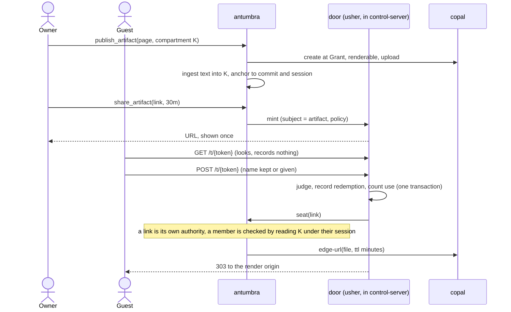

# ADR-0020: Sovereign artifacts, and one door for strangers

**Status:** Accepted (in progress: documents are private; the door, the render class and publishing are queued) · **Date:** 2026-09-19 · **Related:** 0013 (identity), 0014 (compartments and grants), 0016 (control plane and product surface), 0017 (the memory fabric: principals), 0018 (provenance over extraction), 0019 (documents on merge)

> **Documents are private (2026-09-19).** Step 2 of the order of work is in, ahead of step 1 because it closes a hole that was open whether or not artifacts ever ship: `document_chunk` carried the tenant-wide rule, so every document in a tenant was recallable by every member. `DocumentChunk` has a `compartment`, the table takes the compartment rules a memory does, and `ingest_document` and `antumbra ingest` take a compartment; omitting it keeps the shared pool, which is where every existing document and everything the GitHub integration ingests stays. Four things the plan did not foresee, each now in the code and under test:
>
> - **The rule would never have reached a deployed database.** The schema is applied `IF NOT EXISTS`, which skips a table that already exists, so a tightened PERMISSIONS clause passed every test on a fresh store and would have changed nothing on a running one. Each table's own `DEFINE TABLE` statement is now re-asserted on connect (mode and permissions only, no fields or indexes, so nothing is rebuilt). This was a general gap, not one about documents.
> - **A document's identity includes its compartment.** Chunk ids and the archived original were keyed by (workspace, title). Two members' private documents of one title would have shared records, and one archived file: fetching "the original" of one could have returned the other's text. The compartment joins both identities, and only when there is one, so a shared-pool document keeps the ids and the archived file it always had.
> - **Delete takes the write rule.** `memory` keeps a tenant-wide delete. A document cannot: ingest deletes a title before writing its next generation, so a tenant-wide delete would let any member erase another's private document by naming it.
> - **The engine's refusal is silent.** Under a record session a write into a compartment the session may not write to persists nothing and raises nothing, and ingest archives the original before it writes a chunk. So the server and the CLI ask first (`compartment::can_write`, the app-side mirror of the rule), and ingest looks after it writes instead of reporting chunks that are not there.
>
> The same change fixes two defects in the GitHub ingest (0019) that share the table: a document is now titled `<repository>:<path>`, because one workspace holds many repositories and a bare path made every repository's `README.md` the same document; and a document whose file a merge removes or renames away is dropped, where it used to stay recallable and be judged live.

## Context

A coding agent writes pages: a report, a design review, a diagram a team will look at. Today those are published to the model vendor's hosting. A user who runs Antumbra for data sovereignty has no self-hosted equivalent, and with the agent's telemetry turned off the comments on those pages are no longer reachable from the terminal at all. The page, its history, who saw it, and what they said about it are all knowledge, and none of it lands in the user's own store.

Three parts of the estate already hold most of what a sovereign version needs, and each stops short.

- **Copal** has the storage model: access levels `Private`, `Tenant`, `Grant`, `Public`, which is private first and shared outward; versions; revocable grants; short-lived edge tokens; image renditions; an immutable audit trail. It deliberately refuses to render script-capable content. `serve.rs` forces HTML, SVG and XML to `Content-Disposition: attachment` so a hostile upload cannot execute under the service origin. An agent-written page with scripts is exactly that shape, so the refusal is correct and an artifact cannot be viewed.
- **penpal** has the human door: a capability link with a lifetime, a token stored only as its hash, a guest who keeps a suggested name or gives their own, an audit trail of who came, one quiet refusal for unknown, expired and revoked, revocation, and a sweeper. It is welded to Penpot at one call, `redeem::enter` invoking `penpot.seat_url(&link)`, and in four columns of the link row: `file_id`, `share_id`, `page_id`, `swept_at`. Everything else is generic.
- **Antumbra** has identity (tenant, user), the compartment as its unit of sharing with engine-enforced user-to-user grants (0014), the proposed tenant hive into which a member offers and the owner curates (0017), and an ingest path that anchors a document to a commit and archives it to Copal (0018, 0019). It has one gap that matters here: a document is not private. `document_chunk` carries `TENANT_PERMS` and `DocumentChunk` has no owner and no compartment, so every document in a tenant is readable by every member. 0017 appends its hive rule "to the document read rule", and there is no such rule to append to yet.

Two constraints shape the decision. Antumbra builds from crates.io alone since 23f8296, so nothing in its root workspace may depend on a private repository, and penpal depends on Kayak over private git. And penpal's own rule is that it owns time-bound access to Penpot "and nothing else"; widening it into a general link service would dissolve the one thing that makes it easy to reason about.

## Decision

### 1. The door is extracted from penpal as a published crate

Proposed name `oneiriq-usher`: it shows strangers to their seat, for exactly the length of the show. (The name was set aside for the service in favour of penpal; as the door library it describes the job exactly. Naming is the owner's call.)

**What moves:** token minting and hashing, guest names, the link lifecycle (mint, judge, peek, enter, revoke, list the expired and unswept, mark swept, listings), the `redemption` audit table, the refusal grammar, and the two table definitions with their column lists as `surql` definitions, so a consumer's Kayak contract can still type against them and keep its drift gate.

**What stays in penpal:** the Penpot bridge, the plugin, the webhook and `DesignMemory`, the Kayak contract, and the binary.

**Shape: functions over data, no trait hierarchy.**

- `judge(link, now) -> Verdict` is pure. `peek` and `enter` both call it, which removes the judgment that is written twice today.
- The seat is a function the consumer passes to `enter`: given the live link, return where the guest goes. It is async, because resolving a seat may be a network call.
- Consumer state lives in one opaque `seat` object on the link. penpal's `share_id`, `page_id` and `swept_at` move inside it, and `file_id` becomes `subject`.
- A seat is either **live** (the source tool's own share, which is what penpal resolves for Penpot) or a **snapshot** (a rendered record in Copal). The crate knows neither; it only calls the function. The snapshot is the seat that works for every tool.
- The token prefix, the set of modes, and the lifetime bounds are a policy value the consumer supplies. A prefix names what leaked when one leaks, so each consumer keeps its own; penpal keeps `pl-`.
- `enter` becomes one transaction: judge, record the redemption, count the use. That makes an optional `max_uses` safe. Today it is three round-trips, so a one-time link could seat two racing guests.

**Dependencies:** `oneiriq-surql`, `chrono`, `sha2`, `rand`, `base64`, `serde`, `thiserror`, `tracing`. No Kayak and no HTTP framework in the core. An optional `axum` feature provides the two-step door router (`GET` looks and records nothing, `POST` enters) around a page renderer the consumer supplies, so every door in the estate fails the same quiet way.

**Migration for penpal:** fields are renamed in place. Token hashing is unchanged, so live links keep working. The wire shape of penpal's contract does not change; the contract maps the columns and its drift gate proves it.

### 2. Copal gains an opt-in render class

Recorded here as a requirement; Copal takes its own decision record. A file is marked renderable when it is created, never by default. Rendered bytes are served from an origin separate from the API, reachable only through an edge token, with `Content-Security-Policy: sandbox allow-scripts` and without `allow-same-origin`, and `connect-src 'none'`, so a page can run but can reach neither the service nor anywhere else. Previews do not need any of this: a rendition is already a real file with its own access level, and the external-transformer seam takes an HTML-to-PNG or SVG-to-PNG step. The same class makes a design tool's SVG export viewable, which it is not today, and that holds for any tool: Penpot, Figma, Lucidchart, or a desktop application with no API at all. An exported snapshot served this way is the one preview that depends on no vendor's sharing feature.

### 3. Antumbra publishes, and is the one authority on who may see

- **An artifact lives in a compartment, and its audience is that compartment's audience.** 0013, 0014 and 0017 all name the compartment as the unit of sharing, so an artifact does not get an access list of its own. `publish_artifact` takes the compartment (the project's, not one per artifact: a compartment is also the training unit, and one page is the wrong size for that), writes the page to Copal, ingests its text into that compartment, and returns the link. The page, its text, the design memories beside it and the comments on it then share one audience, which is what a reviewer needs: someone granted the kayak-brand compartment sees the rationale as well as the picture.
- **Prerequisite: documents become private.** `DocumentChunk` gains a `compartment`, and `document_chunk` takes the memory read rule in place of `TENANT_PERMS`: visible when un-compartmented (the shared pool, which keeps every existing chunk and everything the GitHub App ingests exactly as readable as today), or when the compartment is owned by or granted to `$auth.user`. Without this, a private artifact's text is recallable by the whole tenant through `recall_documents` while Copal keeps the bytes private, which is the worst of both. It is also the rule 0017 needs to exist before its hive branch has anything to extend.
- **The ladder, with nothing new below the door.** Private compartment; then a link through the door, which is the one deliberate exception to the ACL: time-bound, revocable, audited, and the only way a stranger gets in; then a compartment grant to a user (0014, built, the existing `share_compartment`); then an offer to the tenant hive (0017). So `share_artifact` mints links and nothing else. There is no "share with the tenant": under 0017 a member offers, the owner curates, and nothing is visible until the hive is enabled, the member has opted in, and the owner has accepted. Publishing must not route around that.
- **Copal enforces bytes and decides nothing.** The file stays at `Grant` and is never set to Copal's `Tenant` level, which would let any tenant principal read the bytes and so bypass both the compartment rule and the hive's curation. The door's seat function asks Antumbra; Antumbra proves the viewer can read the compartment by reading under the viewer's scoped session, the pattern the ACL tests already use, and only then mints a short-lived Copal edge URL. Two access systems would drift; one decides and the other serves.
- **Identity.** A republish is a new Copal version behind the same file. The title is `artifact:<user>:<slug>`: document identity is (workspace, title), and a bare title collides across owners the way bare paths collide across repositories in the GitHub ingest.
- **The user fabric (0017 A).** Memory follows the user, not the host, so an artifact's text and comments reach the user's other nodes through `antumbra-sync` like any memory. The bytes do not: they live in Copal. A node that cannot reach the archive refuses to publish, consistent with ingest failing closed, and says so; it does not queue a page it cannot put on record.
- **A team is a question for 0017, not for this record.** 0017's text speaks of a grant to a tenant-hive principal, and its schema implements an offer ledger with two gates and owner-only acceptance, one hive per tenant (`hive_tenant_uq`). A group below the tenant looks less like a new kind of grantee and more like that ledger made plural: named hives, each with its gates and a curation policy. A hive whose offers need a lead's acceptance and a hive whose offers are accepted on arrival are the managed and the collaborative workspace. That is a suggestion for 0017 to take or leave; this record depends only on what 0014 has built.
- The door for artifacts is served by `antumbra-control-server`. It is already the human-facing surface of 0016, already has magic-link login for viewers who must be identified, and already sits in its own workspace, so the crate's dependencies never reach the root workspace.

### 4. A comment is a memory

A comment is stored as an `opinion` or `bank` memory whose evidence is the artifact's Copal file, digest and version, in the artifact's own compartment, so it is visible to exactly the people who can see the page and it counts toward that compartment's consolidation. A guest's comment carries the redemption it came through as provenance, so the door's audit trail is the guest's identity. Feedback on a page becomes recallable and, over time, learnable, which a hosted comment thread never is.

### Order of work

1. Extract and publish the crate; penpal consumes it with no change in behavior.
2. Documents become private: `compartment` on `DocumentChunk`, the memory read rule on `document_chunk`. Independent of everything else here, and owed regardless.
3. The render class in Copal, with the hostile-page test below.
4. `publish_artifact` into a compartment, and link sharing through the door in the control server. Sharing with a member is the existing compartment grant and needs no work.
5. Comments as memories.
6. Offering to the tenant hive, when 0017 lands. 0017 is itself gated on 0006 v0, so nothing above waits for it.

## Consequences

- **Positive:** an artifact, its versions, its audience and its feedback live in the user's own store, under one access authority. penpal keeps its single purpose. Every door in the estate shares one failure grammar and one audit shape. The race in one-time links is closed for penpal as a side effect. Design exports from any tool become viewable from Copal, which is the ground a tool-neutral design memory stands on (a later decision record).
- **Negative:** the document read rule becomes the memory rule, which is one more nested-subquery predicate on a table that is recalled by vector search, and its cost on the HNSW path has to be measured. An artifact cannot be shared with one member without sharing its compartment; the answer is a link or a narrower compartment, and that will sometimes feel heavier than a per-page share. A published crate is a compatibility promise that penpal's private module never was. The render origin is new operational surface: a second hostname, its certificate, and a policy that must never be loosened. The control server becomes a door for strangers, which raises the stakes on a surface that today serves four routes.
- **Neutral:** the hosted product's runtime capabilities (a shared database inside the page, viewer identity inside the page, asking the model) are out of scope; these are static pages. Sovereign mode for the coding agent (detection, doctor, instruction-file injection) is a separate decision, 0021.

## Alternatives considered

- **Widen penpal to seat guests at Copal too.** Least code, and it breaks the rule that makes penpal legible. It would also put a Kayak-dependent private service on Antumbra's path.
- **Give each artifact its own access list.** It is what a hosted product does and it reads as the obvious model. It would be a second sharing system beside compartments, grants and the hive, with its own engine predicates and its own drift, and it would separate a page from the rationale and the feedback that make it worth keeping. The compartment already is the unit of sharing; the artifact joins it.
- **Share to the whole tenant directly, or use Copal's `Tenant` level.** Both bypass 0017's two gates and the owner's curation, which exist so that a member cannot publish into an organization's shared brain alone and an owner cannot conscript a member's work.
- **Put the door inside Copal.** Copal's grants are byte capabilities: they know a token and a use count, not a guest, a name, or a refusal page. Folding a human door into a file service mixes two jobs, and Copal would then need to understand sharing policy it is better off not knowing.
- **Stateless signed tokens for the door.** Revocation and use counting need the row anyway, so statelessness buys nothing and costs a second invalidation mechanism. This is penpal's existing reasoning and it carries over. Copal's edge tokens stay stateless because they live for minutes.
- **A `Seat` trait with implementations per consumer.** A function argument does the same work with nothing to inherit from and nothing to mock.
- **Render under the API origin with a strict policy.** One policy mistake away from script execution with the service's authority. A separate origin fails safe.

## Validation

- **Extraction.** penpal's full-flow test (mint, anonymous redeem, named redeem, ordered audit, use counter, revoke, identical refusal for revoked and unknown) passes unchanged against the crate, and the generated contract artifacts in `generated/` are byte-identical. _Kill criterion:_ the wire shape has to change to make the crate fit. Then the boundary is drawn in the wrong place and the extraction is redone, not patched.
- **One-time links.** Many concurrent entries against a link with `max_uses = 1` seat exactly one guest and record exactly one redemption. _Kill criterion:_ two are seated. Then the transaction is not one, and `max_uses` does not ship.
- **Rendering.** A hostile page served through the render class tries to read a cookie, call the Copal API with ambient credentials, fetch an external host, and navigate the top frame. All four fail. _Kill criterion:_ any one succeeds. Then the render class does not ship, and artifacts are shared as image renditions only until it does.
- **Privacy of the text.** Lily publishes an artifact into a compartment she owns. Oslo, in the same tenant, cannot recall its text through `recall_documents` and cannot obtain an edge URL, tested on unfiltered reads under his scoped session as the compartment tests are. After she grants him the compartment he can do both, and after she revokes it he can do neither. Every chunk that existed before the change is exactly as readable as it was. _Kill criterion:_ the text is recallable by a member with no access to the compartment, or a pre-existing chunk changes visibility. Then publishing does not ship on top of it.
- **Authority.** Revoking a share in Antumbra makes the next entry refuse and no new edge URL is minted; an edge URL already issued dies within its lifetime of minutes. _Kill criterion:_ a revoked viewer can still reach the bytes after that window.
