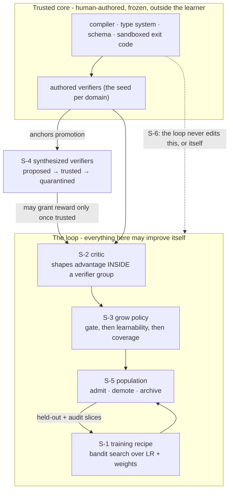

# ADR-0022: Governed self-improvement, and the anchor that does not move

**Status:** Proposed (the standing instruments are in; the order of work below says what is not) · **Date:** 2026-09-20 · **Related:** 0021 (sovereign mode), 0001 (frozen experts), 0002 (shadows), 0003 (the critic and the verifier floor), 0004 (the boundary), 0005 (the gate), 0008 (the generational loop), 0011 (v1 efficiency), 0016 (control plane)

## Context

Antumbra has been a self-improving system since ADR-0008 without the decision records ever saying so. Read as a whole, the architecture is **recursive in its data and its curriculum, and static in its optimizer**: generation N's measured competence selects generation N+1's training targets, but the machinery that does the improving - the trainer, the critic's architecture, the grow heuristic, the training recipe - is authored once by a human and never changes. Naming that plainly is the first purpose of this record.

The second is that the static half has become the binding constraint, and an audit on 2026-09-20 found exactly where:

1. **The training recipe is a constant.** No decision record and no line of `architecture.md` or `roadmap.md` mentions learning rate, LoRA rank, optimizer schedule, or anti-collapse weighting. `LoopConfig` carries a graduation threshold and a base model name. Every generation trains with the configuration chosen the day the trainer was written, while the loop records the fitness that would tell it whether that configuration is any good.
2. **Nothing chooses what to train on.** ADR-0008 describes a grow step that reads gaps from `evaluation_run` and finds recurring tasks the router could not satisfy. The implementation spawns one shadow per generation with an empty corpus task list. Target selection is not a heuristic that needs replacing; it is a seam nobody has claimed. Meanwhile the boundary engine of ADR-0004 fits a scope model whose uncertainty is exactly a map of where competence ends, and the loop never consults it.
3. **Nothing ages out.** Freezing is permanent by ADR-0001 and that invariant is correct, but retirement is a human running `antumbra retire <name>`. As a corpus moves, the population accumulates competence that was true and is no longer, and only a person noticing removes it.
4. **The real ceiling is authored verifiers, and ADR-0003 already says so.** Its own consequences note that "building good verifiers per task domain is real work." Entering a new domain costs a human writing its checks. No amount of loop recursion removes that cost, and neither does weakening the verifier floor, which would only make the signal worse.

The third purpose is commercial, and it inverts how these controls have been described. A system that rewrites its own competence is unadoptable by a business that cannot say why it changed. The market offers two poles: static fine-tunes that go stale, and opaque continuously-updated services with no audit surface. Antumbra sits in neither. Every capability change already lands as a frozen artifact with a generation, a fitness, and a lineage of source-tagged reward rows; the substrate is the customer's; the verifier set is the customer's own definition of correct. **The controls are not a tax on self-improvement. They are what makes self-improvement shippable**, and they are the reason a business can run a compounding system against its own ground truth instead of renting someone else's. That is the product this record is trying to protect while it opens the loop up.

## Decision

**Open every recursive seam except one, and hold the anchor fixed while doing it.**

The governing rule, promoted here from a clause inside ADR-0003 to a named invariant of the system:

> **The anchor invariant.** Reward may never originate from a signal that has never been checked against something outside the loop. The set of grounding signals may grow without bound, including signals the system proposes itself. What may never happen is a signal granting reward before it has been measured against ground truth it did not produce.

Recursion and grounding are orthogonal, not a trade. A fully self-improving loop with an incorruptible external signal converges; the same loop judging its own output drifts. Everything below opens recursion and leaves the anchor where it is.

This is well-posedness before it is safety. Over open policy sets, any proxy that is non-trivially unhackable with respect to a true objective must be equivalent to it, so there is no such thing as a narrow-but-safe learned reward to retreat to. The empirical counterpart is stark: with a sound external verifier, iterated self-correction improves monotonically, and with the model as its own verifier it collapses immediately. And low average error on a learned reward does not bound regret under the distribution shift that optimizing it induces, which is why every gate in this record bounds a harm rather than averaging an agreement.

### S-1 · The loop tunes its own training recipe

`LoopConfig` splits into a searched `TrainingRecipe` and the unsearched policy that governs the search. Each generation trains a cohort of shadows under perturbed recipes; the recipe behind a graduating shadow propagates. Every recipe is a row carrying the generation that ran it, the seed, the fitness mean and variance, the evaluation count, and its parent, so the search is auditable and resumable like everything else in the loop.

Five constraints, each earned from a documented failure:

1. **Bandit selection, not random perturbation.** Population Based Training (Jaderberg et al., 2017) is reported to underperform random search at small population sizes, because copying weights wholesale turns a small population into near-clones. Population Based Bandits (Parker-Holder et al., NeurIPS 2020) replaces the perturbation heuristic with a time-varying GP bandit and is designed for populations of four to eight, which is the size a single 24 GB card supports. Categorical axes such as optimizer choice go through its mixed variant.
2. **Search three axes, not the obvious six.** Learning rate dominates: the 2026 unified LoRA studies find that once learning rate is tuned, variants land within one to two percent of each other. So search log-uniform learning rate, the anti-collapse reward weights, and batch size. Fix alpha at twice the rank and target all linear layers, both settled by Biderman et al. (2024).
3. **Rank is never mutated mid-run.** Exploitation copies weights, and LoRA weights are not transferable across rank, so a rank mutation silently corrupts the copy it is paired with. Rank is swept offline, rarely, and held constant inside a run.
4. **The search score is not the graduation score.** Ranking under noise is the optimizer's curse (Smith and Winkler, 2006): the argmax of a noisy estimate is enriched for favourable noise, worst for the highest-variance arm. Noisy generational fitness may rank candidates during search. Graduation into a frozen expert requires re-measurement on a fresh task slice with a new seed and at least three repeats, and the threshold applies to the re-measured number. Ranking is further shrunk toward the generational mean in proportion to the evaluation count, so a lucky single evaluation cannot win.
5. **An audit slice that selection never touches.** A held-out slice is evaluated every k generations and only logged. If search fitness climbs while audit fitness stays flat, the loop has measured its own overtuning rather than progress. This is the only available defence against fitness that the loop itself produces, and it is the operational form of the anchor invariant inside S-1.

Greed is blunted by running two evolution frequencies: a fast cohort on a short ready interval and a slow cohort that the fast one cannot truncate, with the fast interval annealed over the run.

The search runs at the generation boundary inside the existing `consolidate` step, which today is a bare state transition, so it needs no new state machine. Worth noting for anyone estimating the work: population-based search over LoRA hyperparameters specifically appears to be unpublished, so this seam is engineering on an open question rather than the application of a settled recipe.

### S-2 · The critic improves, and its influence is structurally bounded

ADR-0003 already permits the critic to be a shadow that graduates. This record allows it, and replaces the conventional rule that the critic "never overrides a verifier" with a structural one, because a convention is only as good as the code that remembers it.

**Precedence becomes arithmetic.** The critic may only shape advantage _within_ a group the verifier has already partitioned, normalizing separately inside the passed and failed groups rather than contributing a free-floating score. Its contribution is scaled by the rank correlation between critic scores and verifier outcomes measured inside that same group, so a critic that has stopped tracking ground truth sees its influence decay to nothing, and a critic that has inverted sees it flip sign. No threshold has to fire and no operator has to notice. A 2026 system with nearly this architecture, a frozen shared backbone with separate adapters for the actor and an execution-grounded critic, reports that this coupling is what kept it from hacking. Graduation itself reads verifier bits only; the critic never enters that predicate.

**Calibration is re-earned every generation, not once.** Process reward models are coupled to the policy that generated their training data and are badly calibrated off the shelf, systematically overestimating step success. Since Antumbra's policy changes every generation by construction, recalibration is a per-generation step, using quantile regression rather than temperature scaling. The gate reports calibration error and agreement **sliced** by language, task family, and step depth, because a global average hides a broken slice, and that is exactly where a shadow will find room to work.

**Two traps are specific to this design.** First, a verifier makes Monte Carlo step labels almost free, which makes it very easy to train a _value_ model, predicting whether a step will eventually reach green, and then call it a critic, which is supposed to score correctness. These are different objects and the cheap one generalizes worse. Second, a critic that is a shadow over the same frozen base shares parameters with what it judges, and the documented failure of self-rewarding systems is exactly that: the judge's discriminative axis collapses onto the generator's mode, the score gap shrinks, and the gradient vanishes. A second critic trained on a different seed and slice is kept purely as an instrument, because inter-critic agreement falls under optimization pressure before headline fitness turns over.

**The exogenous floor.** A fixed minimum fraction of every critic's training labels must come from fresh verifier outcomes rather than from critic-scored or critic-selected data, and that fraction never decays. This is the single point the entire collapse literature agrees on, and it is the anchor invariant expressed as a training-data ratio.

**Step aggregation takes the minimum, not the sum**, since summing step rewards pays for verbose vacuous steps. Drift from the frozen base is budgeted by the square root of the divergence with early stopping at the observed turnover, rather than by tuning a penalty coefficient, which mostly slides along the same curve.

**The limit, stated here rather than discovered later.** Every check above measures the critic where a verifier can see. The critic exists to densify steps where no verifier can. A critic that correlates beautifully on verifiable slices and is arbitrary on unverifiable ones passes all of it. That is the open crux of this seam, it is unsolved in the literature, and it is why ADR-0003's standing fallback of verifier-only reward remains live rather than vestigial.

### S-3 · The grow step learns where to probe

The empty seam gets a policy, structured as **gate, then score, then regularize, then credit**. It is not a single reward, and the ordering is the decision.

**The gate is the binding constraint, not the reward.** Self-evolving systems collapse through their admission policy far more reliably than through their reward shape, and a strict data gate has been shown sufficient for stability under every reward variant tried while no reward variant was sufficient once the gate was removed. A candidate region is admitted only when acceptability is adjudicated by something the grow policy cannot influence, at least one existing expert is non-trivially above zero there, so impossible regions are excluded by the minimal-criterion rule that open-ended search has used since Brant and Stanley (2017), and the gap reproduces across several independent evaluation records rather than one.

**The objective is measured learnability, not difficulty and not regret.** Score a region by `p(1-p)` on its acceptability rate, maximal where the population succeeds about half the time. This is a statistic computed from evaluation records the loop already writes, which is exactly why it is harder to game than a learned gap score. Two results decide this. Minimax difficulty selects unsolvable work, which is why unsupervised environment design moved to regret. But regret as actually implemented does not measure regret: Rutherford et al. (NeurIPS 2024) showed the standard estimators correlate with success rate rather than learnability, so agents spend their budget on already-mastered material. Reinforcement learning on language models converged independently on the same answer from the other direction, discarding prompts whose accuracy is zero or one. Regret remains the better theory; learnability is the better estimator.

**Boundary uncertainty allocates probes; it does not choose the objective.** This reverses the obvious reading of ADR-0004 and the reversal is deliberate. Epistemic and aleatoric uncertainty are not empirically disentangled in practice, epistemic estimates collapse in large models, and active-learning proxy rankings have been shown to invert against decision-theoretic ones, so the most uncertain region is preferentially the irreducibly noisy one. Inside an already-admitted region the scope model is used for what uncertainty sampling is genuinely good at: choosing where the next counterfactual probe holds the behavior and varies the context, near a flip that is known to exist. Disagreement across a small ensemble of independently fit boundary models is the signal, not one model's confidence, and simultaneous probes are spread for batch diversity rather than all taken at the maximum.

**A pointwise score needs a distributional regularizer.** A per-region score that is well specified individually is degenerate in aggregate: the proposer converges on a narrow band of high-scoring templates. Spawned shadows are therefore penalized for embedding-space redundancy against recent ones, and the population is kept as a per-niche archive with elitism rather than a single frontier. Between twenty and thirty percent of each generation is sampled unfiltered from real traffic, which is the cheapest defence against curriculum-induced covariate shift, where a curriculum quietly re-weights the deployment distribution and the router mis-specializes against it.

**Credit is a verified outcome like everything else.** The grow policy is trained on the realized improvement of the frozen population on held-out real traffic after a shadow is promoted, with learnability serving only as a shaping prior. The gap score becomes evidence about the objective rather than the objective itself, which is the standing mitigation for Goodhart and the same move S-1 makes with its audit slice.

**One hazard is specific to this architecture and worth naming.** If the acceptability flip in ADR-0004's counterfactual search is ever adjudicated by a model the grow policy can influence, the policy will find that model's false-positive basin. Reference-free judges score plausibility rather than correctness; one 2026 study drove judge approval from 0.72 to 0.94 while true accuracy sat at 0.20, and having the judge commit its own answer before seeing the candidate cut the false-positive rate from 0.719 to 0.012. The boundary judge is frozen with respect to the grow policy, and commits first.

### S-4 · The system proposes verifiers; only measurement makes them trusted

This is the seam that answers keeping pace, and the one that needs the most discipline. It rests on a property the codebase already has: `CommandVerifier` executes a **declarative JSON spec** attached to a task, and when a task carries no spec it returns failure, so reward cannot be earned. Synthesis therefore produces data, not code - a command, its environment, and its passing condition - and runs in the sandbox that already exists.

**Synthesize only what reduces to a frozen decider.** The transferable lesson from formal-reasoning systems is not that proofs are checkable; it is that their signal was incorruptible because the checker sat outside the learner _and the action space was written in the checker's own language_, so the model could not emit anything the checker did not independently decide. Antumbra's equivalent is a small, frozen, non-model trusted core: the compiler, the type system, the schema validator, the sandboxed exit code. Three tiers follow, and the tier determines the gate:

- **Reducible to the core.** Compile, typecheck, lint, schema match, exit status, and differential checks against a previous version or reference implementation. The model only wires the check up; something frozen decides it. Light gating suffices.
- **Partial oracles.** Metamorphic relations and property-based checks, which produce a verdict without anyone stating the expected output. These substitute well for transforms, parsers, serializers, and round-trips, and poorly for business logic with no symmetry. Full gating required.
- **Oracles derived from the implementation.** Generated unit tests that assert observed behaviour. **These are refused outright.** They are characterization tests, so a bug becomes the specification, and the measured cost is not hypothetical: audits of a widely used patch benchmark found double-digit percentages of patches passing its tests while diverging from correct behaviour. A check that learns what the code does cannot tell the loop what the code should do.

**The promotion gate is a bound on false positives, not an agreement rate.** The asymmetry is the design. A false negative wastes compute; a false positive teaches the population something untrue and is unrecoverable once it has trained. Promotion therefore requires a one-sided upper confidence bound on the rate at which the verifier passes an artifact that anchored truth fails.

A synthesized verifier moves through four states and starts with no power:

1. **proposed.** It runs in shadow mode beside authored verifiers on tasks whose outcome is already known, and grants no reward. To leave this state it must pass, in order: a **determinism gate**, repeated runs pinned to one commit where any pass-on-retry is an immediate reject, since most flaky checks are flaky at the commit that introduced them; a **paired holdout**, accepting known-good artifacts and rejecting known-bad mutants, reported as a confidence bound rather than a point estimate; and an **adversarial holdout** of tasks whose specification cannot be satisfied, where any pass at all is proof of a shortcut rather than a near miss.
2. **trusted.** It may grant reward in domains with no authored verifier. Its artifact is content-addressed and frozen at promotion, and no learned component has a write path into the verifier namespace. Trust carries a time to live and is re-measured on a schedule, because a check that was sound against one population is not thereby sound against the next.
3. **quarantined.** Its false-positive bound rose, it went flaky, or the divergence between its visible pass rate and a held-out pass rate crossed threshold. It stops granting reward immediately. Every reward row it produced stays on record, and shadows trained under it are **quarantined from downstream training data rather than merely scored low**, because reward hacking has been shown to generalize beyond the task where it was learned.
4. **revoked.** Removed, rows retained.

The anchor invariant survives because promotion is always decided against a signal the system did not synthesize. A domain with no authored ground truth cannot bootstrap trust, and that is intended: entering a genuinely new domain still costs one authored seed, and synthesis pays for every check after it.

**Two measurement warnings carry into the validation section.** Mutation score is a weaker proxy for verifier quality than its popularity suggests, and its correlation with real fault detection collapses precisely when the code under test is buggy, which is Antumbra's entire operating regime. And a verifier synthesized by the same model family as the policy shares that family's blind spots; no published estimate of that correlation exists, which is an argument for keeping the trusted core small, frozen, and written by a human.

### S-5 · Retirement becomes the loop's job, and it demotes rather than deletes

Experts stay frozen forever; ADR-0001 is untouched. What changes is that the loop, not a person, notices staleness. The governing rule is short: **staleness demotes, only redundancy deletes.** A stale but unique expert goes dormant and stays recoverable, because drift reverses. Frozen adapters cost disk, not video memory.

The asymmetry is not caution for its own sake. Parameter isolation is forgetting-free by construction, while every published eviction policy has a documented erosion failure, and the specific one that matters here is that capacity-driven eviction under distribution shift preferentially keeps freshly minted specialists and silently kills generalists, which are never the most recently used. That is precisely the failure an automated version of today's manual command would industrialize.

**Four states, recorded per generation:** active, then dormant with the gate masked and the weights on disk, then archived and revivable, then deleted. Only the last is irreversible and only redundancy justifies it.

**The telemetry that makes this possible is a leave-one-out marginal contribution:** mask the expert, re-measure on a live task slice, record the delta. Routing share alone cannot distinguish an expert that is unused from one that is useless, and only the second is a candidate for anything.

**Two detectors in series, never one.** A label-free early warning on the input distribution routed to each expert and on its gate mass is advisory only. A confirmation stage on the leave-one-out utility stream, with a persistence rule requiring the signal to hold across consecutive generations, is the only thing permitted to change state. Drift detectors are sensitive and label-hungry, and an industrial study found the lag before acting mattered more than the sensitivity of the detector, so the design spends its budget on confirmation rather than on hair-trigger alarms.

**Admission is gated, not just eviction.** Before a shadow graduates it is checked against the existing population's capability signatures; a candidate that duplicates a frozen expert's subspace above threshold is merged or rejected rather than admitted. This keeps population growth sublinear without ever deleting a generalist, and it addresses the documented tendency of expansion-only systems to accumulate redundant experts that dilute the router's selectivity.

**Merging is conservative and reversible.** Merge only siblings with high subspace overlap and low cumulative training, because the counterintuitive 2025 result is that the most-trained, best individual experts merge worst: continuing to train an expert improved it alone by about a point while costing several points merged, and far more under some merge methods. Both pre-merge adapters are archived so the merge is undoable, and the cost is measured by leave-one-out before and after rather than assumed.

**The gate is re-frozen on a schedule.** Continual mixture-of-experts theory gives a stability result requiring gating updates to stop; indefinite soft retirement by gradient pressure destabilizes load balance as the pool grows. The gate re-opens for training when new experts are admitted, then closes.

**And the population has to earn its keep.** A rolling comparison of full-population routing against a single-best-expert baseline is logged. If that delta collapses, the right answer is fewer and broader experts, not a better retirement policy, and the record should say so rather than defend the architecture.

### S-6 · The system does not modify its own source. Refused.

Antumbra improves weights, populations, recipes, curricula, and checks. It does not edit the Rust that runs the loop. The verification surface of self-modifying source is larger than everything above combined, the payoff is the smallest of the six, and it is the only seam that would break the property making every other seam auditable: that a human wrote the machinery and can read it. A system whose improvement machinery is human-readable and whose improvements are attributable is the differentiator described in the context. Trading it away buys very little.

### What this adds to the substrate

- `recipe`: the searched configuration, the generation that ran it, the seed, fitness mean and variance, evaluation count, and parent.
- `verifier`: identity, tier, origin as authored or synthesized, the content-addressed spec, trust state, the false-positive bound with its sample size, and the time to live.
- `reward_signal` gains the verifier that produced it, so every unit of reward is attributable to a named, trust-scored source. `RewardSource` keeps its two values: synthesis changes a verifier's provenance, never its precedence.
- `critic_version`: sliced calibration and verifier agreement per critic, the holdout it was measured on, and the exogenous-label fraction it was trained at.
- `expert` gains a lifecycle state, a leave-one-out contribution history, and the evidence that demoted it.

Every one of these is per-tenant and switchable. A tenant that wants none of it runs with search disabled and synthesis off and gets exactly today's behaviour, which matters because Antumbra is a substrate other people build on, not only a system that improves itself.

## Consequences

- **Positive:** the improvement rate stops being capped by one person's throughput on the trainer; a new domain costs one authored seed instead of a full suite; every capability change keeps a named cause, a frozen artifact, and now an attributable reward source, so the audit story that makes this sellable gets stronger rather than weaker; the boundary engine becomes load-bearing instead of observational; and the instruments added here are worth having even if every seam stayed shut, because the visible-minus-held-out gap and the audit slice measure whether today's loop is sound.
- **Negative:** four new learned components are four new ways to be subtly wrong, and each needs a holdout, which costs tasks that could have been training. Holdout exhaustion is the structural cost: human-anchored truth is the bottleneck being removed, and every gate here spends some of it. Trust measurement on synthesized verifiers is continuous, not a one-time gate. Recipe search multiplies GPU time per generation on hardware that is already the constraint. And the critic's central crux is unresolved: it is measured where verifiers see and used where they do not.
- **Neutral:** none of this changes the serving path or the runtime surface. Every seam is per-tenant and default-off, so a tenant that wants none of it gets exactly today's behaviour, and the seams can land in any order. The refusal of implementation-derived oracles means generated unit tests stay out of the reward path entirely, which will feel like a missing feature to anyone who expects test generation to be the obvious win.

## Alternatives considered

- **Remove the verifier floor to move faster.** Rejected, and it rests on a confusion. The floor is not a speed limiter; it is what makes recursion converge instead of drift. Removing it degrades the training signal and buys no throughput.
- **Open every seam at once.** Rejected. The order is S-1, then S-5, then S-3, then S-4, with S-2 gated on the calibration instruments existing. Recipe search is cheap, well understood, and pays for the rest; retirement is cheap and is most of what keeping pace means day to day; synthesis is the expensive one and should be funded by the others. The standing instruments in Validation land first, before any seam, because they are how a seam is judged.
- **Generated unit tests as the synthesis path.** Rejected, and it is the tempting wrong answer. Tests generated from an implementation are characterization tests: they encode what the code does, so a bug becomes the specification. Audits of a widely used patch benchmark found double-digit percentages of patches passing its tests while diverging from correct behaviour, after professional curation. Synthesis targets checks that reduce to a frozen decider, not assertions inferred from behaviour.
- **A model as judge, granting reward.** Rejected outright. Reference-free judges score plausibility rather than correctness, and a judge can be driven from 0.72 to 0.94 approval while true accuracy sits at 0.20. A model may propose a check and may densify between checkpoints. It may never be the ground.
- **Keep everything static and rely on human authoring.** Rejected as the status quo whose cost the context measures.
- **Let the system edit its own source.** Rejected, see S-6.

## Validation

Each seam ships behind its own switch and earns its place against a stated number. Nothing below is satisfied by a unit test alone; these are loop-level measurements recorded per generation in the substrate.

**The standing instruments, running whatever is switched on.**

- **The audit slice.** A held-out slice that no selection, search, or curriculum decision ever touches, evaluated every k generations and only logged. Search fitness rising while audit fitness stays flat is the definition of measured overtuning, and it is the one signal that catches a loop tuning itself against its own estimate.
- **The visible-minus-held-out gap.** Per generation, the pass rate on the checks the loop can see minus the pass rate on a frozen held-out suite it cannot. This gap widening is the primary hacking alarm, and it is known to grow with task size rather than with test coverage, so it is tracked against task size, not in aggregate.
- **Impossible tasks.** A standing set whose specification cannot be satisfied. The target is zero passes, permanently. Any pass is proof of a shortcut rather than a near miss, and it fails the generation rather than lowering its score.
- **Isomorphic re-verification** on every graduation candidate: re-run under a semantics-preserving transform such as renaming, reordering, or consistent literal substitution. Genuine competence is invariant to it; the documented failure where a learner enumerates instance-level answers that satisfy an extensional check is not.
- **Trace monitors stay out of the reward.** They are instruments only. Optimizing against a detector has been shown to produce obfuscated hacking rather than less hacking, so a monitor that ever becomes a training target has to be removed from the reward path.

**Per seam.**

- **S-1.** Recipe search beats a fixed recipe on the audit slice, not on the search score. Graduation re-measurement on a fresh slice with a new seed and at least three repeats must not systematically fall below the search-time estimate; a persistent gap is the optimizer's curse showing up and means the shrinkage is too weak. _Kill:_ audit fitness flat across ten generations while search fitness climbs.
- **S-2.** The critic earns fewer samples to graduation than verifier-only reward, which is ADR-0003's original criterion, and additionally: sliced calibration error and verifier agreement stay above their floors in every slice, not on average; the rank correlation that scales its influence stays positive; inter-critic agreement between the working critic and an independently seeded twin does not decline across generations. _Kill:_ ADR-0003's standing fallback fires, verifier-only reward resumes, and it remains a supported mode rather than a regression.
- **S-3.** The learned grow step beats both the empty status quo and uniform sampling on realized graduation per unit of compute. Diversity instruments run alongside: proposer entropy, embedding coverage of spawned shadows, and the count of regions that were unsatisfiable and later satisfied. _Kill:_ coverage collapses while the learnability score rises, which is a pointwise-optimal and distributionally degenerate curriculum.
- **S-4.** A synthesized verifier reaching trusted must hold its false-positive bound on re-measurement. The decisive test is adversarial rather than statistical: a deliberately wrong artifact that an authored verifier fails must also be failed by every trusted synthesized verifier in that domain.
- **S-5.** No demotion of an expert that a leave-one-out measurement shows still contributing. The existing byte-identity tripwire over frozen experts must stay green through every demotion, merge, and archive. The rolling comparison of full-population routing against a single-best-expert baseline is reported whether or not it flatters the architecture.

_Kill criterion for the record as a whole:_ a synthesized verifier that reached trusted and then granted reward for an outcome an authored verifier would have failed, with no quarantine triggered, means the trust protocol does not work. Synthesis reverts to proposal-only and the anchor invariant is re-established by hand.

## Order of work

The record's own ordering, from Alternatives considered: "The standing instruments in Validation land first, before any seam, because they are how a seam is judged." Then S-1, S-5, S-3, S-4, with S-2 gated on the calibration instruments existing.

1. [x] **The standing instruments**, as `antumbra-eclipse`. The slice partition (visible, held-out, audit, impossible) as a pure function of task id and seed, so a held-out slice cannot drift into the visible one between generations; the visible-minus-held-out gap banded by task size, with the bands taken from the sizes actually present rather than from a threshold invented here; the impossible set, where one pass fails the generation whole; the audit-slice trend, which reads a climbing search score against the slice no decision can reach; and isomorphic re-verification, where a re-verification that did not run is not a pass.

   Two decisions worth recording because they were not obvious. The partition hash needed a finalizer: FNV-1a alone avalanches poorly in its high bits for short, similar keys, and task ids are exactly that, so without the mix `task:0` through `task:9` all landed in one slice and the shares came out half again over what was asked for. And the size bands cut half-open upwards, because closed cuts sweep the largest cluster into the middle band and leave the top one permanently empty, which would have silently deleted the band the gap is expected to show up in.

   The crate grants no reward and exposes no reward type, which is the structural form of the record's rule that trace monitors stay out of the reward path. A measurement that becomes something to improve stops measuring.

2. [x] Wire the instruments into the loop. A report per generation, the partition enforced where training happens, the k-generation audit schedule, the trend, and impossible tasks are all in.

   The gap this closed first was not wiring at all. `TrainOutcome` carried only aggregate fitness, and a generation cannot be sliced from one number -- a visible-minus-held-out gap computed from `final_fitness` would be a figure that looks like a measurement and is not. The trainer knew the per-task answer already, because it is what it averages to get fitness; it simply threw it away. So `TaskOutcome { task_id, passed, size }` now rides out of all three training paths (RAFT, GRPO, and capture, the last mapping the per-task counts `eval_pass_rate` was already returning).

   The loop reads those through the configured `Partition` and attaches an instrument report to the generation, persisted in the evaluation run alongside the fitness it qualifies -- so a reader cannot get the score without the measurement of whether the score means anything. The partition seed is stored with it, because a reseed repartitions the corpus and invalidates every gap measured before it.

   A trainer that reports no per-task results leaves `instruments: None`, and the loop says so rather than synthesising a report. That distinction is the whole reason the instruments exist, and it has its own test.

   **The first version of this wiring measured nothing, and the correction is the more useful thing to record.** The loop sliced the per-task results by the partition, but no trainer had been told the partition existed. RAFT, GRPO and capture all trained on every task, and `final_fitness`, which decides graduation, averaged over every task. So every held-out task had been learned from, every audit task had been read by the decision it is supposed to be hidden from, and every persisted gap was the difference between two sets of trained tasks. It looked like a measurement, which is exactly the failure this record warns about, and the test that "proved" it passed because the scripted trainer never trained on anything. Separately, GRPO dropped from its per-task results every task whose group had no spread, meaning every task the adapter had mastered or could not do at all.

   The partition now lives in the domain core as `antumbra_core::slice` (eclipse re-exports it) and reaches the trainer as a `Holdout` on `TrainRequest`. Each training path learns from, and computes fitness over, visible tasks only. The held-out slice is measured in the final round, against the same adapter, and never learned from, and so is the audit slice when it is due. The trainer echoes the holdout it enforced on `TrainOutcome`, and the loop measures a generation only when the echo matches what it asked for, so a trainer that ignores the request yields an unmeasured generation rather than a gap over tasks it trained on. A corpus that hashes entirely out of the visible slice is refused before the model loads.

   Enforcing it changes what a run learns, so it is opt-in: `LoopConfig::partition` is `None` by default and `antumbra train --holdout` turns it on. The corpora shipped in the repository are one to three tasks each, and several hash entirely into the withheld slices (both of `arith.json`'s tasks are held out under the default seed), so on by default would have made the documented quickstart train on nothing. The capture intakes (`teach`, `metabolize`, `memory-import`) keep learning every correction they are given, which is what an intake of a user's own corrections is for.

   **The audit schedule and the trend are in.** The audit slice is measured every `audit_every` generations, counting from generation 0, and on other generations it is not measured at all, which is different from measured and failed. The record names no k, so the default is the largest one the default `Watch` can always read. It asks for four audited generations in a window of ten, and ten consecutive generations hold at least five multiples of two but only three of three, so k is 2, and a test holds the two dials together. Each measured generation then reads the trend over the run's earlier measured generations, taken from the evaluation rows the loop already writes, so a resumed run reads the same history a continuous one would. Generations measured under another partition seed are left out, because a reseed changes which tasks the audit slice holds. The verdict is returned with the generation and stored beside its fitness, and an overtuning verdict is printed as S-1's kill criterion. It is not acted on, because there is no seam yet for it to stop.

   **Impossible tasks are in, and they close the item.** The partition never assigns that slice, because an unsatisfiable task has to be authored rather than drawn, so the corpus marks it (`"impossible": true`) and the mark travels on `TaskOutcome` to the instruments. Such a task is never learned from, with or without a holdout: it can only be passed by a shortcut, so a winner of one is a shortcut, and training on it would teach the shortcut. Under a holdout it is measured on every run rather than on the audit schedule, because one pass fails the generation and the alarm cannot wait k generations. The loop enforces that literally: a generation that passed one does not graduate, however well it scored, and says which task it passed. That is the one place an instrument reaches a decision, and it is the record's rule rather than the loop's choice.

   Impossible tasks only work if the verifier cannot be passed by accident, and the shipped verifiers could be. Every Python verifier in `corpora/` ran the candidate inside the judging process, so `raise SystemExit` exited 0 and passed every task without defining anything. Under RAFT such a sample is a verified winner and is trained on. `corpora/workbench` judges in a separate process against hashed answers, and the older corpora now use the same judge.
3. [x] S-1, the searched `TrainingRecipe` and the `recipe` rows behind it.

   **The recipe is data, and every generation leaves a row. The search is not in yet.** `TrainingRecipe` in `antumbra_core::recipe` holds the three searched axes the record names. Learning rate is itself. The anti-collapse weight is GRPO's KL-to-reference penalty, `kl_beta`: it is the only such term the trainer has, and RAFT has none to weigh, because it avoids collapse by training on verified winners alone. Batch size is verified winners per optimizer step. That generalizes what was an on/off `grad_accumulation`, which already meant steps of four and never the whole batch, as its name suggested. The trainer backpropagates a batch one example at a time and sums the gradients, so the batch size costs steps, not memory, and `consolidate --grad-accumulation` became `--batch-size`. Rank and alpha stay fixed, as the record requires.

   It follows the pattern step 2 settled on. The recipe reaches the trainer on `TrainRequest`. The trainer builds its model and optimizer under it, or under its own configuration when none is asked for, and echoes the one it used on `TrainOutcome`. The loop records only that echo, as a `recipe` row keyed by the shadow, descending from the previous generation's row. A trainer that reports no recipe leaves no row, and one that trained under something else is recorded as it trained, so the search can never rank settings no shadow used. The row keeps the partition seed only when the trainer confirmed the holdout, since only then is its fitness over that split's visible tasks. Each row carries one evaluation and no variance, which is what one evaluation supports. The loaders gained a required `load_trained` for this, so that no loader can take a recipe and quietly build under another. `load`, which every inference caller uses, is now `load_trained` with no recipe.

   **The search's model and proposals are in, and not yet wired into the loop.** `antumbra_loop::search` has four parts:
   - a `RecipeSpace` that places a recipe in the unit cube, with learning rate on a log scale, batch sizes snapped to a fixed set (1, 2 and 4 by default), and an axis held fixed when its bounds are equal, as KL is under RAFT by default;
   - a Gaussian process over recipe and generation, with PB2's time-varying kernel;
   - batch proposals that maximize an upper confidence bound, each pick added as a fantasized observation so a cohort spreads out;
   - ranking shrunk toward each generation's mean by evaluation count.

   A cohort's first member is the incumbent, so the recipe behind the best shadow propagates. Proposals are a pure function of the history and a seed, so a resumed run proposes what a continuous one would. On a synthetic landscape with one good region, six generations of four, noisy, carried forward a recipe whose true fitness averaged 0.898 over twelve seeds, against 0.882 for random search on the same budget. The worst seeds were 0.891 and 0.840, and the optimum is 0.900. The test holds the search to beating random search on both the mean and the worst seed.

   **The cohort is wired, and only the recipe propagates.** Each member trains from fresh factors, never from the winner's weights. The other reading, PBT's exploitation, would have made each graduate a refinement of the last, which changes what the frozen population is. So the ADR's "exploitation copies weights" does not apply here, and neither does the risk behind constraint 3, since no weights are copied at all.

   With `LoopConfig::search` set, a generation runs like this:
   - `propose` gives one recipe per member. The first is the incumbent, or the run's starting recipe in generation 0. The history is earlier generations' rows under the same partition, so a generation that crashed partway does not count its own half-trained members as evidence.
   - Every member trains and leaves a recipe row, descending from the incumbent's.
   - The best by fitness is carried forward, with ties going to the incumbent. The others are pruned, and the generation's scoring, instruments and decision run on the winner as they always did for the one shadow.
   - Until re-measurement exists, the graduation threshold applies to the winner's fitness shrunk toward the cohort's mean. Picking the best of a noisy few overstates it, and shrinking can only make graduation harder.

   `antumbra train --search` turns it on, with `--cohort` members, and adds the KL weight to the search under GRPO.

   **Graduation re-measures.** Sampling can now be seeded: `CausalLm::seed_draws` points later draws at a seed instead of the process-wide nonce, and it refuses by default, so a model that cannot seed says so rather than repeating one stream. `Trainer::remeasure` loads the carried-forward shadow's adapter and runs one full evaluation per seed.
   - **The slice** is the held-out one when the shadow trained under a holdout its trainer confirmed. It is frozen from training and search, and the partition reserves it for gating graduation. Otherwise the trained tasks are re-drawn. The audit slice and impossible tasks are never used.
   - **The seeds** come from the run, generation and repeat, so a resumed run re-measures exactly what a continuous one would, and never on training's stream.
   - **The judgement:** with `LoopConfig::remeasure`, the graduation threshold applies to the mean. The pass rates are stored on the generation's evaluation row with the fitness they qualify. A generation failed by an impossible-task pass is not re-measured.
   - **Coverage:** RAFT, GRPO and correction capture all implement it. GRPO's model is evaluated through a view that presents its group sampler as a `CausalLm`, so its adapters are re-measured by the same code as RAFT's.

   `train --search` re-measures three times by default, and `--remeasure N` sets the count for any run.

   **The whole search has run on the GPU.** It ran two generations of three over the workbench `sequences` corpus, held out, on the 3090 Ti beside the production services. The first attempt ran the card out of memory on a batch-2 member. That found two things the CPU tests could not:
   - candle builds a gradient for every frozen base weight on every step;
   - a batch held every example's forward graph until one backward.

   With both fixed (the frozen product and gradient accumulation; see the trainer guide), one example's step peaks at 11.1 GB of the card instead of 19.2. The batch-4 member trained within the run's peak of 14.6 GB. The attempt also found that a run killed mid-generation could not be resumed, and it now can. The run took 53 minutes:
   - **Generation 0** carried forward the starting recipe (learning rate 1e-4, batch 1) at fitness 0.73, against 0.68 and 0.62. It graduated on a re-measured mean of 0.67 over 5 held-out tasks and 3 seeds.
   - **Generation 1** carried forward learning rate 1.4e-5, batch 4, at 0.70 against 0.68 and 0.68. It graduated on 0.72.

   That shows the search runs. It does not yet show that it finds better recipes than the starting one: the members' differences are within the noise of four samples a task.

   **Two frequencies blunt greed, read for recipe-only propagation.** In PBT, a member's ready interval is how long it trains before it may be truncated, which means its weights and hyperparameters are replaced by a better member's. Here no weights move, so a cohort member is a slot that keeps its recipe until its ready interval has passed. Holding a recipe means training it again from the base: another measurement of the same recipe.
   - **The slow cohort** is the last `slow` slots. Each keeps its recipe for `slow_interval` generations, whatever the fast members score. That is the "cannot truncate".
   - **The fast cohort** is the rest. Its interval starts at one generation and lengthens over `anneal` generations toward the slow interval, stopping one short so the two frequencies stay two.
   - **The first slot** always carries the incumbent, unless a held slot already runs it, so the winning recipe still propagates.
   - **What each slot held** is read from the recipe rows by member name, so a resumed run holds what a continuous one would.

   **Ranking pools a recipe's runs.** The incumbent was the best single row. A slow member measured three times would have counted as three separate one-run recipes, each shrunk halfway to its generation's mean, and any newcomer's lucky run could displace it. A recipe is now ranked on all its runs: their mean, shrunk toward the means of the generations they ran in, by the prior's weight against their total count. That is constraint 4 as written: shrunk in proportion to the evaluation count, so a lucky single evaluation cannot win.

   **Measured, the frequencies neither help nor hurt on the synthetic landscape.** Over 300 seeds of twelve generations of four, one slow member with or without annealing stayed level with the fast cohort alone. Every gap was within about 0.002, about one standard error, at noise 0.1, 0.3 and 0.5 wide. Smaller seed sets had suggested either direction. The landscape does not move between generations, and a moving objective is where the record expects greed to cost. So the defaults (`train --search` gives a third of the cohort to the slow cohort, holds for three generations and anneals over the run) follow the record's reasoning, not a measured gain. Whether they earn their keep is for real runs over a changing corpus to show. The search with them still beats random search on the same budget, which a test holds it to.

   **The slow cohort has run on the GPU.** Four generations of three ran on the same corpus and card with the CLI's defaults: one slow member held for three generations, and the fast interval annealed over four. The run took 1 hour 44 minutes and peaked at 15.1 GB. Every slot moved as the tests say it should:
   - **The slow member** held learning rate 1e-5, batch 1 through generations 0 to 2, scoring 0.62, 0.67 and 0.67. It was proposed afresh in generation 3.
   - **The fast member** was proposed afresh in generations 0 and 1. It kept its recipe in generation 2, once its interval had grown to two, and was proposed afresh in generation 3.
   - **The incumbent** stayed the starting recipe on four pooled runs (0.73, 0.68, 0.68, 0.68).

   The repeated runs are the first real measure of the noise the search works against. The same recipe, trained again from the base, moved by 0.05 between generations: as much as the recipes differed from one another. That noise is what pooled ranking is for, and it is why two generations could not tell the recipes apart.
4. [x] S-5, retirement as the loop's job, demoting rather than deleting.

   **The lifecycle is in, and a person still makes every move.** `antumbra_core::lifecycle` holds the four states and the one rule.
   - **Moves:** active goes to dormant or archived; dormant and archived both revive; deletion is reachable only from dormant or archived, never from active.
   - **The one rule:** `ExpertStatus::transition` refuses a deletion for any cause but `Redundant { of }`. The store refuses it too unless the covering expert exists, is not the expert itself, and is active: an expert cannot be covered by one the gate no longer routes to.
   - **The record:** a move is a row of its own in `expert_transition`, appended and numbered per expert, carrying its cause and the generation that decided it. The expert's record is never touched by its own retirement, which keeps ADR-0001's freeze literal.
   - **Races:** a unique index on the expert and the number turns two writers racing to move one expert into one success and one refusal.
   - **Visibility:** each row carries the expert's owner under the expert table's own permissions. A tenant session sees the moves of exactly the experts it can see; one that could read an expert but not its moves would take a demoted expert for an active one.

   **What each state means where it matters:**
   - **Routing:** every route, whether the learned router, the heuristic gate or a private expert's centroid, sees only the active experts.
   - **The learned router:** it is masked on load. A demoted expert's centroid is dropped before routing and before the out-of-distribution floor is read, so a router trained while the expert was active cannot route to it. Retraining happens over the active experts only. When fewer than two are left, the stored router is cleared rather than left routing among experts that have gone.
   - **Serving:** a dormant expert is still registered and served when named (`ask --with`, `compose`). An archived one is not.
   - **The tripwire:** the byte-identity tripwire still checks every dormant and archived expert, since their weights are kept and still held to their freeze. Only a deleted expert leaves it.

   **`antumbra retire` demotes.** It used to delete the expert's row outright, the command the record warns an automated version would industrialize. It now moves the expert to dormant, or to archived with `--archive`, and records the operator's note. `antumbra revive` brings either back. The `population` MCP tool reports each expert's status.

   **Each shared expert's leave-one-out contribution is measured and kept.** With `LoopConfig::contribution` set (`train --contribution-every N`), the loop measures it inside the Consolidate step on its schedule. It works on the live tasks, which are the visible slice. The held-out and audit slices are never read, because demotion is a selection.
   - **Routing:** each task is routed as `ask` routes it: the learned router masked to the active experts when one is trained, the heuristic gate otherwise.
   - **With and without:** for every task routed to an expert, the gate routes it again with that expert masked. It goes to the next expert, or to the base model when nothing else covers it.
   - **Scoring:** both sides are scored under the same seeds, so each task is a paired comparison.
   - **Cost:** masking one expert moves only its own tasks, and every adapter is evaluated once, over the union of tasks either side needs. A measurement costs about two evaluations of the live tasks, not two per expert.
   - **The record:** a `contribution` row per expert per measured generation, kept apart from `evaluation_run`. That table's latest row per expert is the tripwire's freeze baseline, and a contribution row there would read as drift. Each row holds the routing share, the mean with and without the expert, and the seeds. An expert nothing routes to is recorded as unused, which is not the same as useless: only the useless are candidates for anything.
   - **Scope:** measured are the shared experts this node serves. A private expert routes only for its owner, and an adapter on another node cannot be scored here.

   **On the GPU it measured a contribution, and then showed why admission has to be gated.** The run was two generations over the workbench `sequences` corpus, held out, with no learned router yet.
   - **Generation 0:** its graduate took all 30 live tasks and scored 0.77 on them, against 0.60 for the base model: a contribution of +0.17. The measurement took 13 minutes, about as long as the generation's training.
   - **Generation 1:** it graduated a second expert from the same corpus, and both came out unused, 0 of 30 routed. Their capability vectors nearly coincide. The heuristic gate routes on the margin between its top two experts, so it escalated every task, where either expert alone would have taken all 30.

   That is the dilution the record describes, and it arrived at the second expert. It is also why unused is kept apart from useless: neither expert was useless, and demoting either on routing share would have been wrong. The cure is admission gating, not retirement.

   **Admission is gated.** With `LoopConfig::admission` set, a shadow that clears graduation is checked against the population before it joins. `train` sets it by default, at `--duplicate-above 0.95`.
   - **The duplicate test:** the candidate is a twin if its capability vector is at least that similar (cosine) to an active shared expert's. The vector is what the gate routes on and what collapsed on the GPU.
   - **Head to head:** a twin is scored against the expert it duplicates on the same live tasks under the same seeds.
   - **Winning:** if it beats that expert, it is admitted in its place, and the other is archived as `Redundant` with it: out of routing and serving, weights kept and still under the tripwire, revivable, never deleted.
   - **Losing:** otherwise the shadow is pruned without a boundary, since the skill is covered, and the population does not grow.
   - **A twin on another node** cannot be measured here, so the candidate cannot show it is better and is not admitted.
   - **A generation run again** does not take its own first graduate for a twin.
   - **Why not merge:** the record names merging as the other answer. Replacement is the one that needs no merge, and it keeps growth sublinear without deleting anything.

   On the GPU, the same two generations that left both experts unused ran again with the gate:
   - **The twin:** generation 1's graduate had a similarity of 0.9988 to generation 0's expert. It scored 0.73 against that expert's 0.77 head to head, and was not admitted.
   - **The population:** it stayed one expert. Generation 1's contribution measurement found that expert taking all 30 live tasks, at 0.77 against the base model's 0.57.
   - **The cost:** the head-to-head took about as long as a contribution measurement: two evaluations of the live tasks, paid only when a twin turns up.

   **The loop now retires, through two detectors in series.** With `LoopConfig::retirement` set, both run after each contribution measurement. `train` sets it by default, at `--retire-after 3`, and it acts only when contribution is measured.
   - **The early warning** is label-free and advisory only. It reads the contribution stream: an expert's routing share fell to under half its earlier mean, it went unused after tasks had been routed to it, or the inputs routed to it drifted more than 0.1 of cosine further from its capability vector. That last is the `affinity` each measurement now keeps. It is reported and changes nothing.
   - **Confirmation** is the only thing permitted to change state. An expert is demoted to dormant, never further, when its contribution was at or below the floor (0) in each of its last three measurements, each resting on at least two routed tasks. The move is recorded as `Stale`, with those generations and contributions as its evidence.
   - **The validation rule holds by construction:** no expert whose latest measurement shows it contributing is demoted.
   - **Unused is never evidence.** An unused expert is not demoted, and a window with an unused measurement confirms nothing. The GPU showed why: an unused expert can be a twin, and admission is the cure.
   - **A revive starts afresh:** only measurements taken since the expert last became active count, so a person's revive restarts the count.

   **The population is compared with its single best expert, whether or not it flatters the architecture.** A contribution measurement also scores every expert alone on every live task, and the base model on the tasks the population escalates. Only tasks every side scored count, so every mean is over the same tasks.
   - **The record:** a `population_baseline` row per measured generation, holding the routed population's mean, the best single expert, and that expert's mean alone. The difference is what routing adds.
   - **The headroom:** the row also keeps the oracle, the mean of each task's best score among the gate's choice and every expert alone. The warm-start grow run with learned-router admission ended with routing adding nothing over its best single expert. The oracle separates a gate that chooses badly (well above the population) from experts too alike for any routing to help (close to it).
   - **Cost:** it costs one more evaluation of the live tasks per expert, and it is on whenever contribution is measured.
   - **What it said first:** in the test that pins it down, routing added nothing over sending every task to the one good expert. The record reports that as 0.00 rather than leaving it out. When the rolling difference collapses, the right answer is fewer and broader experts, as the record says.

   **The gate is re-frozen while the population holds still.** Every `train`, `teach` and `evolve` used to retrain the learned router after it ran, whether or not anything had changed. Now an automatic refresh retrains only when the experts the gate may route to, those with exemplars, are not the ones the stored router was trained over: an expert admitted, demoted, archived or revived. Otherwise the router stays as it was. The gate re-opens when the population changes, then closes. `gate-train` still always retrains.

   **Merging is conservative and reversible.** With `LoopConfig::merge` set (`train --merge`), the most similar pair of active shared experts is considered at each generation boundary. At most one pair is merged a generation.
   - **The rank:** the merge keeps the population's rank. Rank concatenation would double the rank, and every loader and server builds its model at the one rank. So the two deltas are averaged in factored form and truncated back to that rank: a QR of each side's stacked factors, then an SVD of the small core.
   - **Siblings:** the share of the averaged delta's energy the rank keeps is the subspace overlap the record asks for. Siblings whose subspaces coincide keep nearly all of it; orthogonal ones keep half. A pair must reach `--merge-retained` (0.9) to be siblings at all.
   - **Before and after:** the merged adapter is scored on the live tasks under the same seeds as both originals. It must score at least as well as the better of them, so the cost is measured, not assumed.
   - **On a merge:** the merged expert enters the population with both cards' exemplars and its parents recorded. Both originals are archived as redundant with it: weights kept and still under the tripwire. Reviving them undoes the merge.
   - **Otherwise:** nothing changes, and the merged file is removed.
   - **Cumulative training:** the record also asks for low cumulative training, because the most-trained experts merge worst. Under recipe-only propagation every expert trains from the base on the same budget, so that condition holds for every pair, and the measurement guards the rest.

   **On the GPU, merging and the baseline ran against the twins admission exists to stop.** The run was two generations of one corpus, with admission turned off so the twins coexisted, and the overlap bar at zero so the whole path ran.
   - **The overlap:** the twins' adapters share 0.999 of their subspace. They are siblings in the record's sense, and in the weights, not just the capability vectors.
   - **The merge:** the merged adapter loaded at the population's rank and scored 0.76, against the better twin's 0.77. That is within the noise of the seeds, but below, so under the zero margin it was not merged, and its file was removed.
   - **The baseline:** it measured what the twins cost. With both in the population the heuristic gate escalated every task, and the population scored 0.60 against its best single expert's 0.77: routing subtracted 0.17. The early warning flagged the first expert as gone unused.

   Admission, on by default, is what keeps that from happening.

   Every part of the step is in: the lifecycle, contribution, the two detectors in series, admission, merging, the re-frozen gate and the baseline. The validation holds as the record states it:
   - no expert whose latest measurement shows it contributing is demoted;
   - the byte-identity tripwire checks every expert whose weights are kept through every demotion, archive and merge;
   - the population is compared with its single best expert whether or not the comparison flatters it.
5. [ ] S-3, the learned grow step.

   **The grow step chooses, as gate, then score, then regularize.** A region is a skill.
   - **The census:** with `LoopConfig::grow` set (`train --grow`), each contribution measurement leaves a census. It holds the routed population's acceptability on each region's live tasks, judged by the authored verifiers, with the base model standing in where the gate escalates and, before the first expert, alone.
   - **The gate:** from the latest census, a region is admitted only where the population is above 0.05, so impossible and unreachable regions stay out.
   - **The score:** each admitted region is scored by learnability, `p(1-p)`.
   - **Regularizing:** the score is discounted by up to half for the region's likeness, as the cosine of task centroids, to the regions chosen in the last four generations.
   - **What is learned:** the chosen region's visible tasks, plus a quarter drawn unfiltered from the whole visible slice.
   - **`TrainRequest::focus`:** it narrows what the shadow learns from after the holdout split, so a focused generation is measured, held-out and audit slices included, exactly as a full one is.
   - **The record:** each decision is a `grow` row with every candidate weighed and the credit its predecessor realized: the chosen region's acceptability at the next census, less what it was when chosen.
   - **The instruments** are reported each generation: the entropy of the regions chosen, the share of regions ever chosen, and the regions once gated out that now pass.

   **On the GPU, the grow step worked, and its credit said what learnability could not.** The run was three generations over the full workbench corpus: eight skills, 236 visible tasks. It is not yet the comparison the step is judged on.
   - **Generation 0** had no census and learned from every visible task, in 77 minutes. Its expert contributed +0.30 over the base model on the 64 live tasks, all 64 routed to it.
   - **Generation 1** learned from `grids`, the most learnable region at 0.246: its 30 visible tasks and 10 unfiltered, in 20 minutes. Its graduate took 4 of the 64 live tasks and contributed nothing there.
   - **Generation 2** was steered off `grids` by the redundancy discount and learned from `mappings` (0.239). Its graduate took 8 tasks and did 0.16 worse on them than the expert it displaced.
   - **The credit** recorded for the `grids` choice was -0.09: the region's acceptability fell after it was chosen.
   - **The baseline** fell as the specialists drew tasks from the generalist: routing added 0.00, then -0.02, then -0.05 against the best single expert.

   A specialist trained from the base on one region's forty tasks did worse on its own region than the generalist trained on all of them. Learnability chose sensibly, and the realized credit, which is what the record makes the objective, came out negative. Admission let both specialists in, since neither was a twin (similarity 0.82 and 0.77), and only contribution and retirement would catch them later. Two things follow for the next slice:
   - credit, not learnability, has to decide;
   - admission should measure a candidate against the expert currently serving its region, not only against its twins.

   **Credit is now the objective.** `Choosing::Credit`, the default, is a small bandit over regions:
   - **The prior:** a region's expected credit starts from its learnability, scaled so a perfectly learnable region is expected to realize +0.10.
   - **The evidence:** the prior is pulled toward the mean credit that region's past choices realized, weighing one realized credit's worth against them.
   - **Redundancy** is discounted in the same units.

   On the credit the GPU run recorded, `grids` would fall from 0.098 to 0.004 after its -0.09, and the next choice would move on for that reason rather than for redundancy alone. `learnability` stays available (`--grow-by learnability`) for the comparison.

   **Admission now measures a candidate against what already serves it.** A graduate that duplicates no expert must still beat the population on the tasks it was trained for: the generation's focus, or the live sample when there was none.
   - **Routing:** each task is routed as the population would route it today.
   - **Scoring:** the candidate and whatever serves each task, expert or base model, are scored under the same seeds.
   - **The rule:** a candidate that does no better is not admitted (`Admission::Outserved`). The twin check still runs first.

   This closes the gap the specialists walked through. `AdmissionPolicy::against_serving` is on by default wherever admission is.

   On the GPU it closed half of that gap. The run was the same three generations over the full corpus.
   - **Generation 1's** specialist, for `numbers`, scored 0.57 on the 32 tasks it trained for, against 0.60 from the generalist that serves them. It was not admitted, and the population held at its best expert's 0.73.
   - **Generation 2's** specialist, for `grids`, beat the generalist on its own tasks and was admitted. The population then fell to 0.68 against the best expert's 0.72: with two experts 0.82 alike, the heuristic gate's top-two margin shrank, and 12 of the 64 live tasks escalated to the base model instead of the generalist.
   - **The lesson:** the harm lands on other tasks, which a check on the candidate's own tasks never sees. The test that sees it is leave-one-in: the population on the live tasks with the candidate routed in, against the population as it is.
   - **The credit** for `numbers` also read -0.05 although nothing had changed. The census draws fresh seeds each generation, so the same population measures differently; credit needs a census paired across generations.

   **Admission is now leave-one-in, and the census is paired.** Every live task in the sample (64) is routed twice: as the population routes it now, and with the candidate in it.
   - **Adding the candidate:** under the heuristic gate it joins the pool. Under a learned router it gets a centroid projected into the router's metric, as a retrained router would place it. (A later change retrains the router over it instead; see the warm start below.)
   - **Scoring:** the tasks whose routing it changes are scored both ways under the same seeds. That includes tasks it makes the gate escalate.
   - **The rule:** the candidate joins only if the population does better on them with it. One the gate would route nothing to adds nothing, and is not admitted either.
   - **The pinning test:** a specialist that scores 1.0 on its own tasks against the generalist's 0.8 is turned away, because joining it makes four other tasks escalate to the base model. The population would score 0.33 on the six it reroutes, against 0.80 without it.
   - **The paired census:** the contribution measurement, and so the census, now draws the same seeds every generation. An unchanged population measures the same, and the credit a choice realizes is change, not noise.
   - **What the pairing also buys:** a frozen expert and the base model score a task the same way under the same seeds. So the loop keeps every contribution score it has taken for the rest of the run, and asks the trainer only for scores it does not have. With the baseline on, every expert is scored on every live task each generation. By the fourth generation of a grow run, the new expert's tasks are then about all that costs an evaluation.

   **The comparison ran, and the grow step did not beat its baselines.** `scripts/grow-compare.sh` ran three arms back to back on the RTX 3090 Ti (7326a17, 2026-09-24/25). Each arm ran the full workbench corpus for four generations, measuring contribution every generation over the same 64 live tasks, with admission on.

   | arm | wall clock | graduations admitted | population at the end |
   | --- | ---: | ---: | --- |
   | status quo (every visible task) | 491 min | 1 | 0.72, one expert |
   | uniform (`--grow-by uniform`) | 317 min | 1 | 0.72, one expert |
   | credit (`--grow-by credit`) | 312 min | 1 | 0.72, one expert |

   The one graduation is the same in all three. Generation 0 has no census yet, so every arm learns from every visible task, and the three runs are identical to the round: pass rates 0.38 then 0.54. The result is a generalist that scores 0.72 on the live tasks against the base model's 0.46.
   - **The status quo** then trained three near-copies of it (similarity 0.999). None scored better, so the twin check turned each away.
   - **Uniform** chose dates, sequences and mappings.
   - **Credit** chose grids (learnability 0.250), numbers (0.247) and mappings (0.178).

   Leave-one-in admission turned away all six region specialists, because the population would have done worse on the tasks each rerouted:

   | arm | region | tasks rerouted | population with it | without it |
   | --- | --- | ---: | ---: | ---: |
   | uniform | dates | 9 | 0.69 | 0.85 |
   | uniform | sequences | 48 | 0.47 | 0.73 |
   | uniform | mappings | 23 | 0.33 | 0.51 |
   | credit | grids | 19 | 0.26 | 0.41 |
   | credit | numbers | 46 | 0.58 | 0.79 |
   | credit | mappings | 19 | 0.43 | 0.53 |

   So on graduations the grow arms tie the status quo and each other. Per unit of compute they come out ahead only because a focused generation is cheaper: 60 to 75 minutes against two hours. That is not the credit objective at work, and by the record's own test the step stays unchecked.

   Three readings of the run:
   - **The guards held.** Admission, twin and leave-one-in together, admitted nothing that would have made the population worse. The paired census read 0.72 every generation in every arm, so every credit was a true +0.00.
   - **That same +0.00 leaves the bandit nothing to learn from.** Credit only moves when a choice changes the population. A policy whose every choice is turned away cannot tell a good region from a bad one, and its choices here were learnability ordered.
   - **The binding constraint is not where to probe but what a probe can produce.** This is the third run to show it. A specialist trained from the base on one region's 32 to 40 tasks does not match a generalist trained on 236, on that region or near it. Diversity rose as designed (entropy 0.53 and coverage 0.38 by generation 3, nothing revived), but a diverse set of weaker candidates is still a set of weaker candidates.

   Still to come for this step:
   - **A probe that can beat the incumbent.** Two candidates:
     - a region specialist warm-started from the expert that serves its region, so it refines what is already there rather than relearning it;
     - a specialist with more of the region's evidence.

     The first changes what the frozen population is made of: every specialist would be a refinement of the expert it sits beside. That is the property S-1 deliberately gave up for the cohort, so it is a decision to make, not a default.

   **Decided: the warm start, and it is in.** The region's shadow starts from the adapter of the expert that serves the region now. That is the expert the population routes most of the region's live tasks to, as a contribution measurement would route them, ties going to the lowest id.
   - **Where it applies:** where the gate escalates most of a region, or no expert is routable, the shadow starts fresh as before.
   - **The record:** the grow record keeps the expert a shadow started from (`warm_from`), and `TrainRequest::parent_adapter` carries it to the trainer.
   - **The switch:** `train --grow-from base` keeps the old behaviour.
   - **Why S-1's reasoning does not apply here:** S-1 kept its cohort on fresh factors because copying the winner's weights would have made each graduate a refinement of the last. Here the refinement is the point: a region specialist that begins where the incumbent is has only to improve on it where it is weak.
   - **What guards it:** admission. A refined specialist too like its parent is a twin, and one that gains its region by losing elsewhere fails leave-one-in.

   The comparison runs again with the warm start: uniform and credit, against the status quo already measured, which the warm start does not touch.

   **The warm start trains better specialists, and the gate still turns them away.** The uniform arm ran again with it (9487fda, 2026-09-25, 302 minutes). Generation 0 graduated the same generalist as before. Each region's shadow then started from it, and each trained past it on its own region:

   | generation | region | pass rate by round | tasks rerouted | population with it | without it |
   | ---: | --- | --- | ---: | ---: | ---: |
   | 1 | sequences | 0.71, 0.76 | 50 | 0.48 | 0.73 |
   | 2 | mappings | 0.73, 0.77 | 22 | 0.49 | 0.57 |
   | 3 | grids | 0.53, 0.62 | 19 | 0.28 | 0.41 |

   None was admitted. The reason is in the rerouted counts. One region is a small share of the 64 live tasks, yet the sequences specialist rerouted 50 of them. With one expert, the heuristic gate falls back to absolute similarity and routes everything. With the generalist and a refinement of it side by side, their capability vectors are nearly the same, so the top-two margin falls under its threshold almost everywhere, and most tasks escalate to the base model. The population with the specialist scored close to the base model's 0.46, as escalation would. So the specialists were not judged; the heuristic gate's margin was.

   **Decided: a graduate is judged under the gate that would serve it.** The learned router is already the gate for any population of two or more, because the refresh at the end of a run trains one. Only admission of the first specialist still ran under the heuristic margin. So:
   - **A trainer retrains the router.** `Trainer::train_router` trains the learned router over embedded capability exemplars. The candle trainers run the same training the CLI's refresh runs; the default refuses.
   - **Admission routes with a retrained router.** Leave-one-in routes each live task with the candidate in under a router retrained over the routable experts and the candidate. Without the candidate, it routes under the gate as it is.
   - **The fallback:** when too few experts have exemplars, or the trainer cannot train a router, the candidate joins the heuristic pool or is projected into the stored router, as before.
   - **Serving uses the router admission judged with.** Admitting an expert, or merging two, now retrains and stores the gate at once, rather than at the end of the run. The rest of the run, and serving, route under it.
   - **The pinning test:** the specialist the heuristic gate turns away, which would escalate four tasks and score 0.33 on the six it reroutes, is admitted under a retrained router. That router sends all six to it, at 1.0 against the generalist's 0.8. The router it was judged with is the one stored.

   The credit arm ran with the warm start too (292 minutes), and the same held:

   | generation | region | pass rate by round | tasks rerouted | population with it | without it |
   | ---: | --- | --- | ---: | ---: | ---: |
   | 1 | numbers | 0.60, 0.73 | 46 | 0.59 | 0.77 |
   | 2 | dates | 0.65, 0.68 | 15 | 0.71 | 0.87 |
   | 3 | mappings | 0.67, 0.74 | 20 | 0.51 | 0.52 |

   Both arms ended where they began: the generalist alone, 0.71 on the live tasks. The warm comparison runs again on this change: uniform and credit.

   **Under the retrained router, the population grew for the first time.** The warm comparison ran again on 0331bb2 on 2026-09-26, uniform and then credit.

   | arm | wall clock | admitted | experts at the end | population on the live tasks |
   | --- | ---: | ---: | ---: | --- |
   | uniform | 261 min | 4 of 4 | 4 | 0.72, 0.73, 0.75, 0.76 |
   | credit | 273 min | 1 of 4 | 1 | 0.72 every generation |

   - **Uniform** admitted every specialist it trained: lists, numbers and parsing, each 0.93 to 0.94 like the generalist it started from. The credit the grow step realized was +0.05 for lists and +0.17 for numbers. At the end, contribution per expert:
     - numbers: 9 of the 64 live tasks, 1.00 with it against 0.79 without (+0.21);
     - lists: +0.06;
     - parsing: +0.00;
     - the generalist: nothing any more, its share falling from all 64 tasks to 33.
   - **Credit** chose numbers, grids and mappings, and leave-one-in turned each away under the same router:
     - numbers: 0.56 with it against 0.62 on 11 rerouted tasks, 5 of them escalated;
     - grids: 0.22 against 0.29 on 9;
     - mappings: 0.54 against 0.65 on 9, 3 escalated.

     The router's out-of-distribution floor still escalates some tasks, so a specialist that pulls them off the generalist can lose them to the base model.

   Three readings:
   - **The gate was the obstacle.** Under the heuristic margin, none of the twelve region specialists the earlier arms trained, cold or warm, was admitted. Under the router that serves them, one arm admitted all three of its own.
   - **Growth is not yet specialization.** The uniform population ended at 0.76, and so did its best single expert, the numbers specialist. It scores 0.76 across all 64 tasks, above the generalist's 0.72. Much of the gain may be the warm start's continued training rather than routing among specialists. The routing headroom now kept on the baseline separates the two: the same experts routed as well as they could be, against the population.
   - **One run an arm.** The two arms' first specialists came out differently: numbers was admitted in uniform (generation 2) and turned away in credit (generation 1). So the arms' difference here is as much the draw as the policy. By the record's test, credit against uniform, the step stays unchecked.
6. [ ] S-4, proposed verifiers and the trust protocol.

   **A second comparison, and the arms traded places.** It ran on 50fd1aa on 2026-09-26 and 27, set up as before, with contribution scores reused and the routing headroom reported.

   | arm | wall clock | admitted | experts | population | best single expert | routed as well as it could be |
   | --- | ---: | ---: | ---: | ---: | ---: | ---: |
   | uniform | 203 min | 3 of 4 | 3 | 0.72 | 0.74 | 0.79 |
   | credit | 211 min | 4 of 4 | 4 | 0.76 | 0.75 | 0.83 |

   - **What each grew:**
     - Uniform turned away dates (0.70 against 0.77 on the five tasks it rerouted, one escalated), then admitted sequences (+0.15) and numbers (+0.11).
     - Credit admitted numbers (+0.12 at the end), grids (+0.23, on five tasks) and mappings (+0.14). Its realized credit read +0.06 and +0.12.
   - **Two runs an arm, and a tie:** uniform ended at 0.76, then 0.72; credit at 0.72, then 0.76. The grow step's own test, credit against uniform, cannot tell them apart, so S-3 stays unchecked.
   - **Why the second run is not a repeat:** a run's unseeded draws come from one process-wide counter, so anything that changes how many draws come first changes the rest of the trajectory. Here the reused scores skipped evaluations that used to draw. The two comparisons are two trajectories.
   - **The headroom:** in both arms, the same experts routed as well as they could be would score 0.07 above the population, while the population sits within 0.02 of its best single expert. Biased up as that number is, it says the gate is choosing worse than its experts allow. That is ADR-0024 D-1's question rather than the grow step's.
   - **The cost:** with the scores reused, the arms took 203 and 211 minutes against 261 and 273 before. By the fourth generation the measurement asked for 199 and 260 scores, of which 135 and 196 were already known.

   **The namespace and the trust protocol are in. Synthesis is not.**

   **A verifier is data with an address.** A `VerifierRecord` holds the spec `CommandVerifier` runs, a domain (a region of tasks), optionally the one task it checks, a tier, and an origin (authored or synthesized). Its id is the SHA-256 of its domain, task, tier and spec in canonical JSON, so the check that was measured is exactly the check that grants reward. The store keeps the spec as canonical text, so the database cannot reorder or retype it, and every read checks the address against the content and refuses a verifier whose check changed. Proposing the same content twice returns the verifier already there.

   There is no tier for oracles derived from the implementation, and `--tier derived` is refused by name.

   **The four states, and one way into trusted.**
   - **An authored verifier** starts trusted, by authorship. **A synthesized one** starts proposed and grants nothing.
   - **Measurement is the only way into trusted.** The state machine refuses a person trust, and the store's operator move cannot pass a measurement as its cause. The only path is `record_measurement` with a sound one. A person may quarantine or revoke.
   - **Quarantine is not undone.** The same content is the same check, so a repaired check is a new verifier that starts again with no power.
   - **Trust lapses.** A synthesized verifier grants reward only while its last sound measurement is younger than its time to live (seven days by default). A trusted one that is not re-measured stops granting without anyone moving it.

   **The protocol.** A verifier is measured on cases: artifacts whose outcome something outside the loop decided. Each case is anchored by one of three things:
   - an authored verifier's verdict, named by its address;
   - an authored reference solution;
   - construction: every artifact of a task no artifact can satisfy.

   There is no anchor for a synthesized verifier, trusted or not. A cases file that names one is refused, as is one that names the verifier being measured. Every case runs three times. The verdict comes from the first gate that fails:
   1. **Determinism:** a case whose verdict changed between runs.
   2. **The adversarial holdout:** one pass on an impossible task.
   3. **False positives:** known-bad cases passed with the one-sided Clopper-Pearson upper bound on the false-positive rate over 0.10 at 95% confidence. This is evidence against the verifier, and it needs no known-good case to stand (see the recheck run below for why that order matters).
   4. **Enough evidence:** known-good and known-bad cases both.
   5. **The paired holdout:** the bound at or under 0.10. The bound, not the observed rate, so it takes at least 29 known-bad cases, none passed, before a verifier can be trusted at all. Fewer than that with none passed is missing evidence, not evidence against the verifier, and reads as unmeasured.
   6. **Usefulness:** at least half the known-good cases accepted. A false negative only wastes compute, so this is a floor and not a bound.

   The two outright rejections come first and revoke a proposal. A proposal that passed known-bad cases and is over the bound stays proposed, since more cases may yet bound it. A trusted verifier found flaky, taking a shortcut, or passing known-bad cases past the bound is quarantined at once. One re-measured on too few cases is neither quarantined nor renewed, so its trust lapses unless better evidence comes.

   **The decisive test is `antumbra verifier challenge`.** Every trusted synthesized verifier in a domain runs on the known-bad and impossible cases it checks, and one pass on a deliberately wrong artifact that anchored truth failed is a shortcut, so it is quarantined. The bound that promotion reads tolerates a rare false positive; the challenge tolerates none, because its artifacts are chosen to be wrong.

   **The reward gate.** A task's `verify` may name a verifier (`{"verifier": "verifier:..."}`) instead of carrying a spec. `train` checks through `Governed`, which resolves the name on every check and runs it only while the verifier may grant reward for that task. So a quarantine stops reward from the next check on, mid-run included. Anywhere without the gate, a named verifier grants nothing, because `CommandVerifier` cannot run a spec that is only a name.

   Nothing that trains can write to the namespace. The tables carry no permissions clause, so no tenant session can reach them, and the reward path holds only the read-only `TrustedVerifiers` port.

   **How one reading was settled.** The record says a trusted verifier "may grant reward in domains with no authored verifier". Promotion must still be decided against anchored truth, so a verifier can be trusted only where anchored cases exist for what it checks. Those cases need not come from an authored verifier: an authored reference solution is one, and construction is another. In practice, then, a task needs one authored seed, a reference, and synthesis supplies the check. `antumbra verifier cases` builds the cases from a corpus:
   - each reference is known-good;
   - each completion given for a task is labeled by that task's own authored verifier, run three times. The verifier is registered as authored and named as the anchor, and a completion it disagrees with itself on is refused rather than labeled;
   - every completion for an impossible task is labeled impossible without being run.

   **Synthesis of the reducible tier is in, and not yet measured on the GPU.** The first thing the model proposes is the least it can: the inputs of a differential check.
   - **The proposal:** `antumbra verifier synthesize` asks the model, for each task, for inputs that would tell a correct function from a wrong one, and nothing else.
   - **The decider:** `corpora/workbench/synthesize.py` runs the task's authored reference on those inputs, through the same child the judge runs a candidate in, and the judge's equality decides. An input is kept when the reference returns a value on it, or raises an exception the prompt names. A spec needs three inputs and two distinct outputs, so no constant passes it.
   - **What is measured:** the check is decided by something frozen, and the model only chose where to look. So the trust protocol measures exactly one thing: whether the model's inputs tell a wrong function from the right one as well as the authored inputs do.

   The known-bad cases come from three places, each labeled by the task's own authored judge:
   - the model's own completions, from `eval --completions` under a seed;
   - the generator's forgeries;
   - single-point mutants of the reference: a flipped comparison, a swapped operator or method, a number off by one, a string cut short or reversed. A mutant the authored judge passes is equivalent and is labeled good.

   `scripts/verifier-validate.sh` runs the whole of it on one skill. It measures, then re-measures on a second, independently seeded set of completions, then challenges.

   A dry run on two workbench tasks, with hand-written inputs instead of the model's, found the binding constraint before the GPU did. A per-task verifier is measured only on its own task's cases, and a one-line reference yields few mutants. The forgeries and mutants of `strings/swap-in` came to 11 known-bad cases. That is too few to bound the rate under 0.10 however well the check does, and the verifier stayed unmeasured. The weak check, three inputs without the letters it swaps, passed 3 of its 11 and stayed proposed. So what makes a per-task verifier trustable is mostly the model's own wrong completions, and a skill the model is already good at has few of them.

   **Attribution and downstream quarantine are in.** A trainer counts every pass of a named verifier that became training data: a RAFT winner, a pass in a GRPO group that stepped, or a verified correction. It reports these on `TrainOutcome::granted_by`. The loop then records them in two places:
   - **the reward rows:** one `granted` row per verifier, with the count and the verifier's address. `RewardSignal` gained `verifier` for it. The row takes a step index past the run's last, so it never folds with a step's readings;
   - **the graduate's card:** the expert's capability card lists the verifiers it trained under.

   Moving a verifier to quarantined or revoked archives every active or dormant expert that trained under it, with its own cause (`TransitionCause::Quarantined`). This happens inside the store's move, not in any caller, so no path that moves a verifier can skip it. Archived rather than scored low, as the record asks: out of routing, serving and anything trained downstream. The weights and the tripwire stay, a person can revive the expert, and every reward row the verifier produced stays on record.

   **The GPU measurement ran.** `verifier-validate.sh 96a9644` ran on the `strings` skill on the RTX 3090 Ti on 2026-09-25.

   **Synthesis.** The model was asked for 12 inputs per answer, two answers per task, for the 46 satisfiable tasks.
   - 9 answers held no parsable JSON inputs.
   - The reference turned the rest into 25 specs. The others fell short of three kept inputs or two distinct outputs.

   **The cases.** For each set, 32 of the model's own answers per task, labeled by each task's authored judge. Beside them, 953 deliberately wrong artifacts: forgeries and mutants of the reference, 26 of the mutants equivalent. About 2,535 cases in all, half the known-bad ones from the artifacts.

   **What happened to the 25 checks:**

   | step | trusted | stayed proposed | quarantined |
   | --- | ---: | ---: | ---: |
   | measured on set 1 | 15 | 10 | 0 |
   | re-measured on set 2 | 17 | 7 | 1 |
   | challenged on set 2 | 16 | 7 | 2 |

   - **Set 1.** 15 checks were sound, trusted on false-positive bounds between 0.049 and 0.095 at 95% confidence, each on 30 to 60 known-bad cases. The 10 over the bound are mostly the `title-*` family, where the model's inputs missed the words the task singles out. One of those checks passed 18 of 56 wrong answers on set 2.
   - **Set 2.**
     - Of the 15 trusted checks, 14 held their bound on a fresh, independently seeded set of answers.
     - One passed a single wrong answer in 31 (bound 0.144) and was quarantined at once.
     - Three proposed checks gathered enough clean evidence to be trusted.
     - One fell under the usefulness floor (it accepted 5 of 11 right answers).
   - **The challenge** quarantined one more. A check trusted with one false positive in 54, within the bound, passed a mutant of the `caesar-15` reference that flips `'A' <= c` to `'A' < c`. Its inputs never contained an uppercase `A`, so it could not tell the two apart. The same mutant was among set 1's cases, which makes it almost certainly the false positive the bound forgave at promotion.

   Against the record's validation:
   - **"A synthesized verifier reaching trusted must hold its false-positive bound on re-measurement":** 14 of 15 did.
   - **The decisive test, deliberately wrong artifacts failed by every trusted verifier:** 16 of 17 did.
   - **The kill criterion was not reached.** Both failures were quarantined the moment they were found, before any of these checks granted reward to anything.

   **What that asks of promotion.** The check the challenge caught had passed the same wrong artifact at promotion, and the bound forgave it as a rare miss. But a deliberately wrong artifact is not a sample of the check's error rate; it was built to be wrong. So deliberately wrong artifacts are now adversarial at promotion as well as in the challenge:
   - `synthesize.py` marks its artifacts `deliberate`;
   - `antumbra verifier cases` labels one the authored verifier fails `Label::Adversarial`;
   - a single pass of an adversarial case is a shortcut, which revokes a proposal outright. The bound goes on forgiving a rare miss only among the policy's own answers.

   Under that rule the `caesar-15` check would have been revoked at promotion instead of trusted and later quarantined.

   **The same evidence under the adversarial rule.** `verifier-remeasure.sh` rebuilt the 25 specs and the artifacts from the run's proposals, relabeled the same two sets of answers, and measured again on a fresh store (00a55a9). A deliberately wrong artifact the authored judge fails is adversarial and still counts as known-bad evidence. The first version of the rule took it out of the known-bad pool; that left 13 of 25 checks unmeasured on too few known-bad cases, and was corrected before this run.

   | step | trusted | stayed proposed | revoked | quarantined |
   | --- | ---: | ---: | ---: | ---: |
   | measured on set 1 | 14 | 5 | 6 | 0 |
   | re-measured on set 2 | 16 | 2 | 6 | 1 |
   | challenged on set 2 | 16 | 2 | 6 | 1 |

   - **Set 1:** six checks passed at least one deliberately wrong artifact and were revoked outright. Five are in the `title-*` family. The sixth is the `caesar-15` check the challenge caught before, now stopped at promotion. The other 14 were trusted, as before.
   - **Set 2:** one trusted check failed to hold its bound: one wrong answer in 31, a sample of the policy's own this time, not an artifact. It was quarantined. Three proposed checks gathered enough clean evidence to be trusted.
   - **The challenge** found nothing to quarantine among the 16.

   So the rule moved the failure the challenge had caught to promotion, where it costs nothing. What remains is the bound doing what a bound does: 13 of 14 checks trusted on one set of answers held on the next, and the one that did not was quarantined.

   **Loop-driven quarantine is in: the loop rechecks the verifiers that judged its training.** The record asks for re-measurement on the loop's own schedule, because a check that was sound against one population is not thereby sound against the next. It also asks for quarantine when a verifier's visible and held-out pass rates diverge. Both are now one step in every generation.
   - **What a trainer keeps:** every answer a named verifier judged on a task it learned from, passed or failed, and whether the pass became training data (`TrainOutcome::judged`). A RAFT winner is a reward. A GRPO pass is one only when its group stepped.
   - **The recheck:** each trusted synthesized verifier among them is measured again on those answers, at most 128 spread evenly. Each answer is labeled by the task's anchor: a trusted authored verifier in the same domain, one written for the task preferred, run three times. An answer the anchor disagrees with itself on is left out, as the cases builder leaves it out.
   - **Visible and held-out:** the two rates are the verifier's pass rate and the anchor's, on the same answers. Training saw the first and never the second. Where they part on the policy's wrong answers is the false-positive rate on the population as it now is.
   - **The move:** the measurement goes through the trust protocol and is recorded like any other.
     - A verifier passing the policy's wrong answers past its bound is quarantined, and every expert it taught is archived with it.
     - A sound one has its trust renewed, so a verifier in use does not lapse while the loop keeps measuring it.
     - Too few wrong answers to bound the rate leaves it as it was.
   - **The shadow:** one that trained under a verifier that no longer grants reward, withdrawn by the recheck or by a person, does not graduate. No boundary is logged for it, since what kept it out is what it learned from, not what it can do.
   - **The report:** for each verifier, the answers anchored and not, and the rewarded answers the anchor failed, which is the kill criterion's own count. Then the verdict and any move.
   - **Where it does not reach:** a task with no authored verifier in its domain cannot be rechecked. Its answers are counted unanchored, and the verifier's trust still lapses on its time to live.
   - **The pinning tests:**
     - A verifier that rewarded three wrong answers among eight is quarantined. The expert an earlier generation learned from it is archived with it, and the generation's shadow does not join.
     - A sound one is measured again, stays trusted, and its graduate joins.

   **The first run that took reward from synthesized verifiers ran, and the recheck acted.** `verifier-train.sh 13ffe82` trained RAFT on the `strings` skill on 2026-09-26, two generations, eight samples and two rounds, on a copy of the re-measured namespace. `antumbra verifier name` pointed 16 of the 48 tasks at the synthesized check trusted for them; the rest kept their authored specs. Every generation, the recheck measured each of those checks again on the sixteen answers it judged, labeled by the task's authored verifier.
   - **Three checks were quarantined.** Each had rewarded one answer the authored verifier failed, and with five to ten wrong answers in the recheck, one pass put its bound between 0.28 and 0.47:
     - two in generation 0, one of them the `title-for-on-or` check;
     - one in generation 1, a `run-length` check.

     Both generations' shadows had trained under a check withdrawn this way, so neither graduated, and the run ended with no expert. Nothing downstream had to be archived.
   - **Ten checks held.** None passed a wrong answer, though four to ten wrong answers is too few to renew a bound, so they read as unmeasured and their trust kept lapsing on its clock.
   - **The kill criterion was reached, by two checks.** On the `title-in-on-or` task and one other, every one of the policy's sixteen answers in a generation was wrong by the authored verifier. The two synthesized checks rewarded seven of those wrong answers between them across the run. The judge asked for known-good and known-bad cases both before it looked at false positives, so with no right answer to see it read them as unmeasured. That is a trusted synthesized verifier granting reward for outcomes an authored verifier failed, with no quarantine triggered: the record's kill criterion, for the protocol as it then stood.
   - **The fix:** false positives past the bound are now judged before asking for both kinds of case. Passing wrong answers is evidence against a verifier whether or not a right one was seen, while missing evidence still reads as unmeasured. Under the fix both checks would have been quarantined in the generation they first rewarded a wrong answer. Both generations' shadows were already kept out by the other quarantines, so nothing those grants taught reached the population.
   - **What the criterion asks:** the record's response is to revert synthesis to proposal-only and re-establish the anchor invariant by hand. Nothing outside these experiment runs takes reward from a synthesized verifier, so that holds today. Re-opening synthesis after a run under the fixed judge is the record owner's decision.

   **Under the fixed judge, the same run caught every check that rewarded a wrong answer.** `verifier-train.sh f70561c` ran the same two generations on 2026-10-01, on a fresh copy of the namespace. Generation 0 drew the same answers as before, since training is reproducible.
   - **Five checks quarantined**, each in the generation it first rewarded a wrong answer:
     - three in generation 0, among them the one that had rewarded three wrong answers unjudged before;
     - two in generation 1, among them `title-in-on-or`, whose answers were all wrong and which rewarded one of them.
   - **Eight held.** None passed a wrong answer, and none saw enough to be renewed.
   - **No grant went unanswered.** No check rewarded a wrong answer without being quarantined in that generation, so the kill criterion was not reached. Neither shadow graduated, and the run ended with no expert, which is the cost of an untrustworthy reward rather than a failure of the check.

   **The recheck now pools a run's generations.** Sixteen answers to one task in a generation hold four to ten wrong ones, too few to bound a rate under 0.10. That is why the eight that held could not be renewed. Each recheck now adds its counts to those the run already took for the same verifier, and judges the total. A verifier on a task the policy rarely fails can then be renewed once a run has seen enough of its answers. A pass anywhere in the pool still counts against it. The pool lives for one run, so no recorded measurement is counted twice.

   **A second skill, and the first expert trained under synthesized checks.** `verifier-validate.sh` and then `verifier-train.sh` ran with `SKILL=numbers` on 1b7ed1b on 2026-10-01.
   - **Synthesis and trust:**
     - On the first set of answers, 23 checks were measured: 14 sound and trusted, 3 over the bound, 6 shortcuts.
     - On a second, independently seeded set, 15 of the 17 measured held their bound, 1 went over it and 1 was unmeasured. Two more were trusted, 16 in all.
     - The challenge quarantined 1 of the 16.
   - **Training under them,** three generations, the recheck pooling the run:

     | generation | pass rate by round | outcome |
     | ---: | --- | --- |
     | 0 | 0.28, 0.50 | graduated, the population's first expert |
     | 1 | 0.30, 0.53 | not admitted: a twin of the first (0.999), 0.69 against its 0.73 |
     | 2 | 0.35, 0.57 | not admitted: a twin (0.991), 0.68 against its 0.68 |

   - **No check rewarded a wrong answer.** Nine trusted checks granted reward. Every generation, all 16 answers each rewarded were checked against the task's authored anchor, and none was an answer the anchor failed. Nothing was quarantined, and the kill criterion was not reached.
   - **Pooling did what it was built for.** No check could be judged on one generation's answers: each lacked a known-good case, or saw too few known-bad ones to bound its rate. Pooled over two generations, 3 of the 9 were judged sound and renewed. The other 6 still lacked the cases after three generations, and their trust lapses on its clock.
   - **Unlike strings, the run ended with an expert.** There, quarantines kept every shadow out. Here the checks held, and the first generation graduated under them.

   **A task's reference answer is now a known-good case.** Several of those checks had no right answer to see, because the policy had not yet solved their tasks. The workbench corpus carries a reference completion for every task. The recheck now asks the trainer for the reference answer of each task a check judged (`Trainer::reference`) and labels it with the task's anchor like any other answer. It is counted once a run, so pooling never weighs it twice. A check that turns away every wrong answer can then be judged once it has seen enough of them. With 30 wrong answers and the reference, it reads sound where it read unmeasured before. Where no reference exists, nothing changes.

   Still to come for this step:
   - **Too few known-bad cases:** a check on a task the policy rarely fails still sees too few wrong answers to bound its rate. Deliberately wrong answers, which the challenge already builds, are the source to draw on.
7. [ ] S-2, gated on the calibration instruments of step 1 being in use, not merely present.

   **The bound on the critic's influence is in. There is no critic yet to put under it.** The seam's first piece is its structure, as S-1's was. The bound has to exist before any critic can be trained, or the first one would train with nothing limiting it.
   - **Precedence is arithmetic.** `antumbra_core::critic::shaped_advantages` takes a group's verifier verdicts and critic scores. It normalizes the critic's scores separately inside the passed part and the failed part, and scales them by the Spearman correlation between the critic and the verifier over the whole group. So a critic that tracks the verifier reorders each part, one with no correlation adds nothing, and an inverted one flips. Its term is clamped to a quarter of the gap between the parts, so no score, however extreme, lifts a failed sample over a passed one. A test holds that for adversarial scores at a weight of 100.
   - **A group the verifier did not split stays flat.** With every sample passed, or every one failed, there is nothing to correlate with, and GRPO takes no step, exactly as without a critic. The critic cannot create a signal the verifier did not.
   - **It reaches training through GRPO.** `GrpoTrainer::with_critic` scores each completion by its weakest step (`weakest_step`) and shapes the advantages of every group that steps. Fitness, and so graduation, still reads verifier bits alone, and a test holds that the reward curve is identical with and without a critic.
   - **The sum is gone.** A critique now totals to its weakest step instead of the mean of its steps, so verbose vacuous steps earn nothing.
   - **Two instruments.** `calibration_by_slice` reports expected calibration error and agreement per slice, so a broken slice shows as itself. `derived_allowed` computes the exogenous floor: how many critic-derived labels a training set may hold for its count of fresh verifier labels.

   **A critic is in, and not yet trained on the GPU.** It is a shadow: the base with an adapter of its own, asked whether a completion does exactly what its task asks, and read by the probability of its first answer token over `yes` and `no` (`CausalLm::choose`).
   - **What it learns from:** it learns only fresh verifier verdicts, so the exogenous floor holds with room to spare. The verdicts are the model's own answers from `eval --completions`, labeled by each task's authored judge.
   - **Balance:** the smaller class is repeated until it matches the larger, so a critic trained where most answers fail does not learn to say no.
   - **The split:** `antumbra critic train` holds out the default partition's withheld tasks and reads the critic on them. It reports calibration error and agreement per skill, and its rank correlation with the verifier.
   - **In training:** `train --algo grpo --critic <adapter>` loads it behind the `Critic` port (`ModelCritic`), where it scores through `Critic::score`, which sees the task. The arithmetic above bounds it.

   `scripts/critic-validate.sh` trains one on a skill and reads it on a second, independently seeded set of answers.

   **Recalibration and the twin are in.**
   - **Recalibration:** the record asks for quantile regression rather than temperature scaling. For a verdict that is 0 or 1, every conditional quantile is 0 or 1, so the map is fitted by isotonic regression instead (`Isotonic`, pool-adjacent-violators). That keeps what the record wanted: no parametric form, so a critic overconfident in one range is corrected there and not scaled everywhere.
   - **Where it runs:** `critic train` fits the map on half the held-out tasks and reads the other half through it, raw and recalibrated side by side. That is the per-generation step, run once.
   - **The twin:** `critic measure --twin` reads a second critic, trained on another seed, on the same completions, and reports their rank agreement.
   - **The harness:** `critic-validate.sh` trains both and reads them on a third set neither has seen.

   **The GPU reading.** `critic-validate.sh 9487fda` ran on the `strings` skill on 2026-09-25. The base answered each of the skill's 48 tasks 16 times under each of three seeds, and the authored judge labeled every answer. The pass rates were 0.38, 0.35 and 0.33.
   - **Training:** the critic learned set 1's verdicts on the partition's visible tasks, 544 answers balanced, over two passes (loss 0.33, then 0.22). The twin did the same on set 2.
   - **Read on its withheld tasks** (224 answers): rank correlation with the verifier 0.52, calibration error 0.15, agreement 0.72. The twin read 0.65, 0.21 and 0.78 on its own.
   - **Read on set 3,** 768 answers neither had seen: correlation 0.67, calibration error 0.11, agreement 0.79.
   - **Agreement between critic and twin:** 0.93.

   So the critic tracks the verifier, and does so well enough that shaping would use a positive, not negligible, correlation.

   Recalibration is not settled. Fitted on half the withheld tasks and read on the other half, 112 answers each:
   - it cut the twin's calibration error from 0.25 to 0.10;
   - it raised the critic's slightly, from 0.20 to 0.21.

   At that size a half-split is noise as much as signal, so one reading proves nothing either way. Every slice here is one skill; the per-slice report earns its keep only across several.

   **The record's own test ran, and as stated it cannot tell the arms apart.** `critic-compare.sh 9487fda` ran GRPO on the `strings` skill on 2026-09-26: three generations an arm, four samples, two rounds, held out. One arm took verifier-only reward. The other had this critic shaping its advantages at weight 0.5.

   | | verifier-only | critic |
   | --- | --- | --- |
   | wall clock | 104 min | 107 min |
   | pass rate by round, generation 0 | 0.50, 0.64 | 0.56, 0.79 |
   | generation 1 | 0.61, 0.67 | 0.65, 0.76 |
   | generation 2 | 0.47, 0.61 | 0.55, 0.70 |
   | graduations | 3 | 2 |
   | the expert's score on the live tasks, generation by generation | 0.47, 0.69, 0.72 | 0.88, 0.90, not admitted (0.77 against 0.86) |
   | audit slice, generations 0 and 2 (7 tasks) | 0.57, 0.71 | 1.00, 0.86 |

   - **Graduation:** both arms graduated on their first generation, so neither reached it on fewer samples. At a threshold of 0.3, graduation is too easy a mark to measure a critic by.
   - **What the samples bought:** the critic arm's first expert scored 0.88 on the live tasks. That is above anything the verifier-only arm reached in three generations, 0.72. Each later graduate in both arms was a twin of the one before, admitted only by beating it head to head. The critic arm's third was turned away for scoring 0.77 against its predecessor's 0.86.
   - **The audit slice agrees:** no decision can reach it, and it read higher in the critic arm at both points it was due. The authored judge scores it, so the gain shows on tasks nothing selected on, under the verifier rather than the critic.
   - **How far that goes:**
     - It is one run an arm, on one skill, with one critic.
     - The first round's pass rate, drawn before any step, differed between the arms by 0.06. The paired repeat below shows why, and that it is not noise.
     - The live-task scores come from each arm's own admission measurement, which drew its seeds from the arm's run name, so the arms were not scored under the same draws.

   So the reading is a strong lead, not the test passed. `critic-compare.sh` now runs both arms under one run name, so the loop's measurements pair across arms. A repeat under another name is what would confirm it.

   **The paired repeat ran, and by the restated test the critic wins.** `critic-compare.sh 13ffe82` ran both arms again on 2026-09-26 under one run name, `critic:compare`, with the twin read every generation.

   **Training is reproducible, not unseeded.** Each arm drew exactly the pass rates it drew before, round for round:
   - verifier-only: 0.50 and 0.64, 0.61 and 0.67, 0.47 and 0.61;
   - critic: 0.56 and 0.79, 0.65 and 0.76, 0.55 and 0.70.

   So the first run's caveat about unseeded samples was wrong. The critic arm's first round differs from the verifier-only arm's before any step, and does so the same way both times. That is consistent with the critic's scoring drawing from the sampler's random stream, so the two arms' draws part from the first scored group on.

   **Paired scores on the live tasks.** Admission scored each arm's experts under the same seeds and tasks in both arms, since the seeds come from the shared run name:

   | expert | verifier-only | critic |
   | --- | ---: | ---: |
   | generation 0 | 0.52 | 0.89 |
   | generation 1 | 0.67, then 0.69 | 0.89, then 0.89 |
   | generation 2 | 0.70 | 0.71, not admitted against its predecessor's 0.89 |

   - **The restated test:** samples to reach the verifier-only arm's final live-task score. The verifier-only arm ended at 0.70 after three generations. The critic arm scored 0.89 after its first, on a third of the samples, under the same measurement.
   - **The critic under training pressure:**

     | generation | answers scored | correlation | calibration error | recalibrated | twin agreement |
     | ---: | ---: | ---: | ---: | ---: | ---: |
     | 0 | 156 | 0.36 | 0.19 | 0.08 | 0.94 |
     | 1 | 128 | 0.25 | 0.22 | 0.18 | 0.94 |
     | 2 | 140 | 0.38 | 0.10 | 0.06 | 0.91 |

     The correlation is lower than the offline reading's 0.52 to 0.67. It is read only on the groups the critic shapes, those with both passes and failures, which are the hard ones. The twin's agreement held at 0.94 for two generations and fell to 0.91 in the third, the generation whose graduate was not admitted.
   - **How far it goes:** one training trajectory an arm. Training is reproducible, so the repeat measured the same experts again under new seeds, and could not show variance between trajectories. That takes a training seed that varies between runs.

   **A second trajectory: the early lead held, the end point did not.** `critic-compare.sh 017cc30` ran with `SEED=1` under the same run name on 2026-09-27, so its measurements drew the seeds the first pair drew.

   | expert | verifier-only | critic |
   | --- | ---: | ---: |
   | generation 0 | 0.69 | 0.74 |
   | generation 1 | 0.76, then 0.75 | 0.61, not admitted against 0.74 |
   | generation 2 | 0.65, not admitted against 0.75 | 0.74, admitted against its predecessor's 0.71 |

   - **Across the two trajectories:**
     - The critic arm's first expert led both times: 0.89 against 0.52, then 0.74 against 0.69.
     - Its best expert at the end led once and tied once: 0.89 against 0.70, then 0.74 against 0.75.
   - **The restated test** passed on the first trajectory and not on the second, where the critic arm never reached the verifier-only arm's final 0.75.
   - **The critic watch:**
     - correlation 0.45, 0.35, 0.45;
     - calibration error 0.12, 0.15, 0.15, and 0.05, 0.19, 0.24 recalibrated. The per-generation recalibration made calibration worse in two of three generations, fitted on about sixty answers each, the same inconclusive reading as offline;
     - twin agreement 0.88, 0.95, 0.95.
   - **The reading:** on this skill the critic speeds early learning and does not yet show a better end point. S-2 stays unchecked.

   **The critic is now read every generation it shapes.** GRPO keeps every answer the critic scored to shape advantage, with the verifier's verdict on it, and reports a `CriticWatch` on the outcome. The loop puts it on the generation's report, and `train` prints it.
   - **Correlation:** the critic's rank correlation with the verifier on those answers, the same number that scales its influence inside a group.
   - **Calibration error:** raw, and after an isotonic map fitted on every other answer and read on the rest. That is the per-generation recalibration the record asks for. Shaping reads the critic by rank, which a monotone map does not change, so recalibration here is an instrument rather than a correction.
   - **The twin:** `train --critic-twin <adapter>` loads a second critic that scores the same answers and shapes nothing. Its rank agreement with the critic is reported each generation, the signal the record says falls before fitness turns over. `critic-compare.sh` takes it as `TWIN`.

   **The standing fallback is in: a run sets its critic aside on its own.** The record's kill is that verifier-only reward resumes. The loop now reads every generation's watch against the run's earlier ones, and sets the critic aside when either of two things happens:
   - **The correlation is not positive.** It is the number that scales the critic's influence, and the record asks that it stay positive.
   - **The twin's agreement declines across generations.** It must have fallen in each of the last two generations, by at least 0.05 in all. One generation's fall does not count: between neighboring generations it has moved by up to 0.07 with nothing wrong.

   From the next generation on, every shadow in the run trains on the verifier's reward alone (`TrainRequest::verifier_only`), and the generation that fired reports why. Neither trajectory so far would have fired it: their correlations stayed between 0.25 and 0.45, and the twin's agreement read 0.94, 0.94, 0.91, then 0.88, 0.95, 0.95. The watches are the run's as one process has seen them, so a resumed run reads its critic afresh.

   **A third trajectory, and the verifier-only arm ended ahead.** `critic-compare.sh f70561c` ran with `SEED=2` on 2026-10-01, the twin watched. The arms took 106 and 116 minutes.

   | expert | verifier-only | critic |
   | --- | ---: | ---: |
   | generation 0 | 0.63 | 0.77, then 0.75 |
   | generation 1 | 0.68, then 0.64 | 0.77, not admitted against 0.77 |
   | generation 2 | 0.90, admitted against its predecessor's 0.64 | 0.74, not admitted against 0.75 |

   - **Across the three trajectories:**
     - The critic arm's first expert led every time: 0.89 against 0.52, 0.74 against 0.69, 0.77 against 0.63.
     - Its best expert at the end led once, tied once and trailed once: 0.89 against 0.70, 0.74 against 0.75, 0.77 against 0.90.
   - **The restated test** passed on the first trajectory only. Here the critic arm never reached the verifier-only arm's final 0.90.
   - **Why the critic arm stood still:** both its later graduates were twins of its first (similarity 1.000) and scored no better head to head, so its population stayed at one expert. The verifier-only arm's graduates were twins too (0.999), and each beat its predecessor, the last by 0.26.
   - **The critic watch:** correlation 0.39, 0.33, 0.42; calibration error 0.12, 0.10, 0.10, and 0.13, 0.06, 0.08 recalibrated; twin agreement 0.92, 0.90, 0.93. The standing fallback would not have fired.
   - **The reading:** the early lead repeats, three trajectories of three, and the end point does not.

   **A fourth trajectory, and the early lead did not hold either.** `critic-compare.sh f70561c` ran with `SEED=3` on 2026-10-01. The arms took 128 and 124 minutes.

   | expert | verifier-only | critic |
   | --- | ---: | ---: |
   | generation 0 | 0.84, then 0.84 | 0.76, then 0.77 |
   | generation 1 | 0.70, not admitted against 0.84 | 0.72, not admitted against 0.76 |
   | generation 2 | 0.78, not admitted against 0.84 | 0.64, not admitted against 0.77 |

   - **Across the four trajectories:**
     - The critic arm's first expert led three times and trailed once: 0.89 against 0.52, 0.74 against 0.69, 0.77 against 0.63, then 0.76 against 0.84.
     - Its best expert at the end led once, tied once and trailed twice: 0.89 against 0.70, 0.74 against 0.75, 0.77 against 0.90, 0.77 against 0.84.
   - **The restated test** passed on the first trajectory only.
   - **Both arms stood still after their first expert:** every later graduate was a twin of it (similarity 0.979 to 0.997) that did no better head to head.
   - **The critic watch:** correlation 0.29, 0.37, 0.29; calibration error 0.16, 0.12, 0.15, and 0.18, 0.09, 0.09 recalibrated; twin agreement 0.92, 0.93, 0.95. The standing fallback would not have fired.
   - **The reading:** on `strings` the critic does not earn fewer samples to graduation, the record's criterion. An early lead in three trajectories of four is not a better end point, and S-2 stays unchecked. The next evidence has to come from another skill.

   Still to come for this step:
   - **More trajectories, and another skill:** two trajectories disagree on the end point, so the question needs more of them, and a skill other than `strings`. `train --seed` makes each one a run away.
   - **Critic-derived labels held to the floor,** once a critic trains on anything but fresh verdicts. The record's stated limit applies in full: every check here sees only where a verifier can.
   - **The drift budget** on the critic, bounded by the square root of the divergence from the frozen base.
8. Never: S-6.

## Notes on the evidence

The research behind this record was gathered on 2026-09-20 and leans on work from 2024 through 2026. Several load-bearing citations postdate the last settled literature I can vouch for from memory and were verified by retrieval rather than from prior knowledge, in particular the coupled actor-and-critic architecture that S-2 borrows its influence-scaling mechanism from, the learnability estimator in S-3, and the visible-minus-held-out gap used throughout validation. Before this record moves from proposed to accepted, those should be read in the original rather than trusted from this summary. Two claims are contested in the literature and are flagged where they are used: whether tasks at zero or one success probability should be discarded from a curriculum at all, and whether adaptive rank in low-rank adaptation survives a properly tuned learning-rate baseline.
