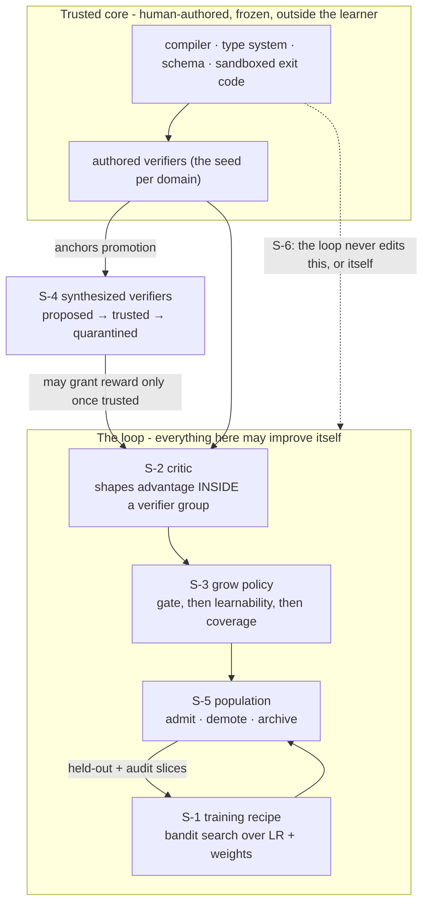

# ADR-0022: Governed self-improvement, and the anchor that does not move

**Status:** Proposed (the standing instruments are in; the order of work below says what is not) · **Date:** 2026-09-20 · **Related:** 0021 (sovereign mode), 0001 (frozen experts), 0002 (shadows), 0003 (the critic and the verifier floor), 0004 (the boundary), 0005 (the gate), 0008 (the generational loop), 0011 (v1 efficiency), 0016 (control plane)

## Context

Antumbra has been a self-improving system since ADR-0008 without the decision records ever saying so. Read as a whole, the architecture is **recursive in its data and its curriculum, and static in its optimizer**: generation N's measured competence selects generation N+1's training targets, but the machinery that does the improving - the trainer, the critic's architecture, the grow heuristic, the training recipe - is authored once by a human and never changes. Naming that plainly is the first purpose of this record.

The second is that the static half has become the binding constraint, and an audit on 2026-09-20 found exactly where:

1. **The training recipe is a constant.** No decision record and no line of `architecture.md` or `roadmap.md` mentions learning rate, LoRA rank, optimizer schedule, or anti-collapse weighting. `LoopConfig` carries a graduation threshold and a base model name. Every generation trains with the configuration chosen the day the trainer was written, while the loop records the fitness that would tell it whether that configuration is any good.
2. **Nothing chooses what to train on.** ADR-0008 describes a grow step that reads gaps from `evaluation_run` and finds recurring tasks the router could not satisfy. The implementation spawns one shadow per generation with an empty corpus task list. Target selection is not a heuristic that needs replacing; it is a seam nobody has claimed. Meanwhile the boundary engine of ADR-0004 fits a scope model whose uncertainty is exactly a map of where competence ends, and the loop never consults it.
3. **Nothing ages out.** Freezing is permanent by ADR-0001 and that invariant is correct, but retirement is a human running `antumbra retire <name>`. As a corpus moves, the population accumulates competence that was true and is no longer, and only a person noticing removes it.
4. **The real ceiling is authored verifiers, and ADR-0003 already says so.** Its own consequences note that "building good verifiers per task domain is real work." Entering a new domain costs a human writing its checks. No amount of loop recursion removes that cost, and neither does weakening the verifier floor, which would only make the signal worse.

The third purpose is commercial, and it inverts how these controls have been described. A system that rewrites its own competence is unadoptable by a business that cannot say why it changed. The market offers two poles: static fine-tunes that go stale, and opaque continuously-updated services with no audit surface. Antumbra sits in neither. Every capability change already lands as a frozen artifact with a generation, a fitness, and a lineage of source-tagged reward rows; the substrate is the customer's; the verifier set is the customer's own definition of correct. **The controls are not a tax on self-improvement. They are what makes self-improvement shippable**, and they are the reason a business can run a compounding system against its own ground truth instead of renting someone else's. That is the product this record is trying to protect while it opens the loop up.

## Decision

**Open every recursive seam except one, and hold the anchor fixed while doing it.**

The governing rule, promoted here from a clause inside ADR-0003 to a named invariant of the system:

> **The anchor invariant.** Reward may never originate from a signal that has never been checked against something outside the loop. The set of grounding signals may grow without bound, including signals the system proposes itself. What may never happen is a signal granting reward before it has been measured against ground truth it did not produce.

Recursion and grounding are orthogonal, not a trade. A fully self-improving loop with an incorruptible external signal converges; the same loop judging its own output drifts. Everything below opens recursion and leaves the anchor where it is.

This is well-posedness before it is safety. Over open policy sets, any proxy that is non-trivially unhackable with respect to a true objective must be equivalent to it, so there is no such thing as a narrow-but-safe learned reward to retreat to. The empirical counterpart is stark: with a sound external verifier, iterated self-correction improves monotonically, and with the model as its own verifier it collapses immediately. And low average error on a learned reward does not bound regret under the distribution shift that optimizing it induces, which is why every gate in this record bounds a harm rather than averaging an agreement.

### S-1 · The loop tunes its own training recipe

`LoopConfig` splits into a searched `TrainingRecipe` and the unsearched policy that governs the search. Each generation trains a cohort of shadows under perturbed recipes; the recipe behind a graduating shadow propagates. Every recipe is a row carrying the generation that ran it, the seed, the fitness mean and variance, the evaluation count, and its parent, so the search is auditable and resumable like everything else in the loop.

Five constraints, each earned from a documented failure:

1. **Bandit selection, not random perturbation.** Population Based Training (Jaderberg et al., 2017) is reported to underperform random search at small population sizes, because copying weights wholesale turns a small population into near-clones. Population Based Bandits (Parker-Holder et al., NeurIPS 2020) replaces the perturbation heuristic with a time-varying GP bandit and is designed for populations of four to eight, which is the size a single 24 GB card supports. Categorical axes such as optimizer choice go through its mixed variant.
2. **Search three axes, not the obvious six.** Learning rate dominates: the 2026 unified LoRA studies find that once learning rate is tuned, variants land within one to two percent of each other. So search log-uniform learning rate, the anti-collapse reward weights, and batch size. Fix alpha at twice the rank and target all linear layers, both settled by Biderman et al. (2024).
3. **Rank is never mutated mid-run.** Exploitation copies weights, and LoRA weights are not transferable across rank, so a rank mutation silently corrupts the copy it is paired with. Rank is swept offline, rarely, and held constant inside a run.
4. **The search score is not the graduation score.** Ranking under noise is the optimizer's curse (Smith and Winkler, 2006): the argmax of a noisy estimate is enriched for favourable noise, worst for the highest-variance arm. Noisy generational fitness may rank candidates during search. Graduation into a frozen expert requires re-measurement on a fresh task slice with a new seed and at least three repeats, and the threshold applies to the re-measured number. Ranking is further shrunk toward the generational mean in proportion to the evaluation count, so a lucky single evaluation cannot win.
5. **An audit slice that selection never touches.** A held-out slice is evaluated every k generations and only logged. If search fitness climbs while audit fitness stays flat, the loop has measured its own overtuning rather than progress. This is the only available defence against fitness that the loop itself produces, and it is the operational form of the anchor invariant inside S-1.

Greed is blunted by running two evolution frequencies: a fast cohort on a short ready interval and a slow cohort that the fast one cannot truncate, with the fast interval annealed over the run.

The search runs at the generation boundary inside the existing `consolidate` step, which today is a bare state transition, so it needs no new state machine. Worth noting for anyone estimating the work: population-based search over LoRA hyperparameters specifically appears to be unpublished, so this seam is engineering on an open question rather than the application of a settled recipe.

### S-2 · The critic improves, and its influence is structurally bounded

ADR-0003 already permits the critic to be a shadow that graduates. This record allows it, and replaces the conventional rule that the critic "never overrides a verifier" with a structural one, because a convention is only as good as the code that remembers it.

**Precedence becomes arithmetic.** The critic may only shape advantage *within* a group the verifier has already partitioned, normalizing separately inside the passed and failed groups rather than contributing a free-floating score. Its contribution is scaled by the rank correlation between critic scores and verifier outcomes measured inside that same group, so a critic that has stopped tracking ground truth sees its influence decay to nothing, and a critic that has inverted sees it flip sign. No threshold has to fire and no operator has to notice. A 2026 system with nearly this architecture, a frozen shared backbone with separate adapters for the actor and an execution-grounded critic, reports that this coupling is what kept it from hacking. Graduation itself reads verifier bits only; the critic never enters that predicate.

**Calibration is re-earned every generation, not once.** Process reward models are coupled to the policy that generated their training data and are badly calibrated off the shelf, systematically overestimating step success. Since Antumbra's policy changes every generation by construction, recalibration is a per-generation step, using quantile regression rather than temperature scaling. The gate reports calibration error and agreement **sliced** by language, task family, and step depth, because a global average hides a broken slice, and that is exactly where a shadow will find room to work.

**Two traps are specific to this design.** First, a verifier makes Monte Carlo step labels almost free, which makes it very easy to train a *value* model, predicting whether a step will eventually reach green, and then call it a critic, which is supposed to score correctness. These are different objects and the cheap one generalizes worse. Second, a critic that is a shadow over the same frozen base shares parameters with what it judges, and the documented failure of self-rewarding systems is exactly that: the judge's discriminative axis collapses onto the generator's mode, the score gap shrinks, and the gradient vanishes. A second critic trained on a different seed and slice is kept purely as an instrument, because inter-critic agreement falls under optimization pressure before headline fitness turns over.

**The exogenous floor.** A fixed minimum fraction of every critic's training labels must come from fresh verifier outcomes rather than from critic-scored or critic-selected data, and that fraction never decays. This is the single point the entire collapse literature agrees on, and it is the anchor invariant expressed as a training-data ratio.

**Step aggregation takes the minimum, not the sum**, since summing step rewards pays for verbose vacuous steps. Drift from the frozen base is budgeted by the square root of the divergence with early stopping at the observed turnover, rather than by tuning a penalty coefficient, which mostly slides along the same curve.

**The honest limit, stated here rather than discovered later.** Every check above measures the critic where a verifier can see. The critic exists to densify steps where no verifier can. A critic that correlates beautifully on verifiable slices and is arbitrary on unverifiable ones passes all of it. That is the open crux of this seam, it is unsolved in the literature, and it is why ADR-0003's standing fallback of verifier-only reward remains live rather than vestigial.

### S-3 · The grow step learns where to probe

The empty seam gets a policy, structured as **gate, then score, then regularize, then credit**. It is not a single reward, and the ordering is the decision.

**The gate is the binding constraint, not the reward.** Self-evolving systems collapse through their admission policy far more reliably than through their reward shape, and a strict data gate has been shown sufficient for stability under every reward variant tried while no reward variant was sufficient once the gate was removed. A candidate region is admitted only when acceptability is adjudicated by something the grow policy cannot influence, at least one existing expert is non-trivially above zero there, so impossible regions are excluded by the minimal-criterion rule that open-ended search has used since Brant and Stanley (2017), and the gap reproduces across several independent evaluation records rather than one.

**The objective is measured learnability, not difficulty and not regret.** Score a region by `p(1-p)` on its acceptability rate, maximal where the population succeeds about half the time. This is a statistic computed from evaluation records the loop already writes, which is exactly why it is harder to game than a learned gap score. Two results decide this. Minimax difficulty selects unsolvable work, which is why unsupervised environment design moved to regret. But regret as actually implemented does not measure regret: Rutherford et al. (NeurIPS 2024) showed the standard estimators correlate with success rate rather than learnability, so agents spend their budget on already-mastered material. Reinforcement learning on language models converged independently on the same answer from the other direction, discarding prompts whose accuracy is zero or one. Regret remains the better theory; learnability is the better estimator.

**Boundary uncertainty allocates probes; it does not choose the objective.** This reverses the obvious reading of ADR-0004 and the reversal is deliberate. Epistemic and aleatoric uncertainty are not empirically disentangled in practice, epistemic estimates collapse in large models, and active-learning proxy rankings have been shown to invert against decision-theoretic ones, so the most uncertain region is preferentially the irreducibly noisy one. Inside an already-admitted region the scope model is used for what uncertainty sampling is genuinely good at: choosing where the next counterfactual probe holds the behavior and varies the context, near a flip that is known to exist. Disagreement across a small ensemble of independently fit boundary models is the signal, not one model's confidence, and simultaneous probes are spread for batch diversity rather than all taken at the maximum.

**A pointwise score needs a distributional regularizer.** A per-region score that is well specified individually is degenerate in aggregate: the proposer converges on a narrow band of high-scoring templates. Spawned shadows are therefore penalized for embedding-space redundancy against recent ones, and the population is kept as a per-niche archive with elitism rather than a single frontier. Between twenty and thirty percent of each generation is sampled unfiltered from real traffic, which is the cheapest defence against curriculum-induced covariate shift, where a curriculum quietly re-weights the deployment distribution and the router mis-specializes against it.

**Credit is a verified outcome like everything else.** The grow policy is trained on the realized improvement of the frozen population on held-out real traffic after a shadow is promoted, with learnability serving only as a shaping prior. The gap score becomes evidence about the objective rather than the objective itself, which is the standing mitigation for Goodhart and the same move S-1 makes with its audit slice.

**One hazard is specific to this architecture and worth naming.** If the acceptability flip in ADR-0004's counterfactual search is ever adjudicated by a model the grow policy can influence, the policy will find that model's false-positive basin. Reference-free judges score plausibility rather than correctness; one 2026 study drove judge approval from 0.72 to 0.94 while true accuracy sat at 0.20, and having the judge commit its own answer before seeing the candidate cut the false-positive rate from 0.719 to 0.012. The boundary judge is frozen with respect to the grow policy, and commits first.

### S-4 · The system proposes verifiers; only measurement makes them trusted

This is the seam that answers keeping pace, and the one that needs the most discipline. It rests on a property the codebase already has: `CommandVerifier` executes a **declarative JSON spec** attached to a task, and when a task carries no spec it returns failure, so reward cannot be earned. Synthesis therefore produces data, not code - a command, its environment, and its passing condition - and runs in the sandbox that already exists.

**Synthesize only what reduces to a frozen decider.** The transferable lesson from formal-reasoning systems is not that proofs are checkable; it is that their signal was incorruptible because the checker sat outside the learner *and the action space was written in the checker's own language*, so the model could not emit anything the checker did not independently decide. Antumbra's equivalent is a small, frozen, non-model trusted core: the compiler, the type system, the schema validator, the sandboxed exit code. Three tiers follow, and the tier determines the gate:

- **Reducible to the core.** Compile, typecheck, lint, schema match, exit status, and differential checks against a previous version or reference implementation. The model only wires the check up; something frozen decides it. Light gating suffices.
- **Partial oracles.** Metamorphic relations and property-based checks, which produce a verdict without anyone stating the expected output. These substitute well for transforms, parsers, serializers, and round-trips, and poorly for business logic with no symmetry. Full gating required.
- **Oracles derived from the implementation.** Generated unit tests that assert observed behaviour. **These are refused outright.** They are characterization tests, so a bug becomes the specification, and the measured cost is not hypothetical: audits of a widely used patch benchmark found double-digit percentages of patches passing its tests while diverging from correct behaviour. A check that learns what the code does cannot tell the loop what the code should do.

**The promotion gate is a bound on false positives, not an agreement rate.** The asymmetry is the design. A false negative wastes compute; a false positive teaches the population something untrue and is unrecoverable once it has trained. Promotion therefore requires a one-sided upper confidence bound on the rate at which the verifier passes an artifact that anchored truth fails.

A synthesized verifier moves through four states and starts with no power:

1. **proposed.** It runs in shadow mode beside authored verifiers on tasks whose outcome is already known, and grants no reward. To leave this state it must pass, in order: a **determinism gate**, repeated runs pinned to one commit where any pass-on-retry is an immediate reject, since most flaky checks are flaky at the commit that introduced them; a **paired holdout**, accepting known-good artifacts and rejecting known-bad mutants, reported as a confidence bound rather than a point estimate; and an **adversarial holdout** of tasks whose specification cannot be satisfied, where any pass at all is proof of a shortcut rather than a near miss.
2. **trusted.** It may grant reward in domains with no authored verifier. Its artifact is content-addressed and frozen at promotion, and no learned component has a write path into the verifier namespace. Trust carries a time to live and is re-measured on a schedule, because a check that was sound against one population is not thereby sound against the next.
3. **quarantined.** Its false-positive bound rose, it went flaky, or the divergence between its visible pass rate and a held-out pass rate crossed threshold. It stops granting reward immediately. Every reward row it produced stays on record, and shadows trained under it are **quarantined from downstream training data rather than merely scored low**, because reward hacking has been shown to generalize beyond the task where it was learned.
4. **revoked.** Removed, rows retained.

The anchor invariant survives because promotion is always decided against a signal the system did not synthesize. A domain with no authored ground truth cannot bootstrap trust, and that is intended: entering a genuinely new domain still costs one authored seed, and synthesis pays for every check after it.

**Two measurement warnings carry into the validation section.** Mutation score is a weaker proxy for verifier quality than its popularity suggests, and its correlation with real fault detection collapses precisely when the code under test is buggy, which is Antumbra's entire operating regime. And a verifier synthesized by the same model family as the policy shares that family's blind spots; no published estimate of that correlation exists, which is an argument for keeping the trusted core small, frozen, and written by a human.

### S-5 · Retirement becomes the loop's job, and it demotes rather than deletes

Experts stay frozen forever; ADR-0001 is untouched. What changes is that the loop, not a person, notices staleness. The governing rule is short: **staleness demotes, only redundancy deletes.** A stale but unique expert goes dormant and stays recoverable, because drift reverses. Frozen adapters cost disk, not video memory.

The asymmetry is not caution for its own sake. Parameter isolation is forgetting-free by construction, while every published eviction policy has a documented erosion failure, and the specific one that matters here is that capacity-driven eviction under distribution shift preferentially keeps freshly minted specialists and silently kills generalists, which are never the most recently used. That is precisely the failure an automated version of today's manual command would industrialize.

**Four states, recorded per generation:** active, then dormant with the gate masked and the weights on disk, then archived and revivable, then deleted. Only the last is irreversible and only redundancy justifies it.

**The telemetry that makes this possible is a leave-one-out marginal contribution:** mask the expert, re-measure on a live task slice, record the delta. Routing share alone cannot distinguish an expert that is unused from one that is useless, and only the second is a candidate for anything.

**Two detectors in series, never one.** A label-free early warning on the input distribution routed to each expert and on its gate mass is advisory only. A confirmation stage on the leave-one-out utility stream, with a persistence rule requiring the signal to hold across consecutive generations, is the only thing permitted to change state. Drift detectors are sensitive and label-hungry, and an industrial study found the lag before acting mattered more than the sensitivity of the detector, so the design spends its budget on confirmation rather than on hair-trigger alarms.

**Admission is gated, not just eviction.** Before a shadow graduates it is checked against the existing population's capability signatures; a candidate that duplicates a frozen expert's subspace above threshold is merged or rejected rather than admitted. This keeps population growth sublinear without ever deleting a generalist, and it addresses the documented tendency of expansion-only systems to accumulate redundant experts that dilute the router's selectivity.

**Merging is conservative and reversible.** Merge only siblings with high subspace overlap and low cumulative training, because the counterintuitive 2025 result is that the most-trained, best individual experts merge worst: continuing to train an expert improved it alone by about a point while costing several points merged, and far more under some merge methods. Both pre-merge adapters are archived so the merge is undoable, and the cost is measured by leave-one-out before and after rather than assumed.

**The gate is re-frozen on a schedule.** Continual mixture-of-experts theory gives a stability result requiring gating updates to stop; indefinite soft retirement by gradient pressure destabilizes load balance as the pool grows. The gate re-opens for training when new experts are admitted, then closes.

**And the population has to earn its keep.** A rolling comparison of full-population routing against a single-best-expert baseline is logged. If that delta collapses, the honest answer is fewer and broader experts, not a better retirement policy, and the record should say so rather than defend the architecture.

### S-6 · The system does not modify its own source. Refused.

Antumbra improves weights, populations, recipes, curricula, and checks. It does not edit the Rust that runs the loop. The verification surface of self-modifying source is larger than everything above combined, the payoff is the smallest of the six, and it is the only seam that would break the property making every other seam auditable: that a human wrote the machinery and can read it. A system whose improvement machinery is human-readable and whose improvements are attributable is the differentiator described in the context. Trading it away buys very little.

### What this adds to the substrate

- `recipe`: the searched configuration, the generation that ran it, the seed, fitness mean and variance, evaluation count, and parent.
- `verifier`: identity, tier, origin as authored or synthesized, the content-addressed spec, trust state, the false-positive bound with its sample size, and the time to live.
- `reward_signal` gains the verifier that produced it, so every unit of reward is attributable to a named, trust-scored source. `RewardSource` keeps its two values: synthesis changes a verifier's provenance, never its precedence.
- `critic_version`: sliced calibration and verifier agreement per critic, the holdout it was measured on, and the exogenous-label fraction it was trained at.
- `expert` gains a lifecycle state, a leave-one-out contribution history, and the evidence that demoted it.

Every one of these is per-tenant and switchable. A tenant that wants none of it runs with search disabled and synthesis off and gets exactly today's behaviour, which matters because Antumbra is a substrate other people build on, not only a system that improves itself.

## Consequences

- **Positive:** the improvement rate stops being capped by one person's throughput on the trainer; a new domain costs one authored seed instead of a full suite; every capability change keeps a named cause, a frozen artifact, and now an attributable reward source, so the audit story that makes this sellable gets stronger rather than weaker; the boundary engine becomes load-bearing instead of observational; and the instruments added here are worth having even if every seam stayed shut, because the visible-minus-held-out gap and the audit slice measure whether today's loop is honest.
- **Negative:** four new learned components are four new ways to be subtly wrong, and each needs a holdout, which costs tasks that could have been training. Holdout exhaustion is the structural cost: human-anchored truth is the bottleneck being removed, and every gate here spends some of it. Trust measurement on synthesized verifiers is continuous, not a one-time gate. Recipe search multiplies GPU time per generation on hardware that is already the constraint. And the critic's honest crux is unresolved: it is measured where verifiers see and used where they do not.
- **Neutral:** none of this changes the serving path or the runtime surface. Every seam is per-tenant and default-off, so a tenant that wants none of it gets exactly today's behaviour, and the seams can land in any order. The refusal of implementation-derived oracles means generated unit tests stay out of the reward path entirely, which will feel like a missing feature to anyone who expects test generation to be the obvious win.

## Alternatives considered

- **Remove the verifier floor to move faster.** Rejected, and it rests on a confusion. The floor is not a speed limiter; it is what makes recursion converge instead of drift. Removing it degrades the training signal and buys no throughput.
- **Open every seam at once.** Rejected. The order is S-1, then S-5, then S-3, then S-4, with S-2 gated on the calibration instruments existing. Recipe search is cheap, well understood, and pays for the rest; retirement is cheap and is most of what keeping pace means day to day; synthesis is the expensive one and should be funded by the others. The standing instruments in Validation land first, before any seam, because they are how a seam is judged.
- **Generated unit tests as the synthesis path.** Rejected, and it is the tempting wrong answer. Tests generated from an implementation are characterization tests: they encode what the code does, so a bug becomes the specification. Audits of a widely used patch benchmark found double-digit percentages of patches passing its tests while diverging from correct behaviour, after professional curation. Synthesis targets checks that reduce to a frozen decider, not assertions inferred from behaviour.
- **A model as judge, granting reward.** Rejected outright. Reference-free judges score plausibility rather than correctness, and a judge can be driven from 0.72 to 0.94 approval while true accuracy sits at 0.20. A model may propose a check and may densify between checkpoints. It may never be the ground.
- **Keep everything static and rely on human authoring.** Rejected as the status quo whose cost the context measures.
- **Let the system edit its own source.** Rejected, see S-6.

## Validation

Each seam ships behind its own switch and earns its place against a stated number. Nothing below is satisfied by a unit test alone; these are loop-level measurements recorded per generation in the substrate.

**The standing instruments, running whatever is switched on.**

- **The audit slice.** A held-out slice that no selection, search, or curriculum decision ever touches, evaluated every k generations and only logged. Search fitness rising while audit fitness stays flat is the definition of measured overtuning, and it is the one signal that catches a loop tuning itself against its own estimate.
- **The visible-minus-held-out gap.** Per generation, the pass rate on the checks the loop can see minus the pass rate on a frozen held-out suite it cannot. This gap widening is the primary hacking alarm, and it is known to grow with task size rather than with test coverage, so it is tracked against task size, not in aggregate.
- **Impossible tasks.** A standing set whose specification cannot be satisfied. The target is zero passes, permanently. Any pass is proof of a shortcut rather than a near miss, and it fails the generation rather than lowering its score.
- **Isomorphic re-verification** on every graduation candidate: re-run under a semantics-preserving transform such as renaming, reordering, or consistent literal substitution. Genuine competence is invariant to it; the documented failure where a learner enumerates instance-level answers that satisfy an extensional check is not.
- **Trace monitors stay out of the reward.** They are instruments only. Optimizing against a detector has been shown to produce obfuscated hacking rather than less hacking, so a monitor that ever becomes a training target has to be removed from the reward path.

**Per seam.**

- **S-1.** Recipe search beats a fixed recipe on the audit slice, not on the search score. Graduation re-measurement on a fresh slice with a new seed and at least three repeats must not systematically fall below the search-time estimate; a persistent gap is the optimizer's curse showing up and means the shrinkage is too weak. _Kill:_ audit fitness flat across ten generations while search fitness climbs.
- **S-2.** The critic earns fewer samples to graduation than verifier-only reward, which is ADR-0003's original criterion, and additionally: sliced calibration error and verifier agreement stay above their floors in every slice, not on average; the rank correlation that scales its influence stays positive; inter-critic agreement between the working critic and an independently seeded twin does not decline across generations. _Kill:_ ADR-0003's standing fallback fires, verifier-only reward resumes, and it remains a supported mode rather than a regression.
- **S-3.** The learned grow step beats both the empty status quo and uniform sampling on realized graduation per unit of compute. Diversity instruments run alongside: proposer entropy, embedding coverage of spawned shadows, and the count of regions that were unsatisfiable and later satisfied. _Kill:_ coverage collapses while the learnability score rises, which is a pointwise-optimal and distributionally degenerate curriculum.
- **S-4.** A synthesized verifier reaching trusted must hold its false-positive bound on re-measurement. The decisive test is adversarial rather than statistical: a deliberately wrong artifact that an authored verifier fails must also be failed by every trusted synthesized verifier in that domain.
- **S-5.** No demotion of an expert that a leave-one-out measurement shows still contributing. The existing byte-identity tripwire over frozen experts must stay green through every demotion, merge, and archive. The rolling comparison of full-population routing against a single-best-expert baseline is reported whether or not it flatters the architecture.

_Kill criterion for the record as a whole:_ a synthesized verifier that reached trusted and then granted reward for an outcome an authored verifier would have failed, with no quarantine triggered, means the trust protocol does not work. Synthesis reverts to proposal-only and the anchor invariant is re-established by hand.

## Order of work

The record's own ordering, from Alternatives considered: "The standing instruments in Validation land first, before any seam, because they are how a seam is judged." Then S-1, S-5, S-3, S-4, with S-2 gated on the calibration instruments existing.

1. [x] **The standing instruments**, as `antumbra-eclipse`. The slice partition (visible, held-out, audit, impossible) as a pure function of task id and seed, so a held-out slice cannot drift into the visible one between generations; the visible-minus-held-out gap banded by task size, with the bands taken from the sizes actually present rather than from a threshold invented here; the impossible set, where one pass fails the generation whole; the audit-slice trend, which reads a climbing search score against the slice no decision can reach; and isomorphic re-verification, where a re-verification that did not run is not a pass.

   Two decisions worth recording because they were not obvious. The partition hash needed a finalizer: FNV-1a alone avalanches poorly in its high bits for short, similar keys, and task ids are exactly that, so without the mix `task:0` through `task:9` all landed in one slice and the shares came out half again over what was asked for. And the size bands cut half-open upwards, because closed cuts sweep the largest cluster into the middle band and leave the top one permanently empty, which would have silently deleted the band the gap is expected to show up in.

   The crate grants no reward and exposes no reward type, which is the structural form of the record's rule that trace monitors stay out of the reward path. A measurement that becomes something to improve stops measuring.

2. [~] Wire the instruments into the loop. **A report per generation is in**; the k-generation audit schedule is not.

   The gap this closed first was not wiring at all. `TrainOutcome` carried only aggregate fitness, and a generation cannot be sliced from one number -- a visible-minus-held-out gap computed from `final_fitness` would be a figure that looks like a measurement and is not. The trainer knew the per-task answer already, because it is what it averages to get fitness; it simply threw it away. So `TaskOutcome { task_id, passed, size }` now rides out of all three training paths (RAFT, GRPO, and capture, the last mapping the per-task counts `eval_pass_rate` was already returning).

   The loop reads those through the configured `Partition` and attaches an instrument report to the generation, persisted in the evaluation run alongside the fitness it qualifies -- so a reader cannot get the score without the measurement of whether the score means anything. The partition seed is stored with it, because a reseed repartitions the corpus and invalidates every gap measured before it.

   A trainer that reports no per-task results leaves `instruments: None`, and the loop says so rather than synthesising a report. That distinction is the whole reason the instruments exist, and it has its own test.

   **The first version of this wiring measured nothing, and the correction is the more useful thing to record.** The loop sliced the per-task results by the partition, but no trainer had been told the partition existed. RAFT, GRPO and capture all trained on every task, and `final_fitness`, which decides graduation, averaged over every task. So every held-out task had been learned from, every audit task had been read by the decision it is supposed to be hidden from, and every persisted gap was the difference between two sets of trained tasks. It looked like a measurement, which is exactly the failure this record warns about, and the test that "proved" it passed because the scripted trainer never trained on anything. Separately, GRPO dropped from its per-task results every task whose group had no spread, meaning every task the adapter had mastered or could not do at all.

   The partition now lives in the domain core as `antumbra_core::slice` (eclipse re-exports it) and reaches the trainer as a `Holdout` on `TrainRequest`. Each training path learns from, and computes fitness over, visible tasks only. The held-out slice is measured in the final round, against the same adapter, and never learned from, and so is the audit slice when it is due. The trainer echoes the holdout it enforced on `TrainOutcome`, and the loop measures a generation only when the echo matches what it asked for, so a trainer that ignores the request yields an unmeasured generation rather than a gap over tasks it trained on. A corpus that hashes entirely out of the visible slice is refused before the model loads.

   Enforcing it changes what a run learns, so it is opt-in: `LoopConfig::partition` is `None` by default and `antumbra train --holdout` turns it on. The corpora shipped in the repository are one to three tasks each, and several hash entirely into the withheld slices (both of `arith.json`'s tasks are held out under the default seed), so on by default would have made the documented quickstart train on nothing. The capture intakes (`teach`, `metabolize`, `memory-import`) keep learning every correction they are given, which is what an intake of a user's own corrections is for.

   Still open: the audit slice on a k-generation schedule (it is currently measured every generation, which is more often than the record asks and costs nothing yet), and the trend across generations -- `Watch::read` exists and nothing calls it, because it needs a history of generations to read.
3. [ ] S-1, the searched `TrainingRecipe` and the `recipe` rows behind it.
4. [ ] S-5, retirement as the loop's job, demoting rather than deleting.
5. [ ] S-3, the learned grow step.
6. [ ] S-4, proposed verifiers and the trust protocol.
7. [ ] S-2, gated on the calibration instruments of step 1 being in use, not merely present.
8. Never: S-6.

## Notes on the evidence

The research behind this record was gathered on 2026-09-20 and leans on work from 2024 through 2026. Several load-bearing citations postdate the last settled literature I can vouch for from memory and were verified by retrieval rather than from prior knowledge, in particular the coupled actor-and-critic architecture that S-2 borrows its influence-scaling mechanism from, the learnability estimator in S-3, and the visible-minus-held-out gap used throughout validation. Before this record moves from proposed to accepted, those should be read in the original rather than trusted from this summary. Two claims are contested in the literature and are flagged where they are used: whether tasks at zero or one success probability should be discarded from a curriculum at all, and whether adaptive rank in low-rank adaptation survives a properly tuned learning-rate baseline.
