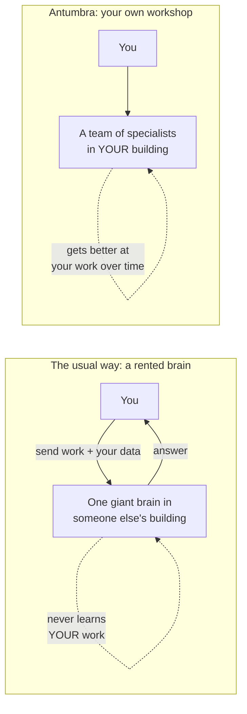
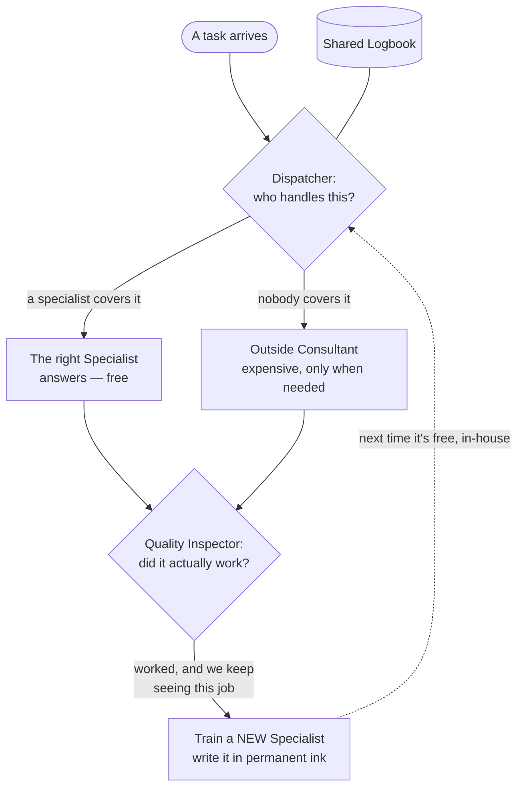
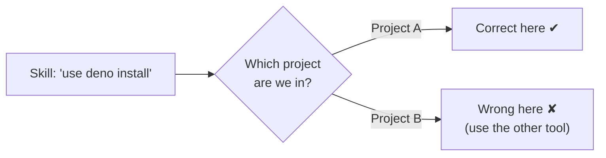
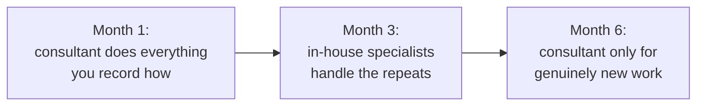

# Antumbra, explained for anyone

*No computer-science background needed. If you can picture a small workshop with a
team of people, you can understand the whole thing.*

---

## The one-sentence version

> Most AI is a giant brain you **rent** in someone else's building — it never learns
> *your* work, and your data has to leave your hands to use it. **Antumbra** is the
> opposite: a small **team of specialists you grow in your own building**, that gets
> better at the work you do over and over, and keeps everything with you.

Think of it as the difference between **calling an expensive outside consultant
every single time** versus **training your own in-house staff** who eventually just
*know* the job.

---

## The problem it fixes

When you use a normal AI assistant, you're talking to one enormous, general-purpose
brain that lives on a company's servers. Three things follow from that:

1. **It never actually learns your work.** It's exactly as good (or as clueless)
   about *your* projects tomorrow as it is today. Every time, you re-explain.
2. **Your data leaves the building.** To get an answer, you ship your information to
   someone else's computers.
3. **You pay for the same work forever.** The thousandth time it does a routine task
   for you costs the same as the first.

---

## Meet the team (every idea is a person in the workshop)

Antumbra is a little workshop. Here's the cast — and the real (nerdy) word for each,
so you can connect it to anything else you read.

- **The Generalist** *(the “base model”)* — a clever intern who knows a little about
  everything but isn't a true expert at *your* specific work. Everyone in the
  workshop shares this one generalist as their starting point.

- **The Specialists** *(the “experts”)* — apprentices who each master **one** narrow,
  repeating job. A specialist isn't a whole new person — it's a **thin overlay** on
  the Generalist, like a pair of glasses that turns the generalist into an expert for
  one task. (Cheap to make, cheap to keep — you can have hundreds.)

- **Permanent ink** *(“frozen”)* — once a specialist truly masters their craft, you
  write it down in **permanent ink**. This matters more than it sounds: the classic
  way computers “learn” a new skill is by *smudging* old skills — teach it task B and
  it quietly gets worse at task A. Permanent ink is the promise that **a skill, once
  earned, is never forgotten.**

- **The Dispatcher** *(the “router”)* — the person at the front desk who reads each
  incoming job and hands it to the right specialist… or says, *“none of us can do
  this one — call the outside consultant.”*

- **The Quality Inspector** *(the “verifier”)* — the one who checks whether the work
  **actually worked**: did the test pass, did the program run, did the customer
  accept it? Antumbra only rewards results that *truly* worked — **reality is the
  teacher**, not flattery. This is the heart of it: nobody earns a permanent skill on
  someone’s say-so, only on proof.

- **The Logbook** *(the “memory”)* — a shared notebook of facts, past experiences, and
  judgments the whole team keeps and can look things up in.

---

## The clever part: knowing *where* a rule applies

Most systems just collect what *works*. Antumbra’s real bet is on the **other,
neglected half**: knowing the **edges** of a rule — that something is right *here* and
wrong *one step over*, and *what tells the difference*.

A plain example. “Use `deno install`” might be the correct way to add a tool **in one
project**, but completely wrong **in another project** that uses a different toolset.
A good apprentice doesn’t just memorize “always do X.” They learn “do X **when** we’re
in this situation, and **not** when we’re in that one — and the thing that decides is
*which project we’re in*.”

That sense of **scope** is exactly what lets the Dispatcher make the smartest call of
all: *“this is inside what we’re reliably good at — handle it in-house”* versus
*“this is outside our range — escalate to the consultant.”* Knowing the limits of
what you know is as valuable as the knowledge itself.

---

## Muscle memory: the scaffolding shrinks

At first, doing a job takes a lot of scaffolding — notes, checklists, looking things
up in the Logbook, step-by-step instructions. As the team does a job again and again
and it keeps passing inspection, Antumbra **trains that whole routine into a
specialist** — it becomes *muscle memory*. The team stops reaching for the checklist
because they just *know* it now.

This is the part ordinary “AI memory” tools can’t do. They give the brain a **better
notebook** so it can *remember* more. Antumbra makes the brain **actually better at
the job**, so over time it needs the notebook less. Capability **builds up and
compounds**, instead of you re-paying the “look it up and re-explain” cost every
time.

---

## How it pays for itself

You don’t throw out the expensive consultant on day one — you **wean off** them:

Every time the pricey consultant does a job and it **passes inspection**, that’s a
free lesson you already paid for — turn it into an in-house specialist, and you never
pay for that job again. You keep the consultant on call for the genuinely new and
hard stuff. *Honest part:* there’s an up-front investment period where you’re paying
while teaching, and it only really pays off if you do enough repeating work to be
worth it.

---

## Your stuff stays yours

The whole workshop is **in your building**. Your work, your data, and the skills your
team learns never have to be shipped to a stranger’s warehouse. If several people or
teams share one workshop, each one’s materials sit in **separate locked cabinets**,
and the lock is enforced by the building itself — not by a “please don’t peek” sticky
note. (For privacy-sensitive work — medical, legal, financial — this is often the
whole ballgame.)

You can run it two ways: **entirely on your own machine** (nothing ever leaves), or as
a **private hosted service** (someone runs the building for you, but your cabinet is
still only yours).

---

## How your friend would actually use it

You don’t talk to Antumbra directly like a chatbot. You **bolt it onto the AI
assistant you already use** (the popular coding assistants all support this). Antumbra
becomes the **brain**; your assistant stays the **hands and voice**. Once connected:

- **Every session starts smart** — the assistant wakes up already knowing your
  conventions and history (it reads the Logbook on the way in).
- **It answers from the team when it can**, and only escalates the genuinely new.
- **Every session ends by writing down what it learned** — and the proven, repeating
  work quietly graduates into a new permanent specialist for next time.

---

## What it’s *not* (so no one’s oversold)

- It’s **not magic, and not free to start.** It wants a decent graphics card (the kind
  used for games/AI) and a learning-in period before the specialists are any good.
- It’s **not a know-it-all oracle.** It shines on **repeating, checkable** work you do
  a lot. For wildly open-ended, never-seen-before problems, you still lean on the big
  outside brain.
- The bet is simple: **small, well-trained in-house specialists beat a giant generalist
  *for your specific repeated work*** — and you own them.

---

## Cheat sheet: the workshop ↔ the real words

| In the workshop… | The real term | In one line |
|---|---|---|
| The clever intern everyone starts from | base model | one shared general-purpose AI |
| An apprentice who masters one job | expert (LoRA adapter) | a small skill-overlay on the intern |
| Writing a skill in permanent ink | freezing | so learning new things can’t erase it |
| The front-desk dispatcher | router / gate | sends each task to the right expert, or escalates |
| Knowing *where* a rule applies | boundary / scope | right here, wrong there — and what decides |
| The quality inspector | verifier | rewards only work that actually worked |
| The shared notebook | memory store | facts, experiences, and judgments |
| Turning routine into muscle memory | metabolizing / consolidation | the scaffolding shrinks into the brain |
| Separate locked cabinets | multi-tenant isolation | the building enforces who sees what |
| Bolting the brain onto your assistant | MCP integration | Antumbra is the brain, your tool is the hands |

---

*Want the engineering version next? See the [README](../README.md), the
[architecture overview](architecture.md), or [how to wire it in](integration.md).*
