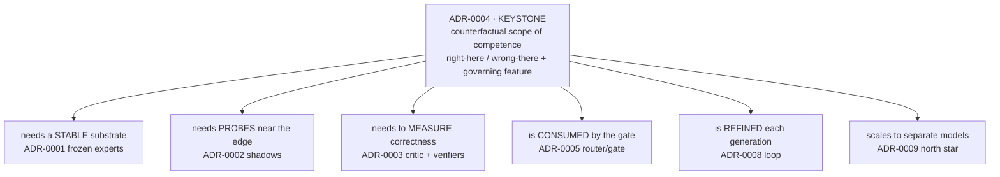
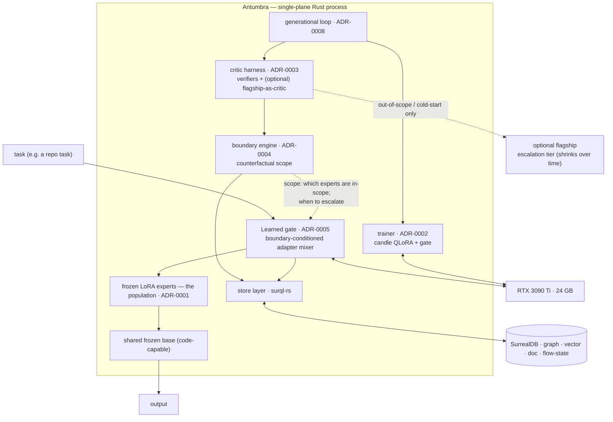
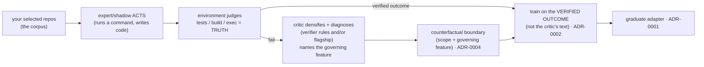
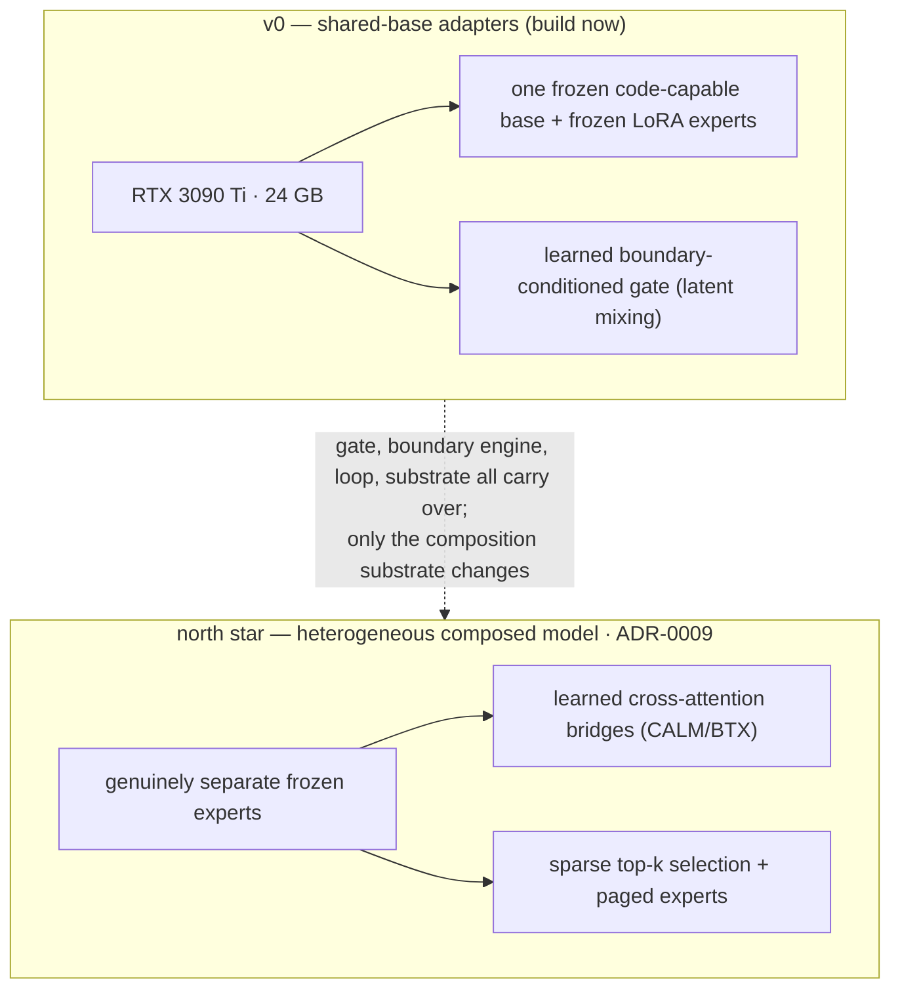
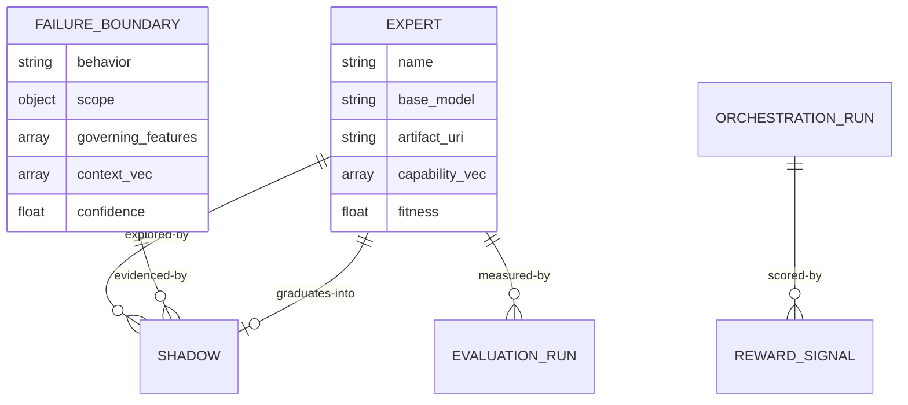

# Antumbra — Architecture

Technical companion to the [README](../README.md): the **single-plane Rust** architecture, the **shared-base
adapter** model that is v0, the **SurrealDB** substrate, the **decision chain**, the **training / data flow**,
and the **schema**. Reflects the decisions locked as of 2026-05-30 (greenfield, all-Rust, single RTX 3090 Ti,
shared-base adapters for v0, heterogeneous composition as the north star).

---

## 1. The thesis, and the two readings of the chain

**ADR-0004 — modeling the counterfactual boundary of the agent's own competence — is the keystone.** It is the
reason the project exists; everything else is apparatus. Read *conceptually*, the architecture radiates from it:



Read as an **engineering** (build-dependency) order, the same pieces fall the other way, which is why the ADRs
are numbered 0001 → 0009 even though 0004 is the heart.

---

## 2. System architecture (v0 — shared-base adapters, single-plane Rust)

v0 is **one frozen, code-capable base + a library of frozen LoRA experts + a learned, boundary-conditioned
gate.** Composition happens in *latent space* (adapter mixing), not by piping text between separate models — so
the same artifacts serve as both a routable population (pick one adapter = *coverage*) and an in-latent composed
model (blend adapters = *composition*). Everything is one Rust process; the only hard seam is training (no Rust
Unsloth) — a **DIY `candle`** path for both the QLoRA adapters and the gate.



- **Serving** — `llama-cpp-2` (GGUF base + LoRA hot-swap) or `mistral.rs` (candle, ISQ, OpenAI-compatible). One
  base + many adapters = **S-LoRA-style multi-adapter serving** on a single GPU.
- **Trainer** — `candle` (`burn` fallback) for QLoRA adapters *and* the gate. The heaviest Rust ML work.
- **Substrate** — one SurrealDB instance is every store + the durable flow state.

---

## 3. Training & data flow (verifiable outcomes, not imitation)

Antumbra learns from **verified outcomes in your environment**, with the critic as a *densifier* — never the
source of truth. This is what keeps it grounded (and clear of "trained on a provider's outputs").



- **The environment is the reward** (a command that works, a test that passes). For coding, this is exec/CI.
- **The critic** (verifier rules, and *optionally* a flagship model) turns a raw failure into a dense diagnostic
  signal and **names the governing feature** of the boundary (e.g. "this is a Deno project") — ADR-0003/0004.
- **You train on the verified outcome, not the critic's words.** The flagship, if used, is a *cold-start
  accelerator*, not an imitation target — your own repos are the more authoritative teacher.
- **Ideal first domain: coding-over-your-repos** — maximally verifiable, maximally context-scoped (per-repo
  conventions are textbook boundaries), data is yours. This pushes the shared base toward a **code-capable**
  model so experts can *act* well enough to generate learnable counterfactuals.

---

## 4. v0 scope vs the north star



The fleet (MacBook M4 Pro 48 GB, RTX 3080 mobile, GTX 1080, Jetson Orin Nano) and any native-ternary serving
(Bonsai / BitNet) remain deferred behind the north star — acknowledged hardware limits keep v0 on the one card.

---

## 5. Schema (SurrealDB) — summary

Full DDL in [ADR-0007](adr/0007-surrealdb-substrate.md). In v0 an `expert` row describes a **frozen LoRA adapter
over the shared base** (`base_model` = the shared base, `artifact_uri` = adapter path). Patterns reuse
**kushtaka** (HNSW recall, `evaluation_run` + `regression_fingerprint`) and the local **data-plane-builder-graph**
(`C:\Users\shonp\repos\data-plane-builder-graph`: schema-as-code, drift detection, migrations, tenant perms).



---

## 6. Tech stack (concrete, v0)

| Layer | Choice |
|---|---|
| Language | **Rust** (single plane) |
| Substrate | **SurrealDB ≥ 3.0** via `surql-rs` (`oneiriq-surql` ≥ 0.2.7) |
| Inference | `llama-cpp-2` (GGUF + LoRA) and/or `mistral.rs` (S-LoRA-style multi-adapter) |
| Training | **`candle`** — QLoRA adapters **and** the gate (NF4 4-bit base + LoRA); `burn` fallback |
| Base model | open, **code-capable** (Qwen-Coder-class or a code-tuned OLMo 3); shared by all adapters |
| Embeddings | 384-d (all-MiniLM-L6-v2, candle BERT, CPU); capability vectors are the centroid of solved-task embeddings (evaluated behavior) |
| Async / CLI | `tokio`; `ratatui` (Kushtaka-style ergonomics) |

---

## 7. Repo structure (greenfield)

```
antumbra/
  Cargo.toml
  crates/
    antumbra-core/         # domain types: Expert(adapter), Shadow, FailureBoundary, Generation
    antumbra-store/        # surql-rs data layer (schema/migrations/repositories)
    antumbra-gate/         # ADR-0005: boundary-conditioned adapter gate (+ north-star bridge client)
    antumbra-boundary/     # ADR-0004: counterfactual scope engine (keystone)
    antumbra-loop/         # ADR-0008: durable generational loop
    antumbra-critic/       # ADR-0003: verifiers + optional flagship-as-critic
    antumbra-train/        # ADR-0002: candle QLoRA + gate training
    antumbra-serve/        # llama-cpp-2 / mistral.rs multi-adapter serving
    antumbra-cli/          # operator CLI + TUI
  migrations/            # SurrealDB .surql
  corpora/               # verifiable corpora — selected repos for the coding domain
  experiments/           # the falsifiable validations ARE the milestones
  docs/adr/              # 0001..0009
```

### v0 implementation status (2026-06-02)

> **Update (2026-06-03).** Since this snapshot: MT-3 is validated on the GPU (the trainer learns — pass-rate to
> 1.0 under both a convention and a real exec verifier), the real candle BERT embedder is wired, the gate does
> relative-coverage out-of-scope escalation, and capability vectors are derived from evaluated behavior. See
> the [Technical Reference](technical-reference.md) §13 for current validation results.

All nine crates exist and compile; the workspace is green (`cargo test`, clippy clean) on Rust 1.96 + your
**surql-rs** (`oneiriq-surql`) on the SurrealDB 3.x driver, **builder-only — no hand-written SurrealQL**.

| Crate | State |
|---|---|
| core, store, critic, gate, boundary, loop | **implemented + tested** — the generational loop persists its full lineage (shadow lifecycle, source-tagged rewards, evaluation runs, graduated experts, open-negative boundaries) and resumes from the persisted head across process restarts (proven on `surrealkv://`). |
| train (ADR-0002/0010) | **implemented, compiles** — RAFT reward-ranked LoRA fine-tuning: candle Qwen2.5-Coder + LoRA `CausalLm` (generate + SFT + save), `RaftTrainer` (the `Trainer` port), `CommandVerifier` (env-as-reward), `JsonCorpus`. Behind the `models` feature; CPU-tested except the model forward, which is validated on the GPU (`docs/running-the-trainer.md`). |
| serve (ADR-0006) | **seam only** — `Serve` port returns `Unimplemented`; not needed for training (the trainer does its own candle generation). |
| cli | `antumbra migrate · schema · experts · status · loop · route · train` |

Not yet runtime-validated / built: the candle model's first GPU run (MT-3), the learned latent gate (v0 is the
heuristic coverage gate), GRPO (v1 over RAFT), GGUF-Q4 quantized backward (MT-4), llama/mistral serving,
`SCHEMAFULL` + the surql-rs migration-history runner, the orchestration-run repo, and loop-driven
counterfactual search. `experiments/` is not yet populated.

---

## 8. ADR map

| ADR | Title | v0 role |
|---|---|---|
| [0001](adr/0001-frozen-experts.md) | Population of frozen experts (adapters) | core |
| [0002](adr/0002-shadow-plasticity.md) | Shadow plasticity (DIY candle QLoRA) | core |
| [0003](adr/0003-critic-credit-assignment.md) | Critic / verifiable rewards | core |
| [0004](adr/0004-inhibitory-boundaries.md) | Counterfactual boundary | **keystone — first-class** |
| [0005](adr/0005-orchestrator-router.md) | Router → in-model gate | core |
| [0006](adr/0006-hardware-serving.md) | Hardware-adaptive serving | **scoped to 1 GPU; fleet deferred** |
| [0007](adr/0007-surrealdb-substrate.md) | SurrealDB substrate | core |
| [0008](adr/0008-generational-loop.md) | Durable generational loop | core |
| [0009](adr/0009-heterogeneous-composition.md) | Heterogeneous composed model | **north star (deferred)** |
