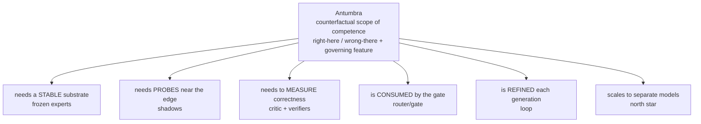
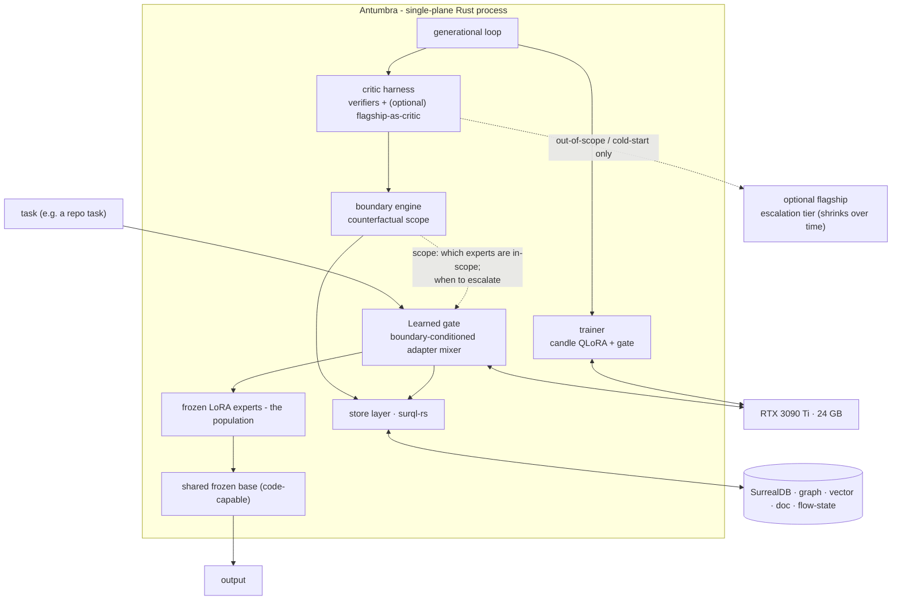
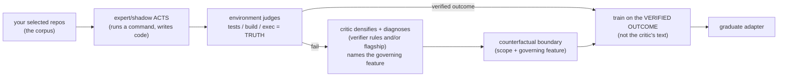
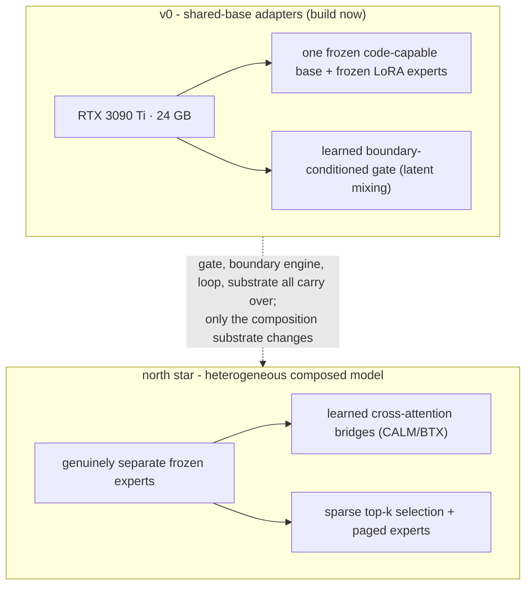
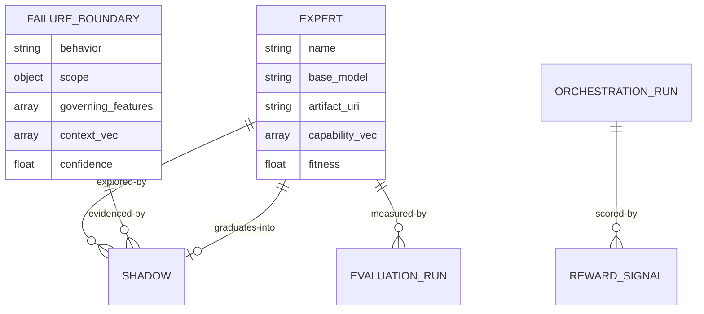

# Antumbra - Architecture

Technical companion to the [README](../README.md): the **single-plane Rust** architecture, the **shared-base adapter** model that is v0, the **SurrealDB** substrate, the **decision chain**, the **training / data flow**, and the **schema**. Reflects the decisions locked as of 2026-05-30 (greenfield, all-Rust, single RTX 3090 Ti, shared-base adapters for v0, heterogeneous composition as the north star).

---

## 1. The thesis, and the two readings of the chain

**Modeling the counterfactual boundary of the agent's own competence is the antumbra.** It is the reason the project exists; everything else is apparatus. Read _conceptually_, the architecture radiates from it:



Read as an **engineering** (build-dependency) order, the same pieces fall the other way, which is why the decision records are numbered 0001 through 0009 even though the boundary (0004) is the heart.

---

## 2. System architecture (v0 - shared-base adapters, single-plane Rust)

v0 is **one frozen, code-capable base + a library of frozen LoRA experts + a learned, boundary-conditioned gate.** Composition happens in _latent space_ (adapter mixing), not by piping text between separate models - so the same artifacts serve as both a routable population (pick one adapter = _coverage_) and an in-latent composed model (blend adapters = _composition_). Everything is one Rust process; the only hard seam is training (no Rust Unsloth) - a **DIY `candle`** path for both the QLoRA adapters and the gate.



- **Serving** - `llama-cpp-2` (GGUF base + LoRA hot-swap) or `mistral.rs` (candle, ISQ, OpenAI-compatible). One base + many adapters = **S-LoRA-style multi-adapter serving** on a single GPU.
- **Trainer** - `candle` (`burn` fallback) for QLoRA adapters _and_ the gate. The heaviest Rust ML work.
- **Substrate** - one SurrealDB instance is every store + the durable flow state.

---

## 3. Training & data flow (verifiable outcomes, not imitation)

Antumbra learns from **verified outcomes in your environment**, with the critic as a _densifier_ - never the source of truth. This is what keeps it grounded (and clear of "trained on a provider's outputs").



- **The environment is the reward** (a command that works, a test that passes). For coding, this is exec/CI.
- **The critic** (verifier rules, and _optionally_ a flagship model) turns a raw failure into a dense diagnostic signal and **names the governing feature** of the boundary (e.g. "this is a Deno project").
- **You train on the verified outcome, not the critic's words.** The flagship, if used, is a _cold-start accelerator_, not an imitation target - your own repos are the more authoritative teacher.
- **Ideal first domain: coding-over-your-repos** - maximally verifiable, maximally context-scoped (per-repo conventions are textbook boundaries), data is yours. This pushes the shared base toward a **code-capable** model so experts can _act_ well enough to generate learnable counterfactuals.

---

## 4. v0 scope vs the north star



The fleet (MacBook M4 Pro 48 GB, RTX 3080 mobile, GTX 1080, Jetson Orin Nano) and any native-ternary serving (Bonsai / BitNet) remain deferred behind the north star - acknowledged hardware limits keep v0 on the one card.

---

## 5. Schema (SurrealDB) - summary

Full DDL in [the SurrealDB substrate record](adr/0007-surrealdb-substrate.md). In v0 an `expert` row describes a **frozen LoRA adapter over the shared base** (`base_model` = the shared base, `artifact_uri` = adapter path). Patterns reuse a **prior memory engine** (HNSW recall, `evaluation_run` + `regression_fingerprint`) and the local **data-plane-builder-graph** (`C:\Users\shonp\repos\data-plane-builder-graph`: schema-as-code, drift detection, migrations, tenant perms).



---

## 6. Tech stack (concrete, v0)

| Layer       | Choice                                                                                                                         |
| ----------- | ------------------------------------------------------------------------------------------------------------------------------ |
| Language    | **Rust** (single plane)                                                                                                        |
| Substrate   | **SurrealDB ≥ 3.0** via `surql-rs` (`oneiriq-surql` ≥ 0.28)                                                                    |
| Inference   | `llama-cpp-2` (GGUF + LoRA) and/or `mistral.rs` (S-LoRA-style multi-adapter)                                                   |
| Training    | **`candle`** - QLoRA adapters **and** the gate (NF4 4-bit base + LoRA); `burn` fallback                                        |
| Base model  | open, **code-capable** (Qwen-Coder-class or a code-tuned OLMo 3); shared by all adapters                                       |
| Embeddings  | 384-d (all-MiniLM-L6-v2, candle BERT, CPU); capability vectors are the centroid of solved-task embeddings (evaluated behavior) |
| Async / CLI | `tokio`; `ratatui` (terminal-native ergonomics)                                                                                |

---

## 7. Repo structure (greenfield)

```
antumbra/
  Cargo.toml
  crates/
    antumbra-core/         # domain types: Expert(adapter), Shadow, FailureBoundary, Generation
    antumbra-store/        # surql-rs data layer (schema/repositories)
    antumbra-embed/        # the MCP runtime surface: HTTP embedder (OpenAI-compatible /embeddings) behind the Embedder port
    antumbra-gate/         # the boundary-conditioned gate: adapter gate (+ north-star bridge client)
    antumbra-boundary/     # the counterfactual boundary: scope engine (antumbra)
    antumbra-loop/         # the durable generational loop
    antumbra-critic/       # the critic for credit assignment: verifiers + optional flagship-as-critic
    antumbra-train/        # shadow plasticity: candle QLoRA + gate training; consolidation (Penumbra memory store)
    antumbra-serve/        # embedder (candle BERT) + multi-adapter serving seam
    antumbra-cli/          # operator CLI
    antumbra-mcp/          # the MCP runtime surface: MCP server (memory + graph + compartments + route)
    antumbra-sync/         # R-1: last-write-wins penumbra replication (local <-> remote)
    antumbra-tui/          # interactive operator console (ratatui): route-ask, event stream, drill-downs, actions
    antumbra-auth/         # the JWT token contract (HS256/RS256 verification, hook-token minting)
    antumbra-rerank/       # cross-encoder /rerank client behind the Reranker port
    antumbra-bench/        # retrieval-quality harness (recall@k / MRR over embedder configs)
    antumbra-control/      # hosted onboarding flow (invites, magic links, tenant provisioning)
    antumbra-control-server/ # its HTTP surface; a separate cargo workspace (its `contract` feature is the one private dependency)
  corpora/               # verifiable corpora - selected repos for the coding domain
  experiments/           # the falsifiable validations ARE the milestones
  docs/adr/              # 0001..0017
```

The Penumbra memory store, engine-enforced multi-tenancy, and compartments live in `antumbra-core` (domain) + `antumbra-store` (the `memory`/`memory_edge`/`compartment`/`grant`/`principal` tables, record-access auth, and the engine-enforced ACL); `antumbra-train` carries the consolidation gate + replay; the `antumbra-mcp` server is the agent-facing runtime surface.

### v0 implementation status (2026-06-05)

All **eighteen crates** exist and compile (seventeen workspace members plus the separately built control server); the workspace is green (`cargo test`, clippy clean) on your **surql-rs** (`oneiriq-surql`, the local `release/0.28.0` checkout, builder-only, with no hand-written SurrealQL) on the SurrealDB 3.x driver. Since the early snapshots: the trainer is GPU-validated (MT-3, pass-rate to 1.0), the real candle BERT embedder + relative-coverage gate are wired, the Penumbra memory store landed with engine-enforced tenant/compartment isolation, and the agent-facing MCP runtime surface is up.

| Crate                                                                          | State                                                                                                                                                                                                                                                                                                                                                                                                                                                                                                                                                                                                                                                                                                                                                                                                                                                                                                          |
| ------------------------------------------------------------------------------ | -------------------------------------------------------------------------------------------------------------------------------------------------------------------------------------------------------------------------------------------------------------------------------------------------------------------------------------------------------------------------------------------------------------------------------------------------------------------------------------------------------------------------------------------------------------------------------------------------------------------------------------------------------------------------------------------------------------------------------------------------------------------------------------------------------------------------------------------------------------------------------------------------------------- |
| core, store, critic, gate, boundary, loop                                      | **implemented + tested** - the generational loop persists its full lineage and resumes across restarts (proven on `surrealkv://`); the store adds the Penumbra (memory + graph + compartments) under an engine-enforced, record-access ACL (`$auth.tenant`/`$auth.user`), with `penumbra::propose_compartments` clustering.                                                                                                                                                                                                                                                                                                                                                                                                                                                                                                                                                                                    |
| train (shadow plasticity, the candle QLoRA trainer, the Penumbra memory store) | **implemented + GPU-validated** - RAFT/GRPO LoRA fine-tuning (candle Qwen2.5-Coder + LoRA `CausalLm`), capture/teach intake, consolidation (gate + replay), memory-import. On the 3090 Ti (CUDA 13.3): RAFT graduated an expert, and memory consolidation internalized a verifier-gated expert (`deno install`) at 1.00. Behind `models`; see `docs/running-the-trainer.md`.                                                                                                                                                                                                                                                                                                                                                                                                                                                                                                                                   |
| serve (hardware-adaptive serving)                                              | **implemented + GPU-validated** - `CandleServe` (single pinned adapter) and `MultiAdapterServe` (resident base, S-LoRA hot-swap per routed expert); both served a trained adapter on the 3090 Ti (CUDA 13.3).                                                                                                                                                                                                                                                                                                                                                                                                                                                                                                                                                                                                                                                                                                  |
| mcp (the MCP runtime surface)                                                  | **implemented + tested** - 19 tools over the Penumbra + population (memory, graph, compartments incl. `propose_compartments`, `route`, `answer`); the antumbra can auto-organize the inbox (`--auto-propose`); stdio (single identity) and networked JWT multi-tenant HTTP (per-request `$auth`, isolation proven on embedded).                                                                                                                                                                                                                                                                                                                                                                                                                                                                                                                                                                                |
| cli                                                                            | `migrate · schema · experts · status · loop · route · seed · ask · serve · train · teach · evolve · populate · memory-import · ingest · git-facts · metabolize · remember · consolidate · consolidate-compartment · propose-compartments · retire · scope · gate-train · compose`                                                                                                                                                                                                                                                                                                                                                                                                                                                                                                                                                                                                                                                   |
| embed (the MCP runtime surface)                                                | **implemented + tested** - the OpenAI-compatible `HttpEmbedder` (behind the `Embedder` port, dimension-enforced) shared by the MCP server and the TUI, so route/ask/recall embed with the same model the population was built with.                                                                                                                                                                                                                                                                                                                                                                                                                                                                                                                                                                                                                                                                            |
| tui (the boundary-conditioned gate, the operator console)                      | **interactive operator console** (ratatui + tachyonfx) over the live population/gate: route-ask through the gate (`--embed-url`), a live event stream of store changes, drill-down inspection, a tabbed multi-page shell (population · memory · loop · evals), switchable layouts (focused / dashboard / graph / sortable table), a KPI metric strip, time-series charts and a reward-landscape heatmap, multi-monitor high-refresh pacing, fuzzy filter/command palette, switchable themes, and operator actions (prune/graduate shadow · freeze/thaw expert · delete boundary · graceful-stop the loop) behind a confirm, plus drill-downs (route-ask, evaluation regression, gate/router inspector). Capability-tiered rendering (`--render`; raster sixel/kitty behind a `raster` feature) keeps the Braille/Canvas path universal. A headless `snapshot` mode emits a text grid (e2e) + a PNG screenshot. |

Not yet runtime-validated / built: GPU validation of `MultiAdapterServe`'s swap and a real private-LoRA mint (`consolidate-compartment`); a live multi-tenant deployment of the networked MCP against a `ws://` server; the learned latent gate (v0 is the heuristic coverage gate); GGUF-Q4 quantized backward (MT-4); `SCHEMAFULL` + the surql-rs migration-history runner. Forward-looking work is tracked in the [roadmap](roadmap.md); validations to date are in the [experiment ledger](../experiments/README.md).

---

## 8. Decision map

| Decision                                | v0 role                             |
| --------------------------------------- | ----------------------------------- |
| Population of frozen experts (adapters) | core                                |
| Shadow plasticity (DIY candle QLoRA)    | core                                |
| Critic / verifiable rewards             | core                                |
| Counterfactual boundary                 | **antumbra, first-class**           |
| Router to an in-model gate              | core                                |
| Hardware-adaptive serving               | **scoped to 1 GPU; fleet deferred** |
| SurrealDB substrate                     | core                                |
| Durable generational loop               | core                                |
| Heterogeneous composed model            | **north star (deferred)**           |
