# Antumbra - Diagram Atlas

Every load-bearing diagram in one place. Each is reproduced from its source-of-truth document; follow the link
in the caption to read the surrounding decision. Grouped: **concept → system → flow → schema → per-ADR
mechanism → north star.**

- Concept: [the shadow](#1-the-shadow-umbra--penumbra--antumbra) · [decision chain](#2-the-keystone-decision-chain)
- System: [v0 architecture](#3-v0-system-architecture) · [v0 vs north star](#5-v0-vs-north-star)
- Flow: [training & data](#4-training--data-flow)
- Schema: [entities](#6-schema---entities) · [substrate](#13-adr-0007---surrealdb-substrate)
- Per-ADR: [0001](#7-adr-0001---umbra-the-frozen-population) · [0002](#8-adr-0002---penumbra-the-shadow-lifecycle) ·
  [0003](#9-adr-0003---criticverifier-credit) · [0004](#10-adr-0004---the-boundary-engine-keystone) ·
  [0005](#11-adr-0005---the-boundary-conditioned-gate) · [0006](#12-adr-0006---single-gpu-serving) ·
  [0008](#14-adr-0008---the-generational-loop) · [0009](#15-adr-0009---heterogeneous-composition)

---

## Concept

### 1. The shadow: umbra · penumbra · antumbra

The name is the model. A cast shadow has three regions and so does the system: the **umbra** is the proven
frozen experts; the **penumbra** is the shadows-in-training; the **antumbra** is the keystone boundary where
coverage *inverts* and the system must escalate. Source: [README](../README.md).

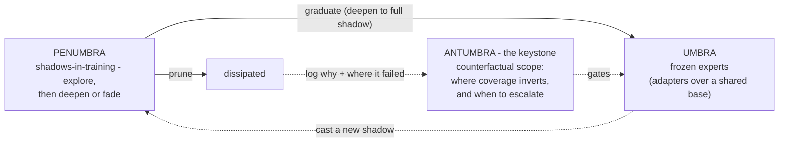

### 2. The keystone decision chain

Read conceptually, the architecture radiates from ADR-0004; the ADRs are numbered 0001→0009 in the opposite
(build-dependency) order. Source: [architecture §1](architecture.md#1-the-thesis-and-the-two-readings-of-the-chain).

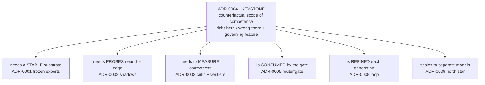

---

## System

### 3. v0 system architecture

One frozen code-capable base + a library of frozen LoRA experts + a learned, boundary-conditioned gate, all in
a single-plane Rust process on one GPU. Source: [architecture §2](architecture.md#2-system-architecture-v0---shared-base-adapters-single-plane-rust).

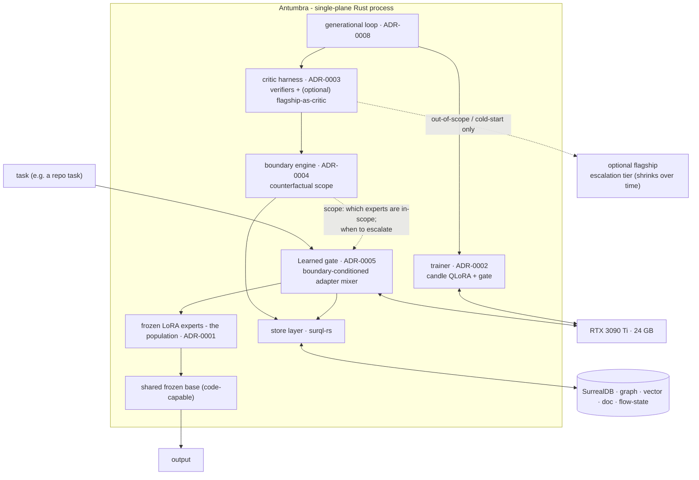

### 5. v0 vs north star

What carries over (gate, boundary engine, loop, substrate) and what changes (only the composition substrate).
Source: [architecture §4](architecture.md#4-v0-scope-vs-the-north-star).

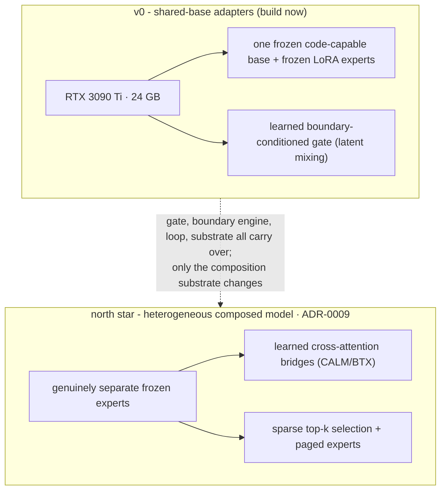

---

## Flow

### 4. Training & data flow

The environment is the truth; the critic only densifies; you train on the verified outcome, never the critic's
text. Source: [architecture §3](architecture.md#3-training--data-flow-verifiable-outcomes-not-imitation).

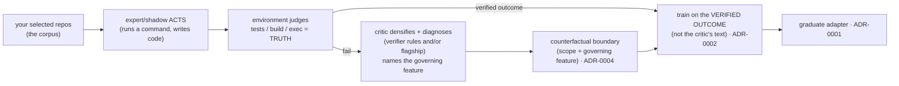

---

## Schema

### 6. Schema - entities

Conceptual ER view; full DDL is in [ADR-0007](adr/0007-surrealdb-substrate.md). Source:
[architecture §5](architecture.md#5-schema-surrealdb---summary).

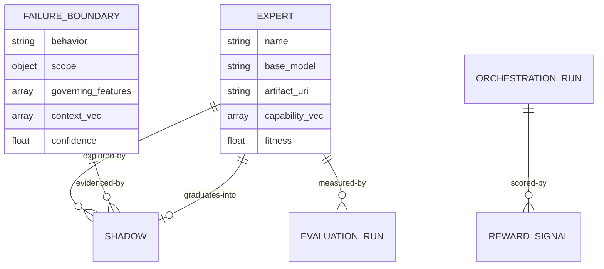

---

## Per-ADR mechanism diagrams

### 7. ADR-0001 - umbra: the frozen population

A base + a growing library of frozen adapters, mixed in latent space by the gate. Source:
[ADR-0001](adr/0001-frozen-experts.md).

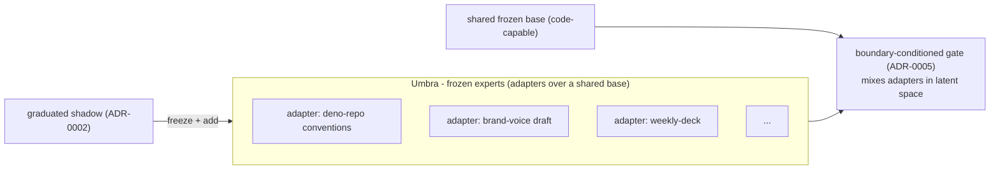

### 8. ADR-0002 - penumbra: the shadow lifecycle

Plasticity lives only in short-lived shadows: spawn → explore → score → graduate (deepen to umbra) or prune.
Source: [ADR-0002](adr/0002-shadow-plasticity.md).

```mermaid
stateDiagram-v2
    [*] --> spawning
    spawning --> exploring: attach LoRA adapter; act on the corpus
    exploring --> scoring: environment verifies + critic densifies (ADR-0003)
    scoring --> exploring: keep training on verified outcomes
    scoring --> graduated: fitness above threshold
    scoring --> pruned: stalled or collapsed
    graduated --> [*]: deepen into a frozen expert (umbra); add to gate (ADR-0001/0005)
    pruned --> [*]: discarded; boundary logged (ADR-0004)
```

### 9. ADR-0003 - critic/verifier credit

Verifiers are primary ground truth; the critic only interpolates dense per-step credit between them and can
never override a verifier. Source: [ADR-0003](adr/0003-critic-credit-assignment.md).

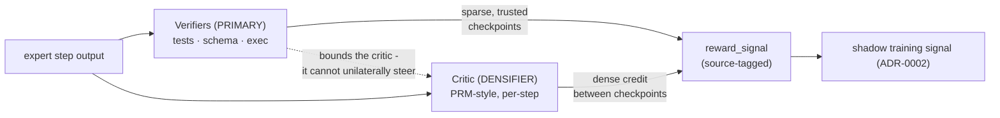

### 10. ADR-0004 - the boundary engine (keystone)

The antumbra made mechanical: hold behavior fixed, vary context until acceptability flips, recover the governing
feature + grain, then inhibit *only in-scope* and steer. Source: [ADR-0004](adr/0004-inhibitory-boundaries.md).

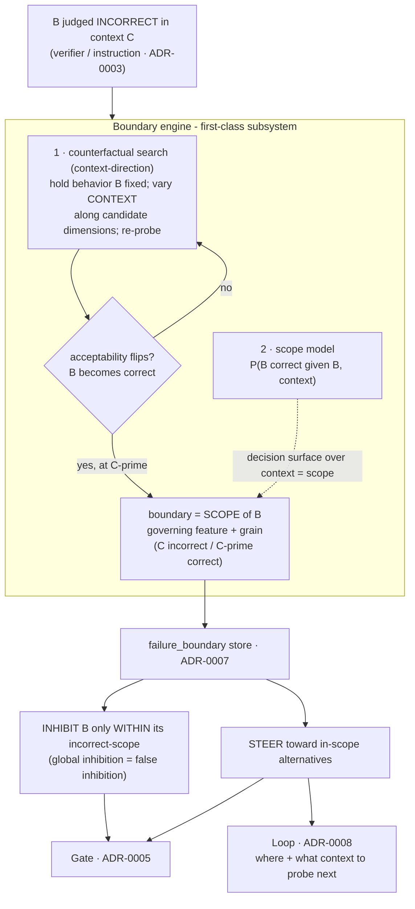

### 11. ADR-0005 - the boundary-conditioned gate

A learned in-model mixer: score adapters, let the scope gate/steer, blend in-scope experts in latent space, or
escalate out-of-scope (which becomes the next training example). Source: [ADR-0005](adr/0005-orchestrator-router.md).

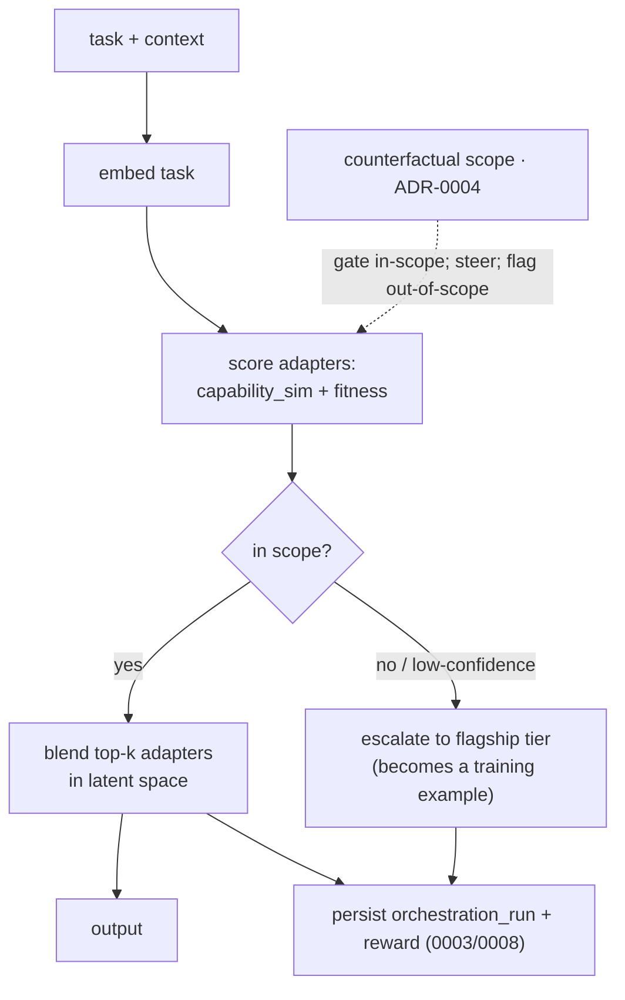

### 12. ADR-0006 - single-GPU serving

v0 is one base + an adapter library (S-LoRA-style) served and trained on one RTX 3090 Ti; the fleet, ternary
tier, and heterogeneous composition all defer. Source: [ADR-0006](adr/0006-hardware-serving.md).

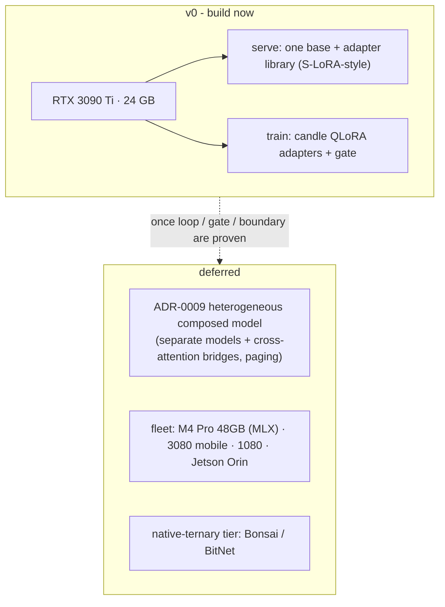

### 13. ADR-0007 - SurrealDB substrate

One multi-model engine is every store + vector index + graph + durable flow state, reached only through
`surql-rs`. Full DDL lives in the ADR. Source: [ADR-0007](adr/0007-surrealdb-substrate.md).

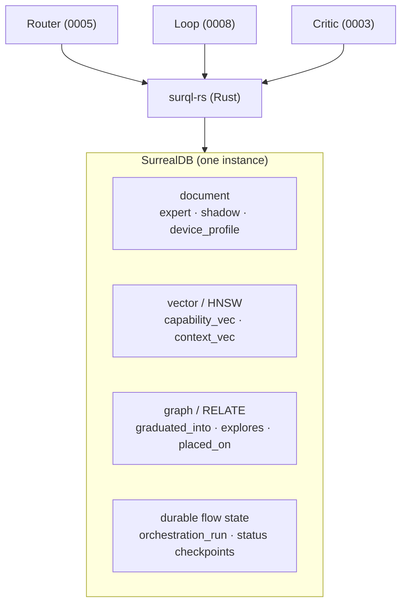

### 14. ADR-0008 - the generational loop

A resumable state-machine-in-DB: grow → explore → score → graduate/prune → consolidate, restartable from the
persisted `status` checkpoint. Source: [ADR-0008](adr/0008-generational-loop.md).

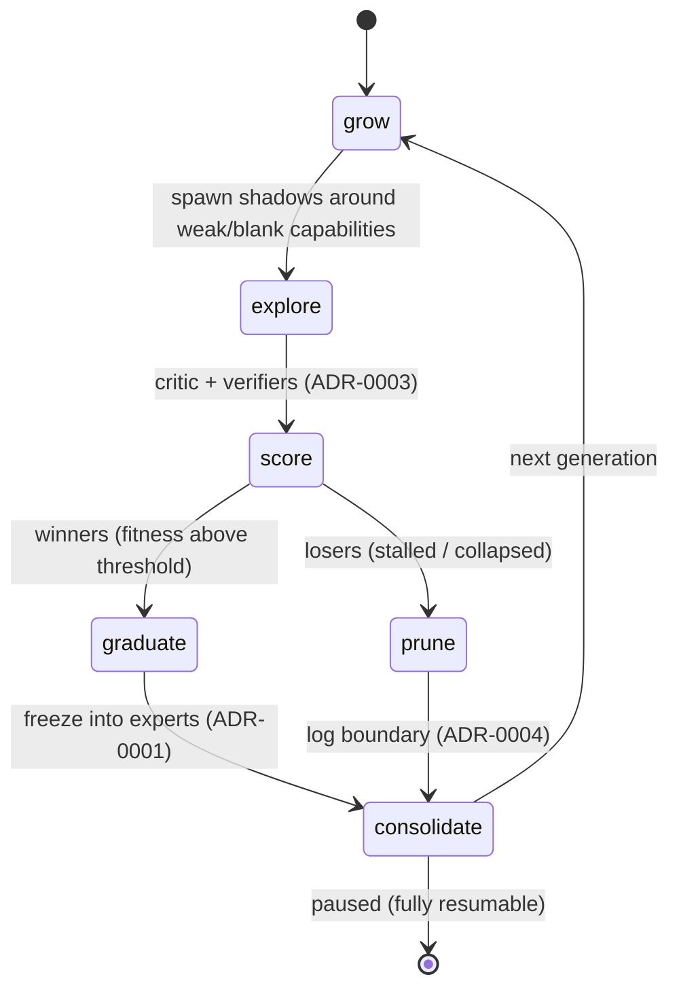

### 15. ADR-0009 - heterogeneous composition

The north star: sparse top-k selection over genuinely separate frozen experts wired by learned, per-expert
cross-attention bridges, with the scope gating both selection and bridge gain. Source:
[ADR-0009](adr/0009-heterogeneous-composition.md).

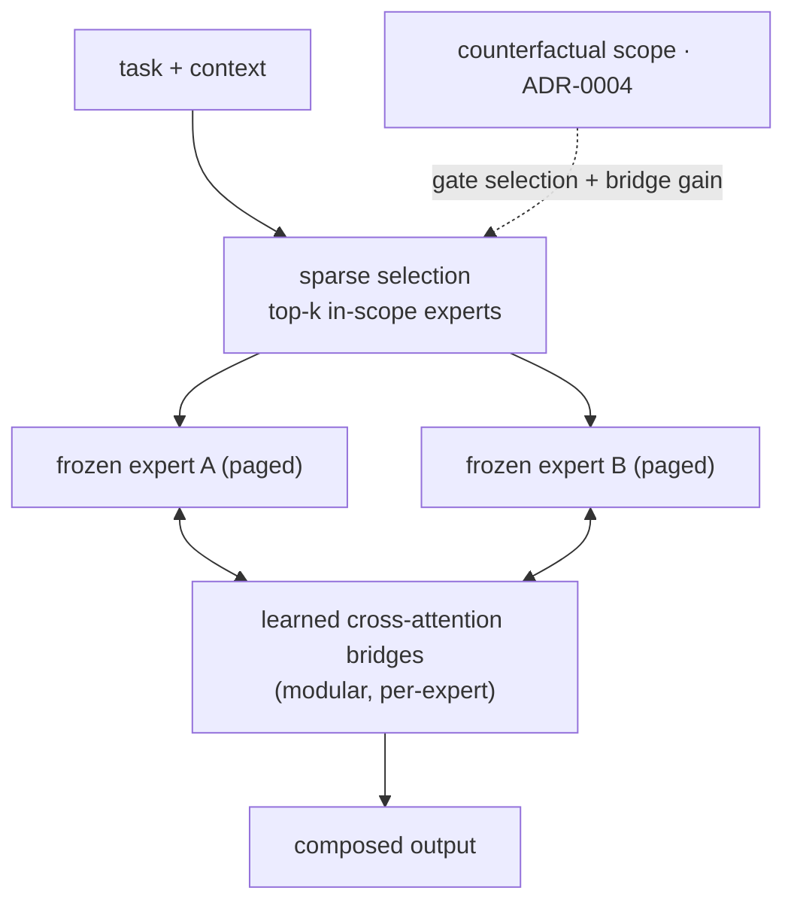

### 16. ADR-0012–0015 - memory, tenancy, compartments, MCP

The newer subsystems carry their diagrams inline in their ADRs, to avoid drift:

- **[ADR-0012](adr/0012-penumbra-memory.md)** - the consolidation arc (penumbra memory → score → capture+replay
  → umbra; contradiction → retire).
- **[ADR-0013](adr/0013-tenant-isolation-identity.md)** - the identity hierarchy and the engine `PERMISSIONS`
  boundary (tenant org → user → compartment → agent; shared umbra, private penumbra).
- **[ADR-0014](adr/0014-compartments.md)** - penumbra → antumbra-clustered compartments → (share / consolidate
  into a private expert).
- **[ADR-0015](adr/0015-mcp-runtime-surface.md)** - the 12-tool MCP surface over the bound `(tenant, user)`.
