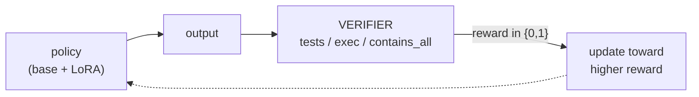
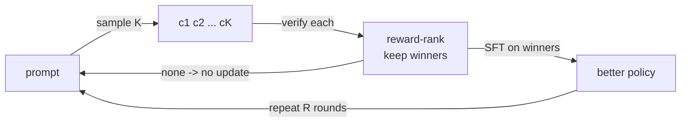
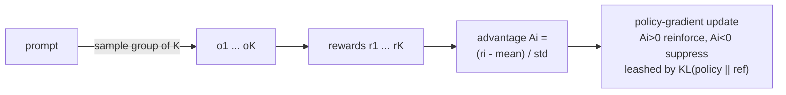
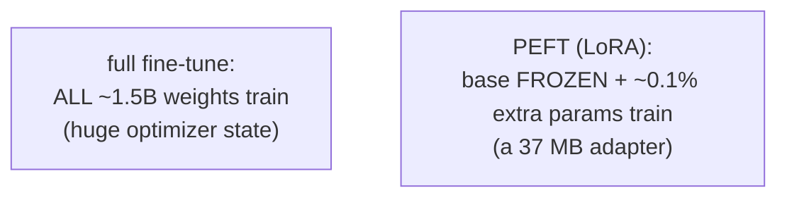
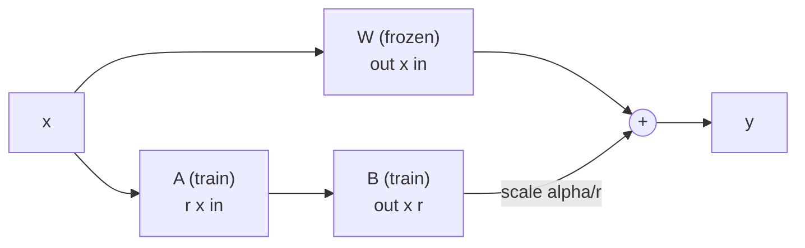
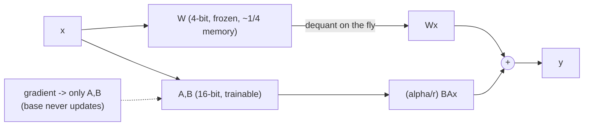
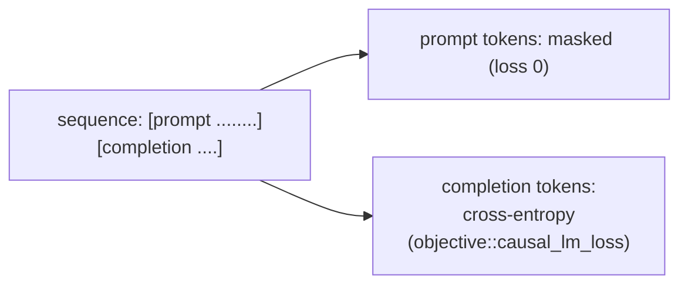
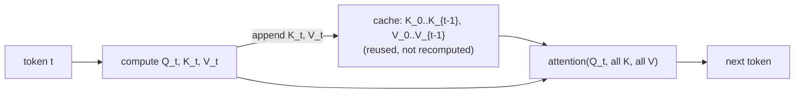
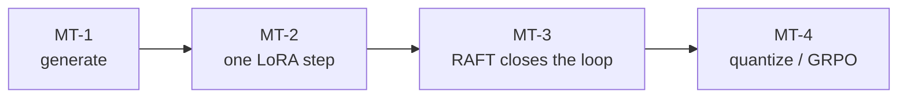
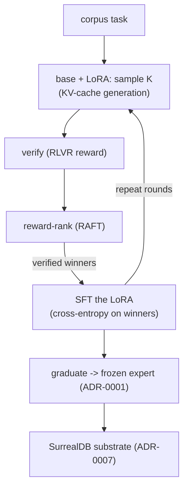

# Antumbra — Glossary (ADR-0010 vocabulary)

Plain-English definitions plus a diagram for every acronym in the trainer ADR. Read alongside
[ADR-0010](adr/0010-candle-qlora-trainer.md) and the [diagram atlas](diagrams.md).

- Naming: [why "candle"](#why-candle)
- Learning algorithm: [RLVR](#rlvr--reinforcement-learning-with-verifiable-rewards) · [RAFT](#raft--reward-ranked-finetuning) · [GRPO](#grpo--group-relative-policy-optimization)
- Parameter efficiency: [PEFT](#peft--parameter-efficient-fine-tuning) · [LoRA](#lora--low-rank-adaptation) · [QLoRA](#qlora--quantized-lora) · [NF4](#nf4--4-bit-normalfloat) · [GGUF](#gguf)
- Mechanics: [SFT](#sft--supervised-fine-tuning) · [KV cache](#kv-cache--keyvalue-cache)
- Process: [ADR](#adr--architecture-decision-record) · [MT-1..MT-4](#mt-1mt-4--trainer-milestones)
- [How they compose](#how-they-compose) · [the result](#the-result)

---

## Why "candle"

`candle` is Hugging Face's minimalist ML framework for Rust (tensors, autograd, CUDA/Metal) — a proper name,
not an acronym. It riffs on PyTorch's "torch": a torch is a big, heavy flame (a large framework that pulls in
all of Python); a **candle** is a small, lightweight light. That captures the pitch — a tiny, Python-free
runtime shippable as one Rust binary, which is exactly why Antumbra uses it (single-process, one GPU —
ADR-0006/0007).

---

## Learning algorithm

### RLVR — Reinforcement Learning with Verifiable Rewards

The reward is an objective, checkable signal (a test passes, output matches a rule) — not a human-preference or
learned reward model. This is Antumbra's reward philosophy (ADR-0003: the environment is the truth).

### RAFT — Reward-rAnked FineTuning

The simplest way to *do* RLVR (a.k.a. RFT / rejection-sampling fine-tuning): sample K candidates, verify each,
keep the winners, SFT on them, repeat. No policy-gradient machinery. This is Antumbra v0.

### GRPO — Group Relative Policy Optimization

The v1 upgrade (DeepSeek): score a *group* of K outputs per prompt and push each up or down by its
**advantage = (reward - group mean) / group std**, with a KL leash to a reference model. More sample-efficient,
more machinery — and critic-free (the group baseline replaces a value network).

---

## Parameter efficiency

### PEFT — Parameter-Efficient Fine-Tuning

Freeze the giant base; train a tiny add-on. Megabytes of trainable parameters instead of gigabytes.

### LoRA — Low-Rank Adaptation

A weight update to a matrix `W` (out x in) is approximated by two skinny matrices `B*A` of rank `r` much smaller
than in/out. Freeze `W`, train only `A` and `B`. One trained `A,B` pair is one expert (ADR-0001).
`y = Wx + (alpha/r) * B(Ax)`.

### QLoRA — Quantized LoRA

LoRA, but the frozen base is stored in 4-bit to save memory; adapters stay full precision; gradients flow
through the dequantized base into the adapters. Antumbra v0 uses an f16/bf16 base — true 4-bit is the deferred
MT-4 step.

### NF4 — 4-bit NormalFloat

The specific 4-bit number format QLoRA introduced: a quantization grid that is information-theoretically optimal
for normally-distributed weights. candle does not use NF4 — it uses the llama.cpp quant types (see GGUF), which
ADR-0010 notes is arguably a better fit.

### GGUF

The llama.cpp model file format (quantized weights such as `Q4_K`, plus metadata). candle and `llama-cpp-2`
load and serve these, so a graduated adapter is serveable without re-quantizing. (Originally an acronym,
"GPT-Generated Unified Format"; now effectively just the format name.)

---

## Mechanics

### SFT — Supervised Fine-Tuning

Train the model to *produce* a target via next-token cross-entropy, masked to the completion only (do not train
it to re-emit the prompt). In RAFT the targets are the model's own verified-correct generations.

### KV cache — Key/Value cache

During generation, the attention keys/values for past tokens are cached, so each new token only computes its own
position instead of re-reading the whole prefix — the difference between quadratic re-encoding and incremental
decoding.

---

## Process

### ADR — Architecture Decision Record

One short document per load-bearing decision: context, decision, consequences, kill criterion. Antumbra has
ADR-0001 through ADR-0010.

### MT-1..MT-4 — trainer milestones

The trainer's milestone track inside ADR-0010, each a falsifiable experiment with a kill criterion:

---

## How they compose

The whole ADR-0010 trainer in one picture: **RAFT** (the loop) drives **SFT** on **PEFT/LoRA** adapters over a
frozen base, rewarded by **RLVR** verifiers, on **candle** — with **GRPO** and **QLoRA/NF4/GGUF** as the
labeled upgrade path.

---

## The result

MT-3 runtime validated on an RTX 3090 Ti (2026-06-03), two ways. On the type-hint-convention corpus
(`corpora/learn.json`, in-process `contains_all` reward), the per-round pass-rate over four RAFT rounds rose
**0.06 -> 0.25 -> 0.88 -> 1.00**. On `corpora/example-tasks.json` with the real **exec verifier** — the
generated function is executed and its behavior asserted — it rose **0.38 -> 1.00 -> 1.00 -> 1.00**. Both
graduated and froze a real bf16 adapter. The adapter learns from verified outcomes, including outcomes verified
by actually running the code — the loop closes and improves.
